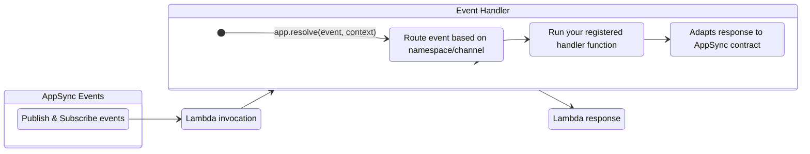

Event Handler for AWS AppSync real-time events.



## Key Features

* Easily handle publish and subscribe events with dedicated handler methods
* Automatic routing based on namespace and channel patterns
* Support for wildcard patterns to create catch-all handlers
* Process events in parallel or sequentially
* Control over event aggregation for batch processing
* Graceful error handling for individual events

## Terminology

**[AWS AppSync Events](https://docs.aws.amazon.com/appsync/latest/eventapi/event-api-welcome.html){target="_blank"}**. A service that enables you to quickly build secure, scalable real-time WebSocket APIs without managing infrastructure or writing API code. It handles connection management, message broadcasting, authentication, and monitoring, reducing time to market and operational costs.

## Getting started

???+ tip "Tip: New to AppSync Real-time API?"
    Visit [AWS AppSync Real-time documentation](https://docs.aws.amazon.com/appsync/latest/eventapi/event-api-getting-started.html){target="_blank"} to understand how to set up subscriptions and pub/sub messaging.

### Required resources

You must have an existing AppSync Events API with real-time capabilities enabled and IAM permissions to invoke your Lambda function.

=== "Getting started with AppSync Events"

    ```yaml hl_lines="5 10 12"
    Resources:
        WebsocketAPI:
            Type: AWS::AppSync::Api
            Properties:
                EventConfig:
                AuthProviders:
                    - AuthType: API_KEY
                ConnectionAuthModes:
                    - AuthType: API_KEY
                DefaultPublishAuthModes:
                    - AuthType: API_KEY
                DefaultSubscribeAuthModes:
                    - AuthType: API_KEY
                Name: RealTimeEventAPI
    
        WebasocketApiKey:
            Type: AWS::AppSync::ApiKey
            Properties:
                ApiId: !GetAtt WebsocketAPI.ApiId
                Description: "API KEY"
                Expires: 365
        
        WebsocketAPINamespace:
            Type: AWS::AppSync::ChannelNamespace
            Properties:
                ApiId: !GetAtt WebsocketAPI.ApiId
                Name: powertools
    ```

### AppSync request and response format

AppSync Events uses a specific event format for Lambda requests and responses. In most scenarios, Powertools for AWS simplifies this interaction by automatically formatting resolver returns to match the expected AppSync response structure.

=== "AppSync payload request"

    ```json"
    {
        "identity":"None",
        "result":"None",
        "request":{
           "headers": {
            "x-forwarded-for": "1.1.1.1, 2.2.2.2",
            "cloudfront-viewer-country": "US",
            "cloudfront-is-tablet-viewer": "false",
            "via": "2.0 xxxxxxxxxxxxxxxx.cloudfront.net (CloudFront)",
            "cloudfront-forwarded-proto": "https",
            "origin": "https://us-west-1.console.aws.amazon.com",
            "content-length": "217",
            "accept-language": "en-US,en;q=0.9",
            "host": "xxxxxxxxxxxxxxxx.appsync-api.us-west-1.amazonaws.com",
            "x-forwarded-proto": "https",
            "user-agent": "Mozilla/5.0 (Macintosh; Intel Mac OS X 10_15_6) AppleWebKit/537.36 (KHTML, like Gecko) Chrome/85.0.4183.83 Safari/537.36",
            "accept": "*/*",
            "cloudfront-is-mobile-viewer": "false",
            "cloudfront-is-smarttv-viewer": "false",
            "accept-encoding": "gzip, deflate, br",
            "referer": "https://us-west-1.console.aws.amazon.com/appsync/home?region=us-west-1",
            "content-type": "application/json",
            "sec-fetch-mode": "cors",
            "x-amz-cf-id": "3aykhqlUwQeANU-HGY7E_guV5EkNeMMtwyOgiA==",
            "x-amzn-trace-id": "Root=1-5f512f51-fac632066c5e848ae714",
            "authorization": "eyJraWQiOiJScWFCSlJqYVJlM0hrSnBTUFpIcVRXazNOW...",
            "sec-fetch-dest": "empty",
            "x-amz-user-agent": "AWS-Console-AppSync/",
            "cloudfront-is-desktop-viewer": "true",
            "sec-fetch-site": "cross-site",
            "x-forwarded-port": "443"
          },
           "domainName":"None"
        },
        "info":{
           "channel":{
              "path":"/default/channel",
              "segments":[
                 "default",
                 "channel"
              ]
           },
           "channelNamespace":{
              "name":"default"
           },
           "operation":"PUBLISH"
        },
        "error":"None",
        "prev":"None",
        "stash":{
      
        },
        "outErrors":[
      
        ],
        "events":[
           {
              "payload":{
                 "data":"data_1"
              },
              "id":"1"
           },
           {
              "payload":{
                 "data":"data_2"
              },
              "id":"2"
           }
        ]
    }

    ```

=== "AppSync payload response"

    ```json"
    {
        "events":[
           {
              "payload":{
                 "data":"data_1"
              },
              "id":"1"
           },
           {
              "payload":{
                 "data":"data_2"
              },
              "id":"2"
           }
        ]
    }

    ```

=== "AppSync payload response with error

    ```json"
    {
        "events":[
           {
              "error": "Error message",
              "id":"1"
           },
           {
              "payload":{
                 "data":"data_2"
              },
              "id":"2"
           }
        ]
    }
    ```

#### Events response with error

When processing events with Lambda, you can return errors to AppSync in three ways:

* **Item specific error:** Return an `error` key within each individual item's response. AppSync Events expects this format for item-specific errors.
* **Fail entire request:** Return a JSON object with a top-level `error` key. This signals a general failure, and AppSync treats the entire request as unsuccessful.
* **Unauthorized exception**: Raise the **UnauthorizedException** exception to reject a subscribe or publish request with HTTP 403.

### Resolver

???+ important
    The event handler automatically parses the incoming event data and invokes the appropriate handler based on the namespace/channel pattern you register.

You can define your handlers for different event types using the `OnPublish()`, `OnPublishAggregate()`, and `OnSubscribe()` methods and their `Async` versions.

=== "Publish events - Class library handler"

    ```chsarp hl_lines="1 5 9-15 20"
    using AWS.Lambda.Powertools.EventHandler.AppSyncEvents;

    public class Function
    {
        AppSyncEventsResolver _app;

        public Function()
        {
            _app = new AppSyncEventsResolver();
            _app.OnPublishAsync("/default/channel", async (payload) =>
            {
                // Handle events or
                // return unchanged payload
                return payload;
            });
        }
    
        public async Task<AppSyncEventsResponse> FunctionHandler(AppSyncEventsRequest input, ILambdaContext context)
        {
            return await _app.ResolveAsync(input, context);
        }
    }
    ```
=== "Publish events - Executable assembly handlers"

    ```chsarp hl_lines="1 3 5-10 14"
    using AWS.Lambda.Powertools.EventHandler.AppSyncEvents;

    var app = new AppSyncEventsResolver();

    app.OnPublishAsync("/default/channel", async (payload) =>
    {
        // Handle events or
        // return unchanged payload
        return payload;
    }

    async Task<AppSyncEventsResponse> Handler(AppSyncEventsRequest appSyncEvent, ILambdaContext context)
    {
        return await app.ResolveAsync(appSyncEvent, context);
    }
    
    await LambdaBootstrapBuilder.Create((Func<AppSyncEventsRequest, ILambdaContext, Task<AppSyncEventsResponse>>)Handler,
    new DefaultLambdaJsonSerializer())
    .Build()
    .RunAsync();
    
    ```

=== "Subscribe to events"

    ```csharp
    app.OnSubscribe("/default/*", (payload) =>
    {
        // Handle subscribe events
        // return true to allow subscription
        // return false or throw to reject subscription
        return true;
    });
    ```

## Advanced

### Wildcard patterns and handler precedence

You can use wildcard patterns to create catch-all handlers for multiple channels or namespaces. This is particularly useful for centralizing logic that applies to multiple channels.

When an event matches with multiple handlers, the most specific pattern takes precedence.

=== "Wildcard patterns"

    ```csharp
    app.OnPublish("/default/channel1", (payload) =>
    {
        // This handler will be called for events on /default/channel1
        return payload;
    });
    
    app.OnPublish("/default/*", (payload) =>
    {
        // This handler will be called for all channels in the default namespace
        // EXCEPT for /default/channel1 which has a more specific handler
        return payload;
    });

    app.OnPublish("/*", (payload) =>
    {
        # This handler will be called for all channels in all namespaces
        # EXCEPT for those that have more specific handlers
        return payload;
    });
    ```

???+ note "Supported wildcard patterns"
    Only the following patterns are supported:

    * `/namespace/*` - Matches all channels in the specified namespace
    * `/*` - Matches all channels in all namespaces

    Patterns like `/namespace/channel*` or `/namespace/*/subpath` are not supported.

    More specific routes will always take precedence over less specific ones. For example, `/default/channel1` will take precedence over `/default/*`, which will take precedence over `/*`.

### Aggregated processing

???+ note "Aggregate Processing"
    `OnPublishAggregate()`, receives a list of all events, requiring you to manage the response format. Ensure your response includes results for each event in the expected [AppSync Request and Response Format](#appsync-request-and-response-format).

In some scenarios, you might want to process all events for a channel as a batch rather than individually. This is useful when you need to:

* Optimize database operations by making a single batch query
* Ensure all events are processed together or not at all
* Apply custom error handling logic for the entire batch

=== "Aggregated processing"

    ```csharp
    app.OnPublishAggregate("/default/channel", (payload) =>
    {
        var evt = new List<AppSyncEvent>();

        foreach (var item in payload.Events)
        {
            if (item.Payload["eventType"].ToString() == "data_2")
            {
                pd.Payload["message"] = "Hello from /default/channel2 with data_2";
                pd.Payload["data"] = new Dictionary<string, object>
                {
                    { "key", "value" }
                };
            }
    
            evt.Add(pd);
        }

        return new AppSyncEventsResponse
        {
            Events = evt
        };
    });
    ```

### Handling errors

You can filter or reject events by raising exceptions in your resolvers or by formatting the payload according to the expected response structure. This instructs AppSync not to propagate that specific message, so subscribers will not receive it.

#### Handling errors with individual items

When processing items individually with `OnPublish()`, you can raise an exception to fail a specific item. When an exception is raised, the Event Handler will catch it and include the exception name and message in the response.

=== "Error handling individual items"

    ```csharp
    app.OnPublish("/default/channel", (payload) =>
    {
        throw new Exception("My custom exception");
    });
    ```

=== "Error handling individual items response"

    ```json hl_lines="4"
    {
        "events":[
           {
              "error": "My custom exception",
              "id":"1"
           },
           {
              "payload":{
                 "data":"data_2"
              },
              "id":"2"
           }
        ]
    }
    ```

#### Handling errors with batch of items

When processing batch of items with `OnPublishAggregate()`, you must format the payload according the expected response.

=== "Error handling batch items"

    ```csharp
    app.OnPublishAggregate("/default/channel", (payload) =>
    {
        throw new Exception("My custom exception");
    });
    ```

=== "Error handling batch items response"

    ```json
    {
        "error": "My custom exception"
    }
    ```

#### Rejecting the entire request

??? warning "Raising `UnauthorizedException` will cause the Lambda invocation to fail."

You can also reject the entire payload by raising an `UnauthorizedException`. This prevents Powertools from processing any messages and causes the Lambda invocation to fail, returning an error to AppSync.

=== "Rejecting the entire request"

    ```csharp
    app.OnPublish("/default/channel", (payload) =>
    {
        throw new UnauthorizedException("My custom exception");
    });
    ```

### Accessing Lambda context and event

You can access to the original Lambda event or context for additional information. These are accessible via the app instance:

=== "Accessing Lambda context"

    ```csharp hl_lines="1 3"
    app.OnPublish("/default/channel", (payload, ctx) =>
    {
        payload["functionName"] = ctx.FunctionName;
        return payload;
    });
    ```

## Testing your code

You can test your event handlers by passing a mocked or actual AppSync Events Lambda event.

### Testing publish events

=== "Test Publish events"

    ```csharp
    [Fact]
    public void Should_Return_Unchanged_Payload()
    {
        // Arrange
        var lambdaContext = new TestLambdaContext();
        var app = new AppSyncEventsResolver();

        app.OnPublish("/default/channel", payload =>
        {
            // Handle channel events
            return payload;
        });

        // Act
        var result = app.Resolve(_appSyncEvent, lambdaContext);

        // Assert
        Assert.Equal("123", result.Events[0].Id);
        Assert.Equal("test data", result.Events[0].Payload?["data"].ToString());
    }
    ```

=== "Publish event json"

    ```json
    {
        "identity":"None",
        "result":"None",
        "request":{
           "headers": {
            "x-forwarded-for": "1.1.1.1, 2.2.2.2",
            "cloudfront-viewer-country": "US",
            "cloudfront-is-tablet-viewer": "false",
            "via": "2.0 xxxxxxxxxxxxxxxx.cloudfront.net (CloudFront)",
            "cloudfront-forwarded-proto": "https",
            "origin": "https://us-west-1.console.aws.amazon.com",
            "content-length": "217",
            "accept-language": "en-US,en;q=0.9",
            "host": "xxxxxxxxxxxxxxxx.appsync-api.us-west-1.amazonaws.com",
            "x-forwarded-proto": "https",
            "user-agent": "Mozilla/5.0 (Macintosh; Intel Mac OS X 10_15_6) AppleWebKit/537.36 (KHTML, like Gecko) Chrome/85.0.4183.83 Safari/537.36",
            "accept": "*/*",
            "cloudfront-is-mobile-viewer": "false",
            "cloudfront-is-smarttv-viewer": "false",
            "accept-encoding": "gzip, deflate, br",
            "referer": "https://us-west-1.console.aws.amazon.com/appsync/home?region=us-west-1",
            "content-type": "application/json",
            "sec-fetch-mode": "cors",
            "x-amz-cf-id": "3aykhqlUwQeANU-HGY7E_guV5EkNeMMtwyOgiA==",
            "x-amzn-trace-id": "Root=1-5f512f51-fac632066c5e848ae714",
            "authorization": "eyJraWQiOiJScWFCSlJqYVJlM0hrSnBTUFpIcVRXazNOW...",
            "sec-fetch-dest": "empty",
            "x-amz-user-agent": "AWS-Console-AppSync/",
            "cloudfront-is-desktop-viewer": "true",
            "sec-fetch-site": "cross-site",
            "x-forwarded-port": "443"
          },
           "domainName":"None"
        },
        "info":{
           "channel":{
              "path":"/default/channel",
              "segments":[
                 "default",
                 "channel"
              ]
           },
           "channelNamespace":{
              "name":"default"
           },
           "operation":"PUBLISH"
        },
        "error":"None",
        "prev":"None",
        "stash":{
    
        },
        "outErrors":[
    
        ],
        "events":[
           {
              "payload":{
                "data": "test data"
              },
              "id":"123"
           }
        ]
    }
    ```

### Testing subscribe events

=== "Test Subscribe with code payload mock"

    ```csharp
    [Fact]
    public async Task Should_Authorize_Subscription()
    {
        // Arrange
        var lambdaContext = new TestLambdaContext();
        var app = new AppSyncEventsResolver();

        app.OnSubscribeAsync("/default/*", async (info) => true);

        var subscribeEvent = new AppSyncEventsRequest
        {
            Info = new Information
            {
                Channel = new Channel
                {
                    Path = "/default/channel",
                    Segments = ["default", "channel"]
                },
                Operation = AppSyncEventsOperation.Subscribe,
                ChannelNamespace = new ChannelNamespace { Name = "default" }
            }
        };
        // Act
        var result = await app.ResolveAsync(subscribeEvent, lambdaContext);

        // Assert
        Assert.Null(result);
    }
    ```