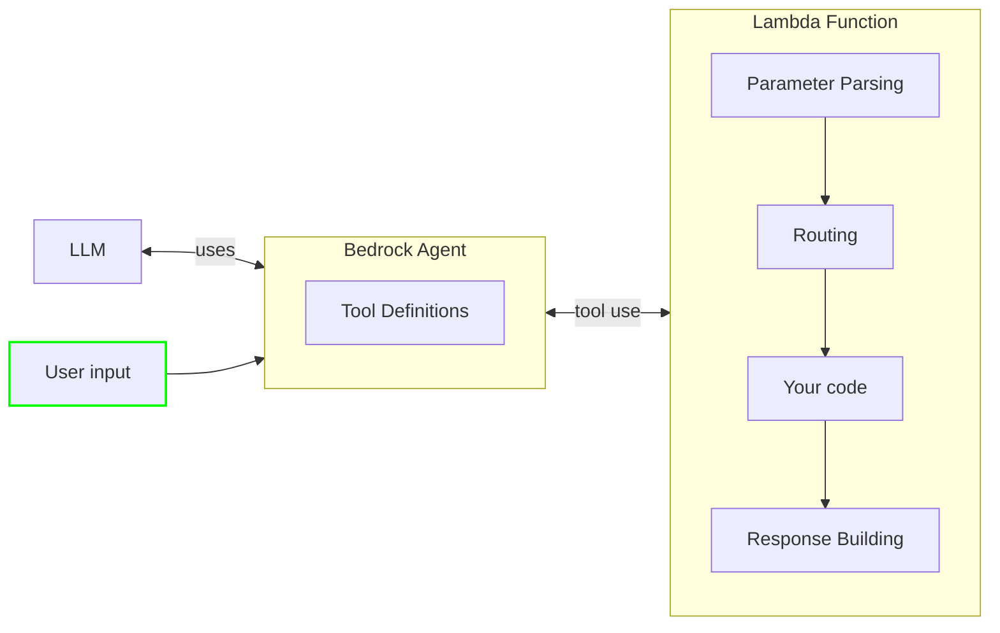

# AWS Lambda Powertools for .NET - Bedrock Agent Function Resolver

## Overview

The Bedrock Agent Function Resolver is a utility for AWS Lambda that simplifies building serverless applications working with Amazon Bedrock Agents. This library eliminates boilerplate code typically required when implementing Lambda functions that serve as action groups for Bedrock Agents.

Amazon Bedrock Agents can invoke functions to perform tasks based on user input. This library provides an elegant way to register, manage, and execute these functions with minimal code, handling all the parameter extraction and response formatting automatically.

Create [Amazon Bedrock Agents](https://docs.aws.amazon.com/bedrock/latest/userguide/agents.html#agents-how) and focus on building your agent's logic without worrying about parsing and routing requests.



## Features

- **Simple Tool Registration**: Register functions with descriptive names that Bedrock Agents can invoke
- **Automatic Parameter Handling**: Parameters are automatically extracted from Bedrock Agent requests and converted to the appropriate types
- **Lambda Context Access**: Easy access to Lambda context for logging and AWS Lambda features
- **Dependency Injection Support**: Seamless integration with .NET's dependency injection system
- **AOT Compatibility**: Fully compatible with .NET 8 AOT compilation through source generation

## Terminology

**Event handler** is a Powertools for AWS feature that processes an event, runs data parsing and validation, routes the request to a specific function, and returns a response to the caller in the proper format.

**Function details** consist of a list of parameters, defined by their name, data type, and whether they are required. The agent uses these configurations to determine what information it needs to elicit from the user.

**Action group** is a collection of two resources where you define the actions that the agent should carry out: an OpenAPI schema to define the APIs that the agent can invoke to carry out its tasks, and a Lambda function to execute those actions.

**Large Language Models (LLM)** are very large deep learning models that are pre-trained on vast amounts of data, capable of extracting meanings from a sequence of text and understanding the relationship between words and phrases on it.

**Amazon Bedrock Agent** is an Amazon Bedrock feature to build and deploy conversational agents that can interact with your customers using Large Language Models (LLM) and AWS Lambda functions.


## Installation

Install the package via NuGet:

```bash
dotnet add package AWS.Lambda.Powertools.EventHandler.Resolvers.BedrockAgentFunction
```

### Required resources

You must create an Amazon Bedrock Agent with at least one action group. Each action group can contain up to 5 tools, which in turn need to match the ones defined in your Lambda function. Bedrock must have permission to invoke your Lambda function.

??? note "Click to see example IaC templates"

TODO: add cdk


## Basic Usage

To create an agent, use the `BedrockAgentFunctionResolver` to register your tools and handle the requests. The resolver will automatically parse the request, route it to the appropriate function, and return a well-formed response that includes the tool's output and any existing session attributes.

```csharp
using Amazon.BedrockAgentRuntime.Model;
using Amazon.Lambda.Core;
using AWS.Lambda.Powertools.EventHandler;

[assembly: LambdaSerializer(typeof(Amazon.Lambda.Serialization.SystemTextJson.DefaultLambdaJsonSerializer))]

namespace MyLambdaFunction
{
    public class Function
    {
        private readonly BedrockAgentFunctionResolver _resolver;
        
        public Function()
        {
            _resolver = new BedrockAgentFunctionResolver();
            
            // Register simple tool functions
            _resolver
                .Tool("GetWeather", (string city) => $"The weather in {city} is sunny")
                .Tool("CalculateSum", (int a, int b) => $"The sum of {a} and {b} is {a + b}")
                .Tool("GetCurrentTime", () => $"The current time is {DateTime.Now}");
        }
        
        // Lambda handler function
        public ActionGroupInvocationOutput FunctionHandler(
            ActionGroupInvocationInput input, ILambdaContext context)
        {
            return _resolver.Resolve(input, context);
        }
    }
}
```

When the Bedrock Agent invokes your Lambda function with a request to use the "GetWeather" tool and a parameter for "city", the resolver automatically extracts the parameter, passes it to your function, and formats the response.

## Advanced Usage

### Functions with Descriptions

Add descriptive information to your tool functions:

```csharp
_resolver.Tool(
    "CheckInventory", 
    "Checks if a product is available in inventory",
    (string productId, bool checkWarehouse) => 
    {
        return checkWarehouse 
            ? $"Product {productId} has 15 units in warehouse" 
            : $"Product {productId} has 5 units in store";
    });
```

### Accessing Lambda Context

You can access to the original Lambda event or context for additional information. These are passed to the handler function as optional arguments.

```csharp
_resolver.Tool(
    "LogRequest",
    "Logs request information and returns confirmation",
    (string requestId, ILambdaContext context) => 
    {
        context.Logger.LogLine($"Processing request {requestId}");
        return $"Request {requestId} logged successfully";
    });
```

### Handling errors

By default, we will handle errors gracefully and return a well-formed response to the agent so that it can continue the conversation with the user.

When an error occurs, we send back an error message in the response body that includes the error type and message. The agent will then use this information to let the user know that something went wrong.

If you want to handle errors differently, you can return a `BedrockFunctionResponse` with a custom `Body` and `ResponseState` set to `FAILURE`. This is useful when you want to abort the conversation.

```csharp
resolver.Tool("CustomFailure", () => 
{
    // Return a custom FAILURE response
    return new BedrockFunctionResponse
    {
        Response = new Response
        {
            ActionGroup = "TestGroup",
            Function = "CustomFailure",
            FunctionResponse = new FunctionResponse
            {
                ResponseBody = new ResponseBody
                {
                    Text = new TextBody 
                    { 
                        Body = "Critical error occurred: Database unavailable" 
                    }
                },
                ResponseState = ResponseState.FAILURE  // Mark as FAILURE to abort the conversation
            }
        }
    };
});
```
### Setting session attributes

When Bedrock Agents invoke your Lambda function, it can pass session attributes that you can use to store information across multiple interactions with the user. You can access these attributes in your handler function and modify them as needed.

```csharp
// Create a counter tool that reads and updates session attributes
resolver.Tool("CounterTool", (BedrockFunctionRequest request) => 
{
    // Read the current count from session attributes
    int currentCount = 0;
    if (request.SessionAttributes != null && 
        request.SessionAttributes.TryGetValue("counter", out var countStr) &&
        int.TryParse(countStr, out var count))
    {
        currentCount = count;
    }
    
    // Increment the counter
    currentCount++;
    
    // Create a new dictionary with updated counter
    var updatedSessionAttributes = new Dictionary<string, string>(request.SessionAttributes ?? new Dictionary<string, string>())
    {
        ["counter"] = currentCount.ToString(),
        ["lastAccessed"] = DateTime.UtcNow.ToString("o")
    };

    // Return response with updated session attributes
    return new BedrockFunctionResponse
    {
        Response = new Response
        {
            ActionGroup = request.ActionGroup,
            Function = request.Function,
            FunctionResponse = new FunctionResponse
            {
                ResponseBody = new ResponseBody
                {
                    Text = new TextBody { Body = $"Current count: {currentCount}" }
                }
            }
        },
        SessionAttributes = updatedSessionAttributes,
        PromptSessionAttributes = request.PromptSessionAttributes
    };
});
```

### Asynchronous Functions

Register and use asynchronous functions:

```csharp
_resolver.Tool(
    "FetchUserData",
    "Fetches user data from external API", 
    async (string userId, ILambdaContext ctx) => 
    {
        // Log the request
        ctx.Logger.LogLine($"Fetching data for user {userId}");
        
        // Simulate API call
        await Task.Delay(100); 
        
        // Return user information
        return new { Id = userId, Name = "John Doe", Status = "Active" }.ToString();
    });
```

### Direct Access to Request Payload

Access the raw Bedrock Agent request:

```csharp
_resolver.Tool(
    "ProcessRawRequest",
    "Processes the raw Bedrock Agent request", 
    (ActionGroupInvocationInput input) => 
    {
        var functionName = input.Function;
        var parameterCount = input.Parameters.Count;
        return $"Received request for {functionName} with {parameterCount} parameters";
    });
```

## Dependency Injection

The library supports dependency injection for integrating with services:

```csharp
using Microsoft.Extensions.DependencyInjection;

// Set up dependency injection
var services = new ServiceCollection();
services.AddSingleton<IWeatherService, WeatherService>();
services.AddBedrockResolver(); // Extension method to register the resolver

var serviceProvider = services.BuildServiceProvider();
var resolver = serviceProvider.GetRequiredService<BedrockAgentFunctionResolver>();

// Register a tool that uses an injected service
resolver.Tool(
    "GetWeatherForecast",
    "Gets the weather forecast for a location",
    (string city, IWeatherService weatherService, ILambdaContext ctx) => 
    {
        ctx.Logger.LogLine($"Getting weather for {city}");
        return weatherService.GetForecast(city);
    });
```

## How It Works with Amazon Bedrock Agents

1. When a user interacts with a Bedrock Agent, the agent identifies when it needs to call an action to fulfill the user's request.
2. The agent determines which function to call and what parameters are needed.
3. Bedrock sends a request to your Lambda function with the function name and parameters.
4. The BedrockAgentFunctionResolver automatically:
   - Finds the registered handler for the requested function
   - Extracts and converts parameters to the correct types
   - Invokes your handler with the parameters
   - Formats the response in the way Bedrock Agents expect
5. The agent receives the response and uses it to continue the conversation with the user

## Supported Parameter Types

- `string`
- `int`
- `number`
- `bool`
- `enum` types
- `ILambdaContext` (for accessing Lambda context)
- `ActionGroupInvocationInput` (for accessing raw request)
- Any service registered in dependency injection


## Using Attributes to Define Tools

You can define Bedrock Agent functions using attributes instead of explicit registration. This approach provides a clean, declarative way to organize your tools into classes:

### Define Tool Classes with Attributes

```csharp
// Define your tool class with BedrockFunctionType attribute
[BedrockFunctionType]
public class WeatherTools
{
    // Each method marked with BedrockFunctionTool attribute becomes a tool
    [BedrockFunctionTool(Name = "GetWeather", Description = "Gets weather forecast for a location")]
    public static string GetWeather(string city, int days)
    {
        return $"Weather forecast for {city} for the next {days} days: Sunny";
    }
    
    // Supports dependency injection and Lambda context access
    [BedrockFunctionTool(Name = "GetDetailedForecast", Description = "Gets detailed weather forecast")]
    public static string GetDetailedForecast(
        string location, 
        IWeatherService weatherService, 
        ILambdaContext context)
    {
        context.Logger.LogLine($"Getting forecast for {location}");
        return weatherService.GetForecast(location);
    }
}
```

### Register Tool Classes in Your Application

Using the extension method provided in the library, you can easily register all tools from a class:

```csharp

var services = new ServiceCollection();
services.AddSingleton<IWeatherService, WeatherService>();
services.AddBedrockResolver(); // Extension method to register the resolver

var serviceProvider = services.BuildServiceProvider();
var resolver = serviceProvider.GetRequiredService<BedrockAgentFunctionResolver>()
    .RegisterTool<WeatherTools>(); // Register tools from the class during service registration

```

## Complete Example with Dependency Injection

```csharp
using Amazon.BedrockAgentRuntime.Model;
using Amazon.Lambda.Core;
using AWS.Lambda.Powertools.EventHandler;
using Microsoft.Extensions.DependencyInjection;

[assembly: LambdaSerializer(typeof(Amazon.Lambda.Serialization.SystemTextJson.DefaultLambdaJsonSerializer))]

namespace MyBedrockAgent
{
    // Service interfaces and implementations
    public interface IWeatherService
    {
        string GetForecast(string city);
    }

    public class WeatherService : IWeatherService
    {
        public string GetForecast(string city) => $"Weather forecast for {city}: Sunny, 75°F";
    }

    public interface IProductService
    {
        string CheckInventory(string productId);
    }

    public class ProductService : IProductService
    {
        public string CheckInventory(string productId) => $"Product {productId} has 25 units in stock";
    }
    
    // Main Lambda function
    public class Function
    {
        private readonly BedrockAgentFunctionResolver _resolver;

        public Function()
        {
            // Set up dependency injection
            var services = new ServiceCollection();
            services.AddSingleton<IWeatherService, WeatherService>();
            services.AddSingleton<IProductService, ProductService>();
            services.AddBedrockResolver(); // Extension method to register the resolver
            
            var serviceProvider = services.BuildServiceProvider();
            _resolver = serviceProvider.GetRequiredService<BedrockAgentFunctionResolver>();

            // Register tool functions that use injected services
            _resolver
                .Tool("GetWeatherForecast", 
                    "Gets weather forecast for a city",
                    (string city, IWeatherService weatherService, ILambdaContext ctx) => 
                    {
                        ctx.Logger.LogLine($"Weather request for {city}");
                        return weatherService.GetForecast(city);
                    })
                .Tool("CheckInventory",
                    "Checks inventory for a product",
                    (string productId, IProductService productService) => 
                        productService.CheckInventory(productId))
                .Tool("GetServerTime",
                    "Returns the current server time",
                    () => DateTime.Now.ToString("F"));
        }

        public ActionGroupInvocationOutput FunctionHandler(
            ActionGroupInvocationInput input, ILambdaContext context)
        {
            return _resolver.Resolve(input, context);
        }
    }
}
```