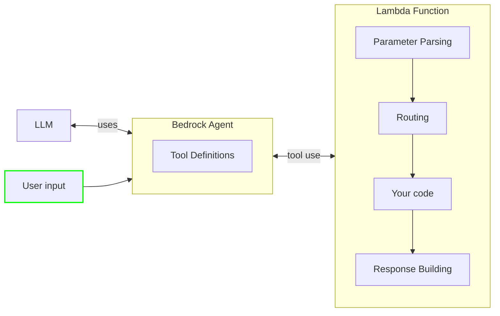

# AWS Lambda Powertools for .NET - Bedrock Agent Function Resolver

## Overview

The Bedrock Agent Function Resolver is a utility for AWS Lambda that simplifies building serverless applications working with Amazon Bedrock Agents. This library eliminates boilerplate code typically required when implementing Lambda functions that serve as action groups for Bedrock Agents.

Amazon Bedrock Agents can invoke functions to perform tasks based on user input. This library provides an elegant way to register, manage, and execute these functions with minimal code, handling all the parameter extraction and response formatting automatically.

Create [Amazon Bedrock Agents](https://docs.aws.amazon.com/bedrock/latest/userguide/agents.html#agents-how) and focus on building your agent's logic without worrying about parsing and routing requests.



## Features

* Easily expose tools for your Large Language Model (LLM) agents
* Automatic routing based on tool name and function details
* Graceful error handling and response formatting
* Fully compatible with .NET 8 AOT compilation through source generation

## Terminology

**Event handler** is a Powertools for AWS feature that processes an event, runs data parsing and validation, routes the request to a specific function, and returns a response to the caller in the proper format.

**Function details** consist of a list of parameters, defined by their name, data type, and whether they are required. The agent uses these configurations to determine what information it needs to elicit from the user.

**Action group** is a collection of two resources where you define the actions that the agent should carry out: an OpenAPI schema to define the APIs that the agent can invoke to carry out its tasks, and a Lambda function to execute those actions.

**Large Language Models (LLM)** are very large deep learning models that are pre-trained on vast amounts of data, capable of extracting meanings from a sequence of text and understanding the relationship between words and phrases on it.

**Amazon Bedrock Agent** is an Amazon Bedrock feature to build and deploy conversational agents that can interact with your customers using Large Language Models (LLM) and AWS Lambda functions.

!!! warning "Migrating to v3"

    If you're upgrading to v3, please review the [Migration Guide v3](../migration-guide-v3.md) for important breaking changes including .NET 8 requirement and AWS SDK v4 migration.

## Installation

Install the package via NuGet:

```bash
dotnet add package AWS.Lambda.Powertools.EventHandler.Resolvers.BedrockAgentFunction
```

### Required resources

You must create an Amazon Bedrock Agent with at least one action group. Each action group can contain up to 5 tools, which in turn need to match the ones defined in your Lambda function. Bedrock must have permission to invoke your Lambda function.

??? note "Click to see example SAM template"
    ```yaml
    AWSTemplateFormatVersion: '2010-09-09'
    Transform: AWS::Serverless-2016-10-31

    Globals:
    Function:
        Timeout: 30
        MemorySize: 256
        Runtime: dotnet8

    Resources:
    HelloWorldFunction:
        Type: AWS::Serverless::Function
        Properties:
        Handler: FunctionHandler
        CodeUri: hello_world

    AirlineAgentRole:
        Type: AWS::IAM::Role
        Properties:
        RoleName: !Sub '${AWS::StackName}-AirlineAgentRole'
        Description: 'Role for Bedrock Airline agent'
        AssumeRolePolicyDocument:
            Version: '2012-10-17'
            Statement:
            - Effect: Allow
                Principal:
                Service: bedrock.amazonaws.com
                Action: sts:AssumeRole
        Policies:
            - PolicyName: bedrock
            PolicyDocument:
                Version: '2012-10-17'
                Statement:
                - Effect: Allow
                    Action: 'bedrock:*'
                    Resource:
                    - !Sub 'arn:aws:bedrock:us-*::foundation-model/*'
                    - !Sub 'arn:aws:bedrock:us-*:*:inference-profile/*'

    BedrockAgentInvokePermission:
        Type: AWS::Lambda::Permission
        Properties:
        FunctionName: !Ref HelloWorldFunction
        Action: lambda:InvokeFunction
        Principal: bedrock.amazonaws.com
        SourceAccount: !Ref 'AWS::AccountId'
        SourceArn: !Sub 'arn:aws:bedrock:${AWS::Region}:${AWS::AccountId}:agent/${AirlineAgent}'

    # Bedrock Agent
    AirlineAgent:
        Type: AWS::Bedrock::Agent
        Properties:
        AgentName: AirlineAgent
        Description: 'A simple Airline agent'
        FoundationModel: !Sub 'arn:aws:bedrock:us-west-2:${AWS::AccountId}:inference-profile/us.amazon.nova-pro-v1:0'
        Instruction: |
            You are an airport traffic control agent. You will be given a city name and you will return the airport code for that city.
        AgentResourceRoleArn: !GetAtt AirlineAgentRole.Arn
        AutoPrepare: true
        ActionGroups:
            - ActionGroupName: AirlineActionGroup
            ActionGroupExecutor:
                Lambda: !GetAtt AirlineAgentFunction.Arn
            FunctionSchema:
                Functions:
                - Name: getAirportCodeForCity
                    Description: 'Get the airport code for a given city'
                    Parameters:
                    city:
                        Type: string
                        Description: 'The name of the city to get the airport code for'
                        Required: true
    ```

## Basic Usage

To create an agent, use the `BedrockAgentFunctionResolver` to register your tools and handle the requests. The resolver will automatically parse the request, route it to the appropriate function, and return a well-formed response that includes the tool's output and any existing session attributes.

=== "Executable asembly"

    ```csharp
    --8<-- "docs/snippets/bedrock-agent-function/GettingStarted.cs:executable_assembly"
    ```

=== "Class Library"

    ```csharp
    --8<-- "docs/snippets/bedrock-agent-function/GettingStarted.cs:class_library"
    ```
When the Bedrock Agent invokes your Lambda function with a request to use the "GetWeather" tool and a parameter for "city", the resolver automatically extracts the parameter, passes it to your function, and formats the response.

## Response Format

You can return any type from your tool function, the library will automatically format the response in a way that Bedrock Agents expect. 

The response will include:

- The action group name
- The function name
- The function response body, which can be a text response or other structured data in string format
- Any session attributes that were passed in the request or modified during the function execution

The response body will **always be a string**. 

If you want to return an object the best practice is to override the `ToString()` method of your return type to provide a custom string representation, or if you don't override, create an anonymous object `return new {}` and pass your object, or simply return a string directly.

```csharp
--8<-- "docs/snippets/bedrock-agent-function/ResponseFormat.cs:response_format_tostring"
```

## How It Works with Amazon Bedrock Agents

1. When a user interacts with a Bedrock Agent, the agent identifies when it needs to call an action to fulfill the user's request.
2. The agent determines which function to call and what parameters are needed.
3. Bedrock sends a request to your Lambda function with the function name and parameters.
4. The BedrockAgentFunctionResolver automatically:
   - Finds the registered handler for the requested function
   - Extracts and converts parameters to the correct types
   - Invokes your handler with the parameters
   - Formats the response in the way Bedrock Agents expect
5. The agent receives the response and uses it to continue the conversation with the user

## Advanced Usage

### Custom type serialization

You can have your own custom types as arguments to the tool function. The library will automatically handle serialization and deserialization of these types. In this case, you need to ensure that your custom type is serializable to JSON, if serialization fails, the object will be null.

```csharp hl_lines="4"
--8<-- "docs/snippets/bedrock-agent-function/AdvancedUsage.cs:custom_type_serialization"
```

### Custom type serialization native AOT

For native AOT compilation, you can use JsonSerializerContext and pass it to `BedrockAgentFunctionResolver`. This allows the library to generate the necessary serialization code at compile time, ensuring compatibility with AOT.

```csharp hl_lines="1 5 12-15"
--8<-- "docs/snippets/bedrock-agent-function/AdvancedUsage.cs:custom_type_serialization_aot"
```

### Accessing Lambda Context

You can access to the original Lambda event or context for additional information. These are passed to the handler function as optional arguments.

```csharp
--8<-- "docs/snippets/bedrock-agent-function/AdvancedUsage.cs:accessing_lambda_context"
```

### Handling errors

By default, we will handle errors gracefully and return a well-formed response to the agent so that it can continue the conversation with the user.

When an error occurs, we send back an error message in the response body that includes the error type and message. The agent will then use this information to let the user know that something went wrong.

If you want to handle errors differently, you can return a `BedrockFunctionResponse` with a custom `Body` and `ResponseState` set to `FAILURE`. This is useful when you want to abort the conversation.

```csharp
--8<-- "docs/snippets/bedrock-agent-function/AdvancedUsage.cs:handling_errors"
```

### Setting session attributes

When Bedrock Agents invoke your Lambda function, it can pass session attributes that you can use to store information across multiple interactions with the user. You can access these attributes in your handler function and modify them as needed.

```csharp
--8<-- "docs/snippets/bedrock-agent-function/AdvancedUsage.cs:session_attributes"
```

### Asynchronous Functions

Register and use asynchronous functions:

```csharp
--8<-- "docs/snippets/bedrock-agent-function/AdvancedUsage.cs:async_functions"
```

### Direct Access to Request Payload

Access the raw Bedrock Agent request:

```csharp
--8<-- "docs/snippets/bedrock-agent-function/AdvancedUsage.cs:direct_access_request"
```

## Dependency Injection

The library supports dependency injection for integrating with services:

```csharp
--8<-- "docs/snippets/bedrock-agent-function/DependencyInjection.cs:dependency_injection"
```

## Using Attributes to Define Tools

You can define Bedrock Agent functions using attributes instead of explicit registration. This approach provides a clean, declarative way to organize your tools into classes:

### Define Tool Classes with Attributes

```csharp
--8<-- "docs/snippets/bedrock-agent-function/DependencyInjection.cs:attribute_tool_classes"
```

### Register Tool Classes in Your Application

Using the extension method provided in the library, you can easily register all tools from a class:

```csharp
--8<-- "docs/snippets/bedrock-agent-function/DependencyInjection.cs:register_tool_classes"
```

## Complete Example with Dependency Injection

You can find examples in the [Powertools for AWS Lambda (.NET) GitHub repository](https://github.com/aws-powertools/powertools-lambda-dotnet/tree/develop/examples/Event%20Handler/BedrockAgentFunction).


```csharp
--8<-- "docs/snippets/bedrock-agent-function/CompleteExample.cs:complete_example_with_di"
```