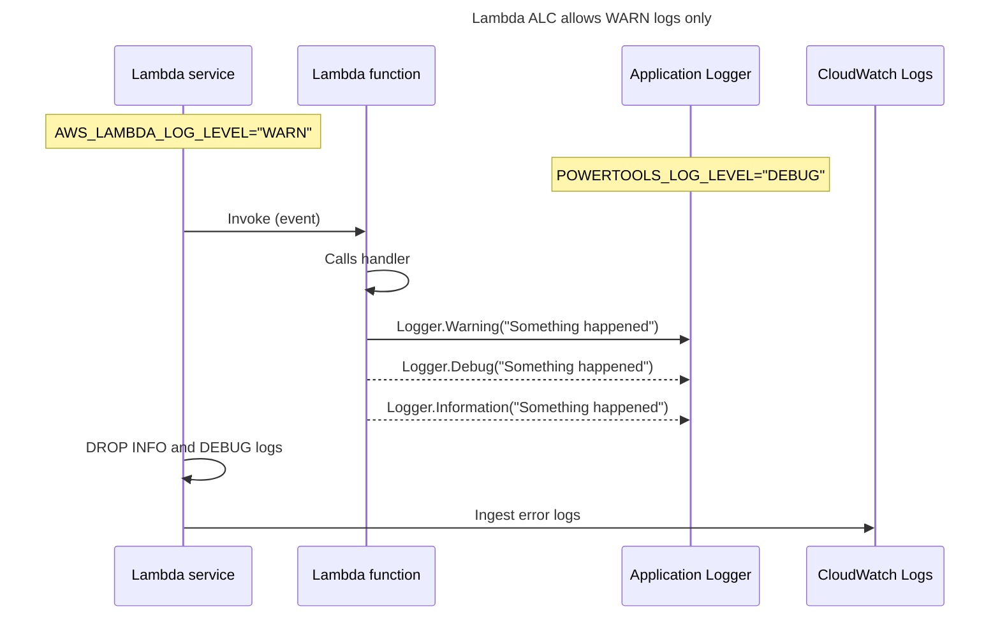
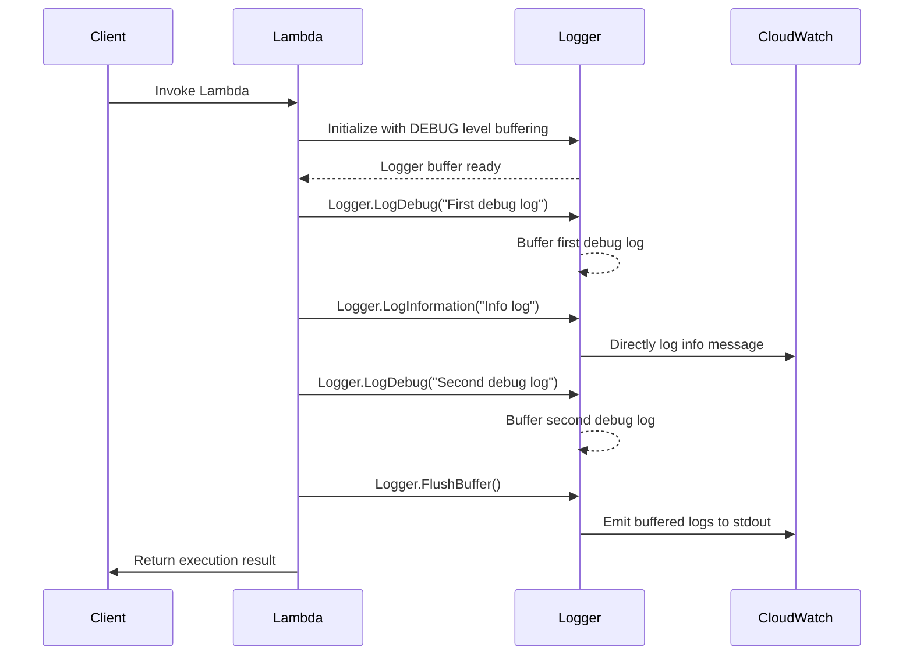
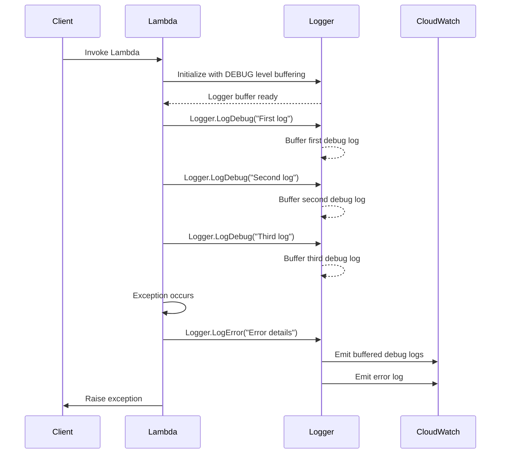
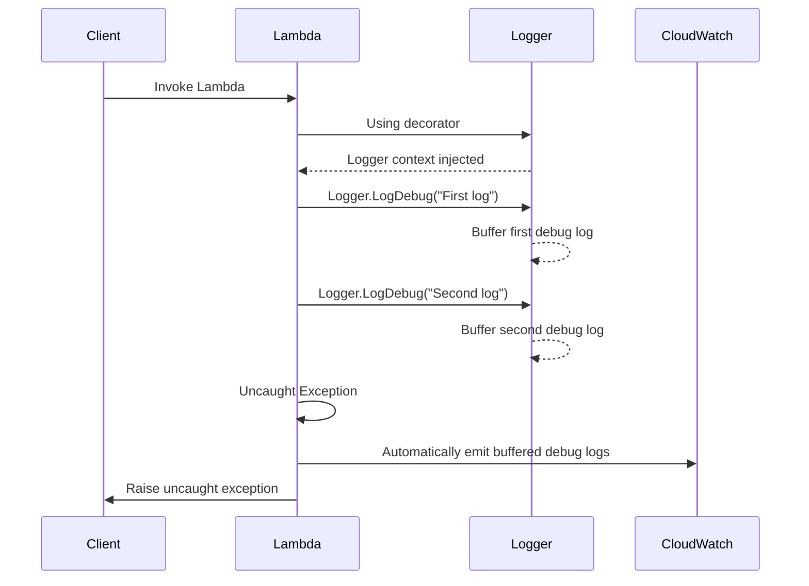

The logging utility provides a Lambda optimized logger with output structured as JSON.

## Key features

* Capture key fields from Lambda context, cold start and structures logging output as JSON
* Log Lambda event when instructed (disabled by default)
* Log sampling enables DEBUG log level for a percentage of requests (disabled by default)
* Append additional keys to structured log at any point in time
* Ahead-of-Time compilation to native code
  support [AOT](https://docs.aws.amazon.com/lambda/latest/dg/dotnet-native-aot.html)
* Custom log formatter to override default log structure
* Support
  for [AWS Lambda Advanced Logging Controls (ALC)](https://docs.aws.amazon.com/lambda/latest/dg/monitoring-cloudwatchlogs-advanced.html)
  {target="_blank"}
* Support for Microsoft.Extensions.Logging
  and [ILogger](https://learn.microsoft.com/en-us/dotnet/api/microsoft.extensions.logging.ilogger?view=dotnet-plat-ext-7.0)
  interface
* Support
  for [ILoggerFactory](https://learn.microsoft.com/en-us/dotnet/api/microsoft.extensions.logging.iloggerfactory?view=dotnet-plat-ext-7.0)
  interface
* Support for message templates `{}` and `{@}` for structured logging

!!! warning "Migrating to v3"

    If you're upgrading to v3, please review the [Migration Guide v3](../migration-guide-v3.md) for important breaking changes including .NET 8 requirement and AWS SDK v4 migration.

## Installation

Powertools for AWS Lambda (.NET) are available as NuGet packages. You can install the packages
from [NuGet Gallery](https://www.nuget.org/packages?q=AWS+Lambda+Powertools*){target="_blank"} or from Visual Studio
editor by searching `AWS.Lambda.Powertools*` to see various utilities available.

* [AWS.Lambda.Powertools.Logging](https://www.nuget.org/packages?q=AWS.Lambda.Powertools.Logging):

  `dotnet add package AWS.Lambda.Powertools.Logging`

## Getting started

!!! info

    AOT Support
    If loooking for AOT specific configurations navigate to the [AOT section](#aot-support)    

Logging requires two settings:

 Setting           | Description                                                         | Environment variable      | Attribute parameter 
-------------------|---------------------------------------------------------------------|---------------------------|---------------------
 **Service**       | Sets **Service** key that will be present across all log statements | `POWERTOOLS_SERVICE_NAME` | `Service`           
 **Logging level** | Sets how verbose Logger should be (Information, by default)         | `POWERTOOLS_LOG_LEVEL`    | `LogLevel`          

### Full list of environment variables

| Environment variable              | Description                                                                            | Default               |
|-----------------------------------|----------------------------------------------------------------------------------------|-----------------------|
| **POWERTOOLS_SERVICE_NAME**       | Sets service name used for tracing namespace, metrics dimension and structured logging | `"service_undefined"` |
| **POWERTOOLS_LOG_LEVEL**          | Sets logging level                                                                     | `Information`         |
| **POWERTOOLS_LOGGER_CASE**        | Override the default casing for log keys                                               | `SnakeCase`           |
| **POWERTOOLS_LOGGER_LOG_EVENT**   | Logs incoming event                                                                    | `false`               |
| **POWERTOOLS_LOGGER_SAMPLE_RATE** | Debug log sampling                                                                     | `0`                   |

### Setting up the logger

You can set up the logger in different ways. The most common way is to use the `Logging` attribute on your Lambda.
You can also use the `ILogger` interface to log messages. This interface is part of the Microsoft.Extensions.Logging.

=== "Using decorator"

    ```c# hl_lines="6 10"
        /**
         * Handler for requests to Lambda function.
         */
        public class Function
        {
            [Logging(Service = "payment", LogLevel = LogLevel.Debug)]
            public async Task<APIGatewayProxyResponse> FunctionHandler
                (APIGatewayProxyRequest apigProxyEvent, ILambdaContext context)
            {
                Logger.LogInformation("Collecting payment");
                ...
            }
        }
    ```

=== "Logger Factory"

    ```c# hl_lines="6 10-17 23"
        /**
         * Handler for requests to Lambda function.
         */
        public class Function
        {
            private readonly ILogger _logger;
    
            public Function(ILoggerFactory loggerFactory)
            {
                _logger = loggerFactory.Create(builder =>
                {
                    builder.AddPowertoolsLogger(config =>
                    {
                        config.Service = "TestService";
                        config.LoggerOutputCase = LoggerOutputCase.PascalCase;
                    });
                }).CreatePowertoolsLogger();
            }
    
            public async Task<APIGatewayProxyResponse> FunctionHandler
                (APIGatewayProxyRequest apigProxyEvent, ILambdaContext context)
            {
                _logger.LogInformation("Collecting payment");
                ...
            }
        }
    ```

=== "With Builder"

    ```c# hl_lines="6 10-13 19"
        /**
         * Handler for requests to Lambda function.
         */
        public class Function
        {
            private readonly ILogger _logger;
    
            public Function(ILogger logger)
            {
                _logger = logger ?? new PowertoolsLoggerBuilder()
                    .WithService("TestService")
                    .WithOutputCase(LoggerOutputCase.PascalCase)
                    .Build();
            }
    
            public async Task<APIGatewayProxyResponse> FunctionHandler
                (APIGatewayProxyRequest apigProxyEvent, ILambdaContext context)
            {
                _logger.LogInformation("Collecting payment");
                ...
            }
        }
    ```

### Customizing the logger

You can customize the logger by setting the following properties in the `Logger.Configure` method:

| Property               | Description                                                                                      |
|:----------------------|--------------------------------------------------------------------------------------------------|
| `Service`             | The name of the service. This is used to identify the service in the logs.                      |
| `MinimumLogLevel`            | The minimum log level to log. This is used to filter out logs below the specified level.         |
| `LogFormatter`        | The log formatter to use. This is used to customize the structure of the log entries.            |
| `JsonOptions`         | The JSON options to use. This is used to customize the serialization of logs.|
| `LogBuffering`        | The log buffering options. This is used to configure log buffering.                             |
| `TimestampFormat`     | The format of the timestamp. This is used to customize the format of the timestamp in the logs.|
| `SamplingRate`       | Sets a percentage (0.0 to 1.0) of logs that will be dynamically elevated to DEBUG level   |
| `LoggerOutputCase`   | The output casing of the logger. This is used to customize the casing of the log entries.       |
| `LogOutput`        | Specifies the console output wrapper used for writing logs. This property allows redirecting log output for testing or specialized handling scenarios.           |


### Configuration

You can configure Powertools Logger using the static `Logger` class. This class is a singleton and is created when the
Lambda function is initialized. You can configure the logger using the `Logger.Configure` method.

=== "Configure static Logger"

```c# hl_lines="5-9"
    public class Function
    {
        public Function()
        {
            Logger.Configure(options =>
            {
                options.MinimumLogLevel = LogLevel.Information;
                options.LoggerOutputCase = LoggerOutputCase.CamelCase;
            });
        }

        public async Task<APIGatewayProxyResponse> FunctionHandler
            (APIGatewayProxyRequest apigProxyEvent, ILambdaContext context)
        {
            Logger.LogInformation("Collecting payment");
            ...
        }
    }
```

### ILogger
You can also use the `ILogger` interface to log messages. This interface is part of the Microsoft.Extensions.Logging.
With this approach you get more flexibility and testability using dependency injection (DI).

=== "Configure with LoggerFactory or Builder"

    ```c# hl_lines="5-12"
        public class Function
        {
            public Function(ILogger logger)
            {
                _logger = logger ?? LoggerFactory.Create(builder =>
                {
                    builder.AddPowertoolsLogger(config =>
                    {
                        config.Service = "TestService";
                        config.LoggerOutputCase = LoggerOutputCase.PascalCase;
                    });
                }).CreatePowertoolsLogger();
            }
    
            public async Task<APIGatewayProxyResponse> FunctionHandler
                (APIGatewayProxyRequest apigProxyEvent, ILambdaContext context)
            {
                Logger.LogInformation("Collecting payment");
                ...
            }
        }
    ```

## Standard structured keys

Your logs will always include the following keys to your structured logging:

 Key                    | Type   | Example                                                                                              | Description                                                            
------------------------|--------|------------------------------------------------------------------------------------------------------|------------------------------------------------------------------------
 **Level**              | string | "Information"                                                                                        | Logging level                                                          
 **Message**            | string | "Collecting payment"                                                                                 | Log statement value. Unserializable JSON values will be cast to string 
 **Timestamp**          | string | "2020-05-24 18:17:33,774"                                                                            | Timestamp of actual log statement                                      
 **Service**            | string | "payment"                                                                                            | Service name defined. "service_undefined" will be used if unknown      
 **ColdStart**          | bool   | true                                                                                                 | ColdStart value.                                                       
 **FunctionName**       | string | "example-powertools-HelloWorldFunction-1P1Z6B39FLU73"                                                
 **FunctionMemorySize** | string | "128"                                                                                                
 **FunctionArn**        | string | "arn:aws:lambda:eu-west-1:012345678910:function:example-powertools-HelloWorldFunction-1P1Z6B39FLU73" 
 **FunctionRequestId**  | string | "899856cb-83d1-40d7-8611-9e78f15f32f4"                                                               | AWS Request ID from lambda context                                     
 **FunctionVersion**    | string | "12"                                                                                                 
 **XRayTraceId**        | string | "1-5759e988-bd862e3fe1be46a994272793"                                                                | X-Ray Trace ID when Lambda function has enabled Tracing                
 **Name**               | string | "Powertools for AWS Lambda (.NET) Logger"                                                            | Logger name                                                            
 **SamplingRate**       | int    | 0.1                                                                                                  | Debug logging sampling rate in percentage e.g. 10% in this case        
 **Customer Keys**      |        |                                                                                                      |

!!! Warning
    If you emit a log message with a key that matches one of `level`, `message`, `name`, `service`, or `timestamp`, the Logger will ignore the key.

## Message templates

You can use message templates to extract properties from your objects and log them as structured data.

!!! info

    Override the `ToString()` method of your object to return a meaningful string representation of the object.

    This is especially important when using `{}` to log the object as a string.

    ```csharp
        public class User
        {
            public string FirstName { get; set; }
            public string LastName { get; set; }
            public int Age { get; set; }

            public override string ToString()
            {
                return $"{LastName}, {FirstName} ({Age})";
            }
        }
    ```

If you want to log the object as a JSON object, use `{@}`. This will serialize the object and log it as a JSON object.

=== "Message template {@}"

    ```c# hl_lines="7-14"
        public class Function
        {
            [Logging(Service = "user-service", LogLevel = LogLevel.Information)]
            public async Task<APIGatewayProxyResponse> FunctionHandler
                (APIGatewayProxyRequest apigProxyEvent, ILambdaContext context)
            {
                var user = new User
                {
                    FirstName = "John",
                    LastName = "Doe",
                    Age = 42
                };

                logger.LogInformation("User object: {@user}", user);
                ...
            }
        }
    ```

=== "{@} Output"

    ```json hl_lines="3 8-12"
    {
        "level": "Information",
        "message": "User object: Doe, John (42)",
        "timestamp": "2025-04-07 09:06:30.708",
        "service": "user-service",
        "coldStart": true,
        "name": "AWS.Lambda.Powertools.Logging.Logger",
        "user": {
            "firstName": "John",
            "lastName": "Doe",
            "age": 42
        },
        ...
    }
    ```

If you want to log the object as a string, use `{}`. This will call the `ToString()` method of the object and log it as
a string.

=== "Message template {} ToString"

    ```c# hl_lines="7-12 14 18 19"
        public class Function
        {
            [Logging(Service = "user", LogLevel = LogLevel.Information)]
            public async Task<APIGatewayProxyResponse> FunctionHandler
                (APIGatewayProxyRequest apigProxyEvent, ILambdaContext context)
            {
                var user = new User
                {
                    FirstName = "John",
                    LastName = "Doe",
                    Age = 42
                };

                logger.LogInformation("User data: {user}", user);
                
                // Also works with numbers, dates, etc.

                logger.LogInformation("Price: {price:0.00}", 123.4567); // will respect decimal places
                logger.LogInformation("Percentage: {percent:0.0%}", 0.1234);
                ...
            }
        }
    ```

=== "Output {} ToString"

    ```json hl_lines="3 8 12 17 21 26"
    {
        "level": "Information",
        "message": "User data: Doe, John (42)",
        "timestamp": "2025-04-07 09:06:30.689",
        "service": "user-servoice",
        "coldStart": true,
        "name": "AWS.Lambda.Powertools.Logging.Logger",
        "user": "Doe, John (42)"
    }
    {
        "level": "Information",
        "message": "Price: 123.46",
        "timestamp": "2025-04-07 09:23:01.235",
        "service": "user-servoice",
        "cold_start": true,
        "name": "AWS.Lambda.Powertools.Logging.Logger",
        "price": 123.46
    }
    {
        "level": "Information",
        "message": "Percentage: 12.3%",
        "timestamp": "2025-04-07 09:23:01.260",
        "service": "user-servoice",
        "cold_start": true,
        "name": "AWS.Lambda.Powertools.Logging.Logger",
        "percent": "12.3%"
    }
    ```


## Logging incoming event

When debugging in non-production environments, you can instruct Logger to log the incoming event with `LogEvent`
parameter or via `POWERTOOLS_LOGGER_LOG_EVENT` environment variable.

!!! warning
    Log event is disabled by default to prevent sensitive info being logged.

=== "Function.cs"

    ```c# hl_lines="6"
    /**
     * Handler for requests to Lambda function.
     */
    public class Function
    {
        [Logging(LogEvent = true)]
        public async Task<APIGatewayProxyResponse> FunctionHandler
            (APIGatewayProxyRequest apigProxyEvent, ILambdaContext context)
        {
            ...
        }
    }
    ```

## Setting a Correlation ID

You can set a Correlation ID using `CorrelationIdPath` parameter by passing
a [JSON Pointer expression](https://datatracker.ietf.org/doc/html/draft-ietf-appsawg-json-pointer-03){target="_blank"}.

!!! Attention
    The JSON Pointer expression is `case sensitive`. In the bellow example `/headers/my_request_id_header` would work but
    `/Headers/my_request_id_header` would not find the element.

=== "Function.cs"

    ```c# hl_lines="6"
    /**
     * Handler for requests to Lambda function.
     */
    public class Function
    {
        [Logging(CorrelationIdPath = "/headers/my_request_id_header")]
        public async Task<APIGatewayProxyResponse> FunctionHandler
            (APIGatewayProxyRequest apigProxyEvent, ILambdaContext context)
        {
            ...
        }
    }
    ```

=== "Example Event"

    ```json hl_lines="3"
    {
        "headers": {
            "my_request_id_header": "correlation_id_value"
        }
    }
    ```

=== "Example CloudWatch Logs excerpt"

    ```json hl_lines="15"
    {
        "level": "Information",
        "message": "Collecting payment",
        "timestamp": "2021-12-13T20:32:22.5774262Z",
        "service": "lambda-example",
        "cold_start": true,
        "function_name": "test",
        "function_memory_size": 128,
        "function_arn": "arn:aws:lambda:eu-west-1:12345678910:function:test",
        "function_request_id": "52fdfc07-2182-154f-163f-5f0f9a621d72",
        "function_version": "$LATEST",
        "xray_trace_id": "1-61b7add4-66532bb81441e1b060389429",
        "name": "AWS.Lambda.Powertools.Logging.Logger",
        "sampling_rate": 0.7,
        "correlation_id": "correlation_id_value",
    }
    ```

We provide [built-in JSON Pointer expression](https://datatracker.ietf.org/doc/html/draft-ietf-appsawg-json-pointer-03)
{target="_blank"}
for known event sources, where either a request ID or X-Ray Trace ID are present.

=== "Function.cs"

    ```c# hl_lines="6"
    /**
     * Handler for requests to Lambda function.
     */
    public class Function
    {
        [Logging(CorrelationIdPath = CorrelationIdPaths.ApiGatewayRest)]
        public async Task<APIGatewayProxyResponse> FunctionHandler
            (APIGatewayProxyRequest apigProxyEvent, ILambdaContext context)
        {
            ...
        }
    }
    ```

=== "Example Event"

    ```json hl_lines="3"
    {
        "RequestContext": {
            "RequestId": "correlation_id_value"
        }
    }
    ```

=== "Example CloudWatch Logs excerpt"

    ```json hl_lines="15"
    {
        "level": "Information",
        "message": "Collecting payment",
        "timestamp": "2021-12-13T20:32:22.5774262Z",
        "service": "lambda-example",
        "cold_start": true,
        "function_name": "test",
        "function_memory_size": 128,
        "function_arn": "arn:aws:lambda:eu-west-1:12345678910:function:test",
        "function_request_id": "52fdfc07-2182-154f-163f-5f0f9a621d72",
        "function_version": "$LATEST",
        "xray_trace_id": "1-61b7add4-66532bb81441e1b060389429",
        "name": "AWS.Lambda.Powertools.Logging.Logger",
        "sampling_rate": 0.7,
        "correlation_id": "correlation_id_value",
    }
    ```

## Appending additional keys

!!! info "Custom keys are persisted across warm invocations"
    Always set additional keys as part of your handler to ensure they have the latest value, or explicitly clear them with [
    `ClearState=true`](#clearing-all-state).

You can append your own keys to your existing logs via `AppendKey`. Typically this value would be passed into the
function via the event. Appended keys are added to all subsequent log entries in the current execution from the point
the logger method is called. To ensure the key is added to all log entries, call this method as early as possible in the
Lambda handler.

=== "Function.cs"

    ```c# hl_lines="21"
    /**
     * Handler for requests to Lambda function.
     */
    public class Function
    {
        [Logging(LogEvent = true)]
        public async Task<APIGatewayProxyResponse> FunctionHandler(APIGatewayProxyRequest apigwProxyEvent,
            ILambdaContext context)
        {
            var requestContextRequestId = apigwProxyEvent.RequestContext.RequestId;
            
        var lookupInfo = new Dictionary<string, object>()
        {
            {"LookupInfo", new Dictionary<string, object>{{ "LookupId", requestContextRequestId }}}
        };  

        // Appended keys are added to all subsequent log entries in the current execution.
        // Call this method as early as possible in the Lambda handler.
        // Typically this is value would be passed into the function via the event.
        // Set the ClearState = true to force the removal of keys across invocations,
        Logger.AppendKeys(lookupInfo);

        Logger.LogInformation("Getting ip address from external service");

    }
    ```

=== "Example CloudWatch Logs excerpt"

    ```json hl_lines="4 5 6"
    {
        "level": "Information",
        "message": "Getting ip address from external service"
        "timestamp": "2022-03-14T07:25:20.9418065Z",
        "service": "powertools-dotnet-logging-sample",
        "cold_start": false,
        "function_name": "PowertoolsLoggingSample-HelloWorldFunction-hm1r10VT3lCy",
        "function_memory_size": 256,
        "function_arn": "arn:aws:lambda:function:PowertoolsLoggingSample-HelloWorldFunction-hm1r10VT3lCy",
        "function_request_id": "96570b2c-f00e-471c-94ad-b25e95ba7347",
        "function_version": "$LATEST",
        "xray_trace_id": "1-622eede0-647960c56a91f3b071a9fff1",
        "name": "AWS.Lambda.Powertools.Logging.Logger",
        "lookup_info": {
            "lookup_id": "4c50eace-8b1e-43d3-92ba-0efacf5d1625"
        },
    }
    ```

### Removing additional keys

You can remove any additional key from entry using `Logger.RemoveKeys()`.

=== "Function.cs"

    ```c# hl_lines="21 22"
    /**
     * Handler for requests to Lambda function.
     */
    public class Function
    {
        [Logging(LogEvent = true)]
        public async Task<APIGatewayProxyResponse> FunctionHandler
            (APIGatewayProxyRequest apigProxyEvent, ILambdaContext context)
        {
            ...
            Logger.AppendKey("test", "willBeLogged");
            ...
            var customKeys = new Dictionary<string, string>
            {
                {"test1", "value1"}, 
                {"test2", "value2"}
            };
            
            Logger.AppendKeys(customKeys);
            ...
            Logger.RemoveKeys("test");
            Logger.RemoveKeys("test1", "test2");
            ...
        }
    }
    ```

### Temporary keys with ExtraKeys

The `ExtraKeys` method allows temporary modification of the Logger's context without manual cleanup. It's useful for adding context keys to specific workflows while maintaining the logger's overall state.

Keys are automatically removed when the scope ends, eliminating the need to manually call `AppendKey` and `RemoveKeys`.

=== "Using Dictionary"

    ```c# hl_lines="12-16"
    /**
     * Handler for requests to Lambda function.
     */
    public class Function
    {
        [Logging]
        public async Task<APIGatewayProxyResponse> FunctionHandler
            (APIGatewayProxyRequest apigProxyEvent, ILambdaContext context)
        {
            var orderId = apigProxyEvent.PathParameters["orderId"];
            
            using (Logger.ExtraKeys(new Dictionary<string, object> { { "orderId", orderId } }))
            {
                Logger.LogInformation("Processing order");
                await ProcessOrderAsync(orderId);
                Logger.LogInformation("Order processed"); // orderId included
            }
            // orderId is automatically removed
            
            Logger.LogInformation("Continuing without orderId");
        }
    }
    ```

=== "Using Tuples"

    ```c# hl_lines="12-16"
    /**
     * Handler for requests to Lambda function.
     */
    public class Function
    {
        [Logging]
        public async Task<APIGatewayProxyResponse> FunctionHandler
            (APIGatewayProxyRequest apigProxyEvent, ILambdaContext context)
        {
            var orderId = apigProxyEvent.PathParameters["orderId"];
            
            using (Logger.ExtraKeys(("orderId", orderId), ("customerId", "customer-123")))
            {
                Logger.LogInformation("Processing order");
                await ProcessOrderAsync(orderId);
                Logger.LogInformation("Order processed"); // orderId and customerId included
            }
            // Both keys are automatically removed
        }
    }
    ```

=== "Nested Scopes"

    ```c# hl_lines="10-19"
    /**
     * Handler for requests to Lambda function.
     */
    public class Function
    {
        [Logging]
        public async Task<APIGatewayProxyResponse> FunctionHandler
            (APIGatewayProxyRequest apigProxyEvent, ILambdaContext context)
        {
            using (Logger.ExtraKeys(("requestId", context.AwsRequestId)))
            {
                Logger.LogInformation("Starting request"); // requestId included
                
                using (Logger.ExtraKeys(("step", "validation")))
                {
                    Logger.LogInformation("Validating"); // requestId AND step included
                }
                // step removed, requestId still present
                
                Logger.LogInformation("Request complete"); // only requestId
            }
        }
    }
    ```

=== "Example CloudWatch Logs excerpt"

    ```json hl_lines="14 15"
    {
        "level": "Information",
        "message": "Processing order",
        "timestamp": "2024-01-15T10:30:00.0000000Z",
        "service": "order-service",
        "cold_start": true,
        "function_name": "OrderProcessor",
        "function_memory_size": 256,
        "function_arn": "arn:aws:lambda:eu-west-1:123456789:function:OrderProcessor",
        "function_request_id": "abc-123-def",
        "function_version": "$LATEST",
        "xray_trace_id": "1-abc-123",
        "name": "AWS.Lambda.Powertools.Logging.Logger",
        "order_id": "order-456",
        "customer_id": "customer-123"
    }
    ```

!!! tip "When to use ExtraKeys vs AppendKey"
    Use `ExtraKeys` when you need keys for a specific operation or code block. Use `AppendKey` when keys should persist for the entire Lambda invocation.

!!! info "Async safe"
    `ExtraKeys` is safe to use across `async/await` boundaries. Keys will correctly flow through asynchronous operations within the same execution context.

## Extra Keys (Single Log Entry)

Extra keys can also be added to a single log entry using message templates. Unlike `AppendKey` or `ExtraKeys()`, these keys will only apply to the current log entry.

Extra keys argument is available for all log levels' methods, as implemented in the standard logging library - e.g.
Logger.Information, Logger.Warning.

It accepts any dictionary, and all keyword arguments will be added as part of the root structure of the logs for that
log statement.

!!! info
    Any keyword argument added using extra keys will not be persisted for subsequent messages.

=== "Function.cs"

    ```c# hl_lines="16"
    /**
     * Handler for requests to Lambda function.
     */
    public class Function
    {
        [Logging(LogEvent = true)]
        public async Task<APIGatewayProxyResponse> FunctionHandler(APIGatewayProxyRequest apigwProxyEvent,
            ILambdaContext context)
        {
            var requestContextRequestId = apigwProxyEvent.RequestContext.RequestId;
            
            var lookupId = new Dictionary<string, object>()
            {
                { "LookupId", requestContextRequestId }
            };

            // Appended keys are added to all subsequent log entries in the current execution.
            // Call this method as early as possible in the Lambda handler.
            // Typically this is value would be passed into the function via the event.
            // Set the ClearState = true to force the removal of keys across invocations,
            Logger.AppendKeys(lookupId);
    }
    ```

### Clearing all state

Logger is commonly initialized in the global scope. Due
to [Lambda Execution Context reuse](https://docs.aws.amazon.com/lambda/latest/dg/runtimes-context.html), this means that
custom keys can be persisted across invocations. If you want all custom keys to be deleted, you can use
`ClearState=true` attribute on `[Logging]` attribute.

=== "Function.cs"

    ```cs hl_lines="6 13"
    /**
     * Handler for requests to Lambda function.
     */
    public class Function
    {
        [Logging(ClearState = true)]
        public async Task<APIGatewayProxyResponse> FunctionHandler
            (APIGatewayProxyRequest apigProxyEvent, ILambdaContext context)
        {
            ...
            if (apigProxyEvent.Headers.ContainsKey("SomeSpecialHeader"))
            {
                Logger.AppendKey("SpecialKey", "value");
            }

            Logger.LogInformation("Collecting payment");
            ...
        }
    }
    ```

=== "#1 Request"

    ```json hl_lines="11"
    {
        "level": "Information",
        "message": "Collecting payment",
        "timestamp": "2021-12-13T20:32:22.5774262Z",
        "service": "payment",
        "cold_start": true,
        "function_name": "test",
        "function_memory_size": 128,
        "function_arn": "arn:aws:lambda:eu-west-1:12345678910:function:test",
        "function_request_id": "52fdfc07-2182-154f-163f-5f0f9a621d72",
        "special_key": "value"
    }
    ```

=== "#2 Request"

    ```json
    {
        "level": "Information",
        "message": "Collecting payment",
        "timestamp": "2021-12-13T20:32:22.5774262Z",
        "service": "payment",
        "cold_start": true,
        "function_name": "test",
        "function_memory_size": 128,
        "function_arn": "arn:aws:lambda:eu-west-1:12345678910:function:test",
        "function_request_id": "52fdfc07-2182-154f-163f-5f0f9a621d72"
    }
    ```

## Sampling debug logs

Use sampling when you want to dynamically change your log level to **DEBUG** based on a **percentage of the Lambda function invocations**.

You can use values ranging from `0.0` to `1` (100%) when setting `POWERTOOLS_LOGGER_SAMPLE_RATE` env var, or `SamplingRate` parameter in Logger.

???+ tip "Tip: When is this useful?"
    Log sampling allows you to capture debug information for a fraction of your requests, helping you diagnose rare or intermittent issues without increasing the overall verbosity of your logs.

    Example: Imagine an e-commerce checkout process where you want to understand rare payment gateway errors. With 10% sampling, you'll log detailed information for a small subset of transactions, making troubleshooting easier without generating excessive logs.

The sampling decision happens automatically with each invocation when using `Logger` decorator.  When not using the decorator, you're in charge of refreshing it via `RefreshSampleRateCalculation` method. Skipping both may lead to unexpected sampling results.

=== "Sampling via attribute parameter"

    ```c# hl_lines="6"
    /**
     * Handler for requests to Lambda function.
     */
    public class Function
    {
        [Logging(SamplingRate = 0.5)]
        public async Task<APIGatewayProxyResponse> FunctionHandler
            (APIGatewayProxyRequest apigProxyEvent, ILambdaContext context)
        {
            ...
        }
    }
    ```

=== "Sampling Logger.Configure"

    ```c# hl_lines="5-10 16"
    public class Function
    {
        public Function()
        {
            Logger.Configure(options =>
            {
                options.MinimumLogLevel = LogLevel.Information;
                options.LoggerOutputCase = LoggerOutputCase.CamelCase;
                options.SamplingRate = 0.1; // 10% sampling
            });
        }

        public async Task<APIGatewayProxyResponse> FunctionHandler
            (APIGatewayProxyRequest apigProxyEvent, ILambdaContext context)
        {
            Logger.RefreshSampleRateCalculation();            
            ...
        }
    }
    ```

=== "Sampling via environment variable"

    ```yaml hl_lines="8"

    Resources:
        HelloWorldFunction:
            Type: AWS::Serverless::Function
            Properties:
            ...
            Environment:
                Variables:
                    POWERTOOLS_LOGGER_SAMPLE_RATE: 0.5
    ```

## Configure Log Output Casing

By definition Powertools for AWS Lambda (.NET) outputs logging keys using **snake case** (e.g. *"function_memory_size":
128*). This allows developers using different Powertools for AWS Lambda (.NET) runtimes, to search logs across services
written in languages such as Python or TypeScript.

If you want to override the default behavior you can either set the desired casing through attributes, as described in
the example below, or by setting the `POWERTOOLS_LOGGER_CASE` environment variable on your AWS Lambda function. Allowed
values are: `CamelCase`, `PascalCase` and `SnakeCase`.

=== "Output casing via attribute parameter"

    ```c# hl_lines="6"
    /**
     * Handler for requests to Lambda function.
     */
    public class Function
    {
        [Logging(LoggerOutputCase = LoggerOutputCase.CamelCase)]
        public async Task<APIGatewayProxyResponse> FunctionHandler
            (APIGatewayProxyRequest apigProxyEvent, ILambdaContext context)
        {
            ...
        }
    }
    ```

Below are some output examples for different casing.

=== "Camel Case"

    ```json
    {
        "level": "Information",
        "message": "Collecting payment",
        "timestamp": "2021-12-13T20:32:22.5774262Z",
        "service": "payment",
        "coldStart": true,
        "functionName": "test",
        "functionMemorySize": 128,
        "functionArn": "arn:aws:lambda:eu-west-1:12345678910:function:test",
        "functionRequestId": "52fdfc07-2182-154f-163f-5f0f9a621d72"
    }
    ```

=== "Pascal Case"

    ```json
    {
        "Level": "Information",
        "Message": "Collecting payment",
        "Timestamp": "2021-12-13T20:32:22.5774262Z",
        "Service": "payment",
        "ColdStart": true,
        "FunctionName": "test",
        "FunctionMemorySize": 128,
        "FunctionArn": "arn:aws:lambda:eu-west-1:12345678910:function:test",
        "FunctionRequestId": "52fdfc07-2182-154f-163f-5f0f9a621d72"
    }
    ```

=== "Snake Case"

    ```json
    {
        "level": "Information",
        "message": "Collecting payment",
        "timestamp": "2021-12-13T20:32:22.5774262Z",
        "service": "payment",
        "cold_start": true,
        "function_name": "test",
        "function_memory_size": 128,
        "function_arn": "arn:aws:lambda:eu-west-1:12345678910:function:test",
        "function_request_id": "52fdfc07-2182-154f-163f-5f0f9a621d72"
    }
    ```


## Advanced

### Log Levels

The default log level is `Information` and can be set using the `MinimumLogLevel` property option or by using the `POWERTOOLS_LOG_LEVEL` environment variable.

We support the following log levels:

| Level         | Numeric value | Lambda Level |
|---------------|---------------|--------------|
| `Trace`       | 0             | `trace`      |
| `Debug`       | 1             | `debug`      |
| `Information` | 2             | `info`       |
| `Warning`     | 3             | `warn`       |
| `Error`       | 4             | `error`      |
| `Critical`    | 5             | `fatal`       |
| `None`        | 6             |              |

### Using AWS Lambda Advanced Logging Controls (ALC)

!!! question "When is it useful?"
    When you want to set a logging policy to drop informational or verbose logs for one or all AWS Lambda functions,
    regardless of runtime and logger used.

With [AWS Lambda Advanced Logging Controls (ALC)](https://docs.aws.amazon.com/lambda/latest/dg/monitoring-cloudwatchlogs.html#monitoring-cloudwatchlogs-advanced)
{target="_blank"}, you can enforce a minimum log level that Lambda will accept from your application code.

When enabled, you should keep `Logger` and ALC log level in sync to avoid data loss.

!!! warning "When using AWS Lambda Advanced Logging Controls (ALC)"
    - When Powertools Logger output is set to `PascalCase` **`Level`**  property name will be replaced by **`LogLevel`** as
    a property name.
    - ALC takes precedence over **`POWERTOOLS_LOG_LEVEL`** and when setting it in code using **`[Logging(LogLevel = )]`**

Here's a sequence diagram to demonstrate how ALC will drop both `Information` and `Debug` logs emitted from `Logger`,
when ALC log level is stricter than `Logger`.



**Priority of log level settings in Powertools for AWS Lambda**

We prioritise log level settings in this order:

1. AWS_LAMBDA_LOG_LEVEL environment variable
2. Setting the log level in code using `[Logging(LogLevel = )]`
3. POWERTOOLS_LOG_LEVEL environment variable

If you set `Logger` level lower than ALC, we will emit a warning informing you that your messages will be discarded by
Lambda.

> **NOTE**
> With ALC enabled, we are unable to increase the minimum log level below the `AWS_LAMBDA_LOG_LEVEL` environment
> variable value,
> see [AWS Lambda service documentation](https://docs.aws.amazon.com/lambda/latest/dg/monitoring-cloudwatchlogs.html#monitoring-cloudwatchlogs-log-level)
> {target="_blank"} for more details.

### Using JsonSerializerOptions

Powertools supports customizing the serialization and deserialization of Lambda JSON events and your own types using
`JsonSerializerOptions`.
You can do this by creating a custom `JsonSerializerOptions` and passing it to the `JsonOptions` of the Powertools
Logger.

Supports `TypeInfoResolver` and `DictionaryKeyPolicy` options. These two options are the most common ones used to
customize the serialization of Powertools Logger.

- `TypeInfoResolver`: This option allows you to specify a custom `JsonSerializerContext` that contains the types you
  want to serialize and deserialize. This is especially useful when using AOT compilation, as it allows you to specify
  the types that should be included in the generated assembly.
- `DictionaryKeyPolicy`: This option allows you to specify a custom naming policy for the properties in the JSON output.
  This is useful when you want to change the casing of the property names or use a different naming convention.

!!! info
    If you want to preserve the original casing of the property names (keys), you can set the `DictionaryKeyPolicy` to
    `null`.

```csharp
builder.Logging.AddPowertoolsLogger(options => 
{
    options.JsonOptions = new JsonSerializerOptions
    {
        DictionaryKeyPolicy = JsonNamingPolicy.CamelCase, // Override output casing
        TypeInfoResolver = MyCustomJsonSerializerContext.Default // Your custom JsonSerializerContext
    };
});
```

!!! warning
    When using `builder.Logging.AddPowertoolsLogger` method it will use any already configured logging providers (file loggers, database loggers, third-party providers).
    
    If you want to use Powertools Logger as the only logging provider, you should call `builder.Logging.ClearProviders()` before adding Powertools Logger or the new method override
    
    ```csharp
    builder.Logging.AddPowertoolsLogger(config =>
        {
        config.Service = "TestService";
        config.LoggerOutputCase = LoggerOutputCase.PascalCase;
        }, clearExistingProviders: true);
    ```

### Custom Log formatter (Bring Your Own Formatter)

You can customize the structure (keys and values) of your log entries by implementing a custom log formatter and
override default log formatter using ``LogFormatter`` property in the `configure` options. 

You can implement a custom log formatter by
inheriting the ``ILogFormatter`` class and implementing the ``object FormatLogEntry(LogEntry logEntry)`` method.

=== "Function.cs"

    ```c# hl_lines="11"
    /**
     * Handler for requests to Lambda function.
     */
    public class Function
    {
        /// <summary>
        /// Function constructor
        /// </summary>
        public Function()
        {
            Logger.Configure(options =>
            {
                options.LogFormatter = new CustomLogFormatter();
            });
        }

        [Logging(CorrelationIdPath = "/headers/my_request_id_header", SamplingRate = 0.7)]
        public async Task<APIGatewayProxyResponse> FunctionHandler
            (APIGatewayProxyRequest apigProxyEvent, ILambdaContext context)
        {
            ...
        }
    }
    ```

=== "CustomLogFormatter.cs"

    ```csharp
    public class CustomLogFormatter : ILogFormatter
    {
        public object FormatLogEntry(LogEntry logEntry)
        {
            return new
            {
                Message = logEntry.Message,
                Service = logEntry.Service,
                CorrelationIds = new 
                {
                    AwsRequestId = logEntry.LambdaContext?.AwsRequestId,
                    XRayTraceId = logEntry.XRayTraceId,
                    CorrelationId = logEntry.CorrelationId
                },
                LambdaFunction = new
                {
                    Name = logEntry.LambdaContext?.FunctionName,
                    Arn = logEntry.LambdaContext?.InvokedFunctionArn,
                    MemoryLimitInMB = logEntry.LambdaContext?.MemoryLimitInMB,
                    Version = logEntry.LambdaContext?.FunctionVersion,
                    ColdStart = logEntry.ColdStart,
                },
                Level = logEntry.Level.ToString(),
                Timestamp = logEntry.Timestamp.ToString("o"),
                Logger = new
                {
                    Name = logEntry.Name,
                    SampleRate = logEntry.SamplingRate
                },
            };
        }
    }
    ```

=== "Example CloudWatch Logs excerpt"

    ```json
    {
        "Message": "Test Message",
        "Service": "lambda-example",
        "CorrelationIds": {
            "AwsRequestId": "52fdfc07-2182-154f-163f-5f0f9a621d72",
            "XRayTraceId": "1-61b7add4-66532bb81441e1b060389429",
            "CorrelationId": "correlation_id_value"
        },
        "LambdaFunction": {
            "Name": "test",
            "Arn": "arn:aws:lambda:eu-west-1:12345678910:function:test",
            "MemorySize": 128,
            "Version": "$LATEST",
            "ColdStart": true
        },
        "Level": "Information",
        "Timestamp": "2021-12-13T20:32:22.5774262Z",
        "Logger": {
            "Name": "AWS.Lambda.Powertools.Logging.Logger",
            "SampleRate": 0.7
        }
    }
    ```

### Buffering logs

Log buffering enables you to buffer logs for a specific request or invocation. Enable log buffering by passing `LogBufferingOptions` when configuring a Logger instance. You can buffer logs at the `Warning`, `Information`, `Debug` or `Trace` level, and flush them automatically on error or manually as needed.

!!! tip "This is useful when you want to reduce the number of log messages emitted while still having detailed logs when needed, such as when troubleshooting issues."

=== "LogBufferingOptions"

    ```csharp hl_lines="5-14"
    public class Function 
    {
        public Function()
        {
          Logger.Configure(logger =>
          {
              logger.Service = "MyServiceName";
              logger.LogBuffering = new LogBufferingOptions
              {
                  BufferAtLogLevel = LogLevel.Debug,
                  MaxBytes = 20480, // Default is 20KB (20480 bytes) 
                  FlushOnErrorLog = true // default true
              };
          });

          Logger.LogDebug('This is a debug message'); // This is NOT buffered
        }

        [Logging]
        public async Task<APIGatewayProxyResponse> FunctionHandler
            (APIGatewayProxyRequest apigProxyEvent, ILambdaContext context)
        {
            Logger.LogDebug('This is a debug message'); // This is buffered
            Logger.LogInformation('This is an info message');
            
            // your business logic here
            
            Logger.LogError('This is an error message'); // This also flushes the buffer
        }
    }
      
    ```

#### Configuring the buffer

When configuring the buffer, you can set the following options to fine-tune how logs are captured, stored, and emitted. You can configure the following options in the `logBufferOptions` constructor parameter:

| Parameter           | Description                                      | Configuration                              | Default |
|---------------------|------------------------------------------------- |--------------------------------------------|---------|
| `MaxBytes`          | Maximum size of the log buffer in bytes          | `number`                                   | `20480` |
| `BufferAtLogLevel` | Minimum log level to buffer                      | `Trace`, `Debug`, `Information`, `Warning` | `Debug` |
| `FlushOnErrorLog`   | Automatically flush buffer when logging an error | `True`, `False`                            | `True`  |

=== "BufferAtLogLevel"

    ```csharp hl_lines="10"
    public class Function 
    {
        public Function()
        {
          Logger.Configure(logger =>
          {
              logger.Service = "MyServiceName";
              logger.LogBuffering = new LogBufferingOptions
              {
                  BufferAtLogLevel = LogLevel.Warning
              };
          });
        }

        [Logging]
        public async Task<APIGatewayProxyResponse> FunctionHandler
            (APIGatewayProxyRequest apigProxyEvent, ILambdaContext context)
        {
          // All logs below are buffered
          Logger.LogDebug('This is a debug message');
          Logger.LogInformation('This is an info message');
          Logger.LogWarning('This is a warn message');
          
          Logger.ClearBuffer(); // This will clear the buffer without emitting the logs
        }
    }
    ```

    1. Setting `BufferAtLogLevel: 'Warning'` configures log buffering for `Warning` and all lower severity levels like `Information`, `Debug`, and `Trace`.
    2. Calling `Logger.ClearBuffer()` will clear the buffer without emitting the logs.

=== "FlushOnErrorLog"

    ```csharp hl_lines="10"
    public class Function 
    {
        public Function()
        {
          Logger.Configure(logger =>
          {
              logger.Service = "MyServiceName";
              logger.LogBuffering = new LogBufferingOptions
              {
                  FlushOnErrorLog = false
              };
          });
        }

        [Logging]
        public async Task<APIGatewayProxyResponse> FunctionHandler
            (APIGatewayProxyRequest apigProxyEvent, ILambdaContext context)
        {
          Logger.LogDebug('This is a debug message'); // this is buffered

          try
          {
              throw new Exception();
          }
          catch (Exception e)
          {
              Logger.LogError(e.Message); // this does NOT flush the buffer
          }
          
          Logger.LogDebug("Debug!!"); // this is buffered
          
          try
          {
              throw new Exception();
          }
          catch (Exception e)
          {
              Logger.LogError(e.Message); // this does NOT flush the buffer
              Logger.FlushBuffer(); // Manually flush
          }
        }
    }
    ```

    1. Disabling `FlushOnErrorLog` will not flush the buffer when logging an error. This is useful when you want to control when the buffer is flushed by calling the `Logger.FlushBuffer()` method.

#### Flushing on errors

When using the `Logger` decorator, you can configure the logger to automatically flush the buffer when an error occurs. This is done by setting the `FlushBufferOnUncaughtError` option to `true` in the decorator.

=== "FlushBufferOnUncaughtError"

    ```csharp hl_lines="15"
    public class Function 
    {
        public Function()
        {
          Logger.Configure(logger =>
          {
              logger.Service = "MyServiceName";
              logger.LogBuffering = new LogBufferingOptions
              {
                  BufferAtLogLevel = LogLevel.Debug
              };
          });
        }

        [Logging(FlushBufferOnUncaughtError = true)]
        public async Task<APIGatewayProxyResponse> FunctionHandler
            (APIGatewayProxyRequest apigProxyEvent, ILambdaContext context)
        {
          Logger.LogDebug('This is a debug message');
          
          throw new Exception(); // This causes the buffer to be flushed
        }
    }
    ```

#### Buffering workflows

##### Manual flush

<center>

<i>Flushing buffer manually</i>
</center>

##### Flushing when logging an error

<center>

<i>Flushing buffer when an error happens</i>
</center>

##### Flushing on error

This works only when using the `Logger` decorator. You can configure the logger to automatically flush the buffer when an error occurs by setting the `FlushBufferOnUncaughtError` option to `true` in the decorator.

<center>

<i>Flushing buffer when an uncaught exception happens</i>
</center>

#### Buffering FAQs

1. **Does the buffer persist across Lambda invocations?**
   No, each Lambda invocation has its own buffer. The buffer is initialized when the Lambda function is invoked and is cleared after the function execution completes or when flushed manually.

2. **Are my logs buffered during cold starts?**
   No, we never buffer logs during cold starts. This is because we want to ensure that logs emitted during this phase are always available for debugging and monitoring purposes. The buffer is only used during the execution of the Lambda function.

3. **How can I prevent log buffering from consuming excessive memory?**
   You can limit the size of the buffer by setting the `MaxBytes` option in the `LogBufferingOptions` constructor parameter. This will ensure that the buffer does not grow indefinitely and consume excessive memory.

4. **What happens if the log buffer reaches its maximum size?**
   Older logs are removed from the buffer to make room for new logs. This means that if the buffer is full, you may lose some logs if they are not flushed before the buffer reaches its maximum size. When this happens, we emit a warning when flushing the buffer to indicate that some logs have been dropped.

5. **How is the log size of a log line calculated?**
   The log size is calculated based on the size of the serialized log line in bytes. This includes the size of the log message, the size of any additional keys, and the size of the timestamp.

6. **What timestamp is used when I flush the logs?**
   The timestamp preserves the original time when the log record was created. If you create a log record at 11:00:10 and flush it at 11:00:25, the log line will retain its original timestamp of 11:00:10.

7. **What happens if I try to add a log line that is bigger than max buffer size?**
   The log will be emitted directly to standard output and not buffered. When this happens, we emit a warning to indicate that the log line was too big to be buffered.

8. **What happens if Lambda times out without flushing the buffer?**
   Logs that are still in the buffer will be lost. If you are using the log buffer to log asynchronously, you should ensure that the buffer is flushed before the Lambda function times out. You can do this by calling the `Logger.FlushBuffer()` method at the end of your Lambda function.

### Timestamp formatting

You can customize the timestamp format by setting the `TimestampFormat` property in the `Logger.Configure` method. The default format is `o`, which is the ISO 8601 format.
You can use any valid [DateTime format string](https://docs.microsoft.com/en-us/dotnet/standard/base-types/custom-date-and-time-format-strings) to customize the timestamp format.
For example, to use the `yyyy-MM-dd HH:mm:ss` format, you can do the following:

```csharp
Logger.Configure(logger =>
{
    logger.TimestampFormat = "yyyy-MM-dd HH:mm:ss";
});
```
This will output the timestamp in the following format:

```json
{
    "level": "Information",
    "message": "Test Message",
    "timestamp": "2021-12-13 20:32:22",
    "service": "lambda-example",
    ...
}
```

## AOT Support

!!! info

    If you want to use the `LogEvent`, `Custom Log Formatter` features, or serialize your own types when Logging events, you need to either pass `JsonSerializerContext` or make changes in your Lambda `Main` method.

!!! info

    Starting from version 1.6.0, it is required to update the Amazon.Lambda.Serialization.SystemTextJson NuGet package to version 2.4.3 in your csproj.

### Using JsonSerializerOptions

To be able to serializer your own types, you need to pass your `JsonSerializerContext` to the `TypeInfoResolver` of the `Logger.Configure` method.

```csharp
Logger.Configure(logger => 
{
    logger.JsonOptions = new JsonSerializerOptions
    {
        TypeInfoResolver = YourJsonSerializerContext.Default
    };
});
```

### Using PowertoolsSourceGeneratorSerializer

Replace `SourceGeneratorLambdaJsonSerializer` with `PowertoolsSourceGeneratorSerializer`.

This change enables Powertools to construct an instance of `JsonSerializerOptions` used to customize the serialization
and deserialization of Lambda JSON events and your own types.

=== "Before"

    ```csharp
     Func<APIGatewayHttpApiV2ProxyRequest, ILambdaContext, Task<APIGatewayHttpApiV2ProxyResponse>> handler = FunctionHandler;
     await LambdaBootstrapBuilder.Create(handler, new SourceGeneratorLambdaJsonSerializer<MyCustomJsonSerializerContext>())
         .Build()
         .RunAsync();
    ```

=== "After"

    ```csharp hl_lines="2"
    Func<APIGatewayHttpApiV2ProxyRequest, ILambdaContext, Task<APIGatewayHttpApiV2ProxyResponse>> handler = FunctionHandler;
    await LambdaBootstrapBuilder.Create(handler, new PowertoolsSourceGeneratorSerializer<MyCustomJsonSerializerContext>())
        .Build()
        .RunAsync();
    ```

For example when you have your own Demo type

```csharp
public class Demo
{
    public string Name { get; set; }
    public Headers Headers { get; set; }
}
```

To be able to serialize it in AOT you have to have your own `JsonSerializerContext`

```csharp
[JsonSerializable(typeof(APIGatewayHttpApiV2ProxyRequest))]
[JsonSerializable(typeof(APIGatewayHttpApiV2ProxyResponse))]
[JsonSerializable(typeof(Demo))]
public partial class MyCustomJsonSerializerContext : JsonSerializerContext
{
}
```

When you update your code to use `PowertoolsSourceGeneratorSerializer<MyCustomJsonSerializerContext>`, we combine your
`JsonSerializerContext` with Powertools' `JsonSerializerContext`. This allows Powertools to serialize your types and
Lambda events.

### Custom Log Formatter

To use a custom log formatter with AOT, pass an instance of `ILogFormatter` to `PowertoolsSourceGeneratorSerializer`
instead of using the static `Logger.UseFormatter` in the Function constructor as you do in non-AOT Lambdas.

=== "Function Main method"

    ```csharp hl_lines="5"

    Func<APIGatewayHttpApiV2ProxyRequest, ILambdaContext, Task<APIGatewayHttpApiV2ProxyResponse>> handler = FunctionHandler;
    await LambdaBootstrapBuilder.Create(handler, 
        new PowertoolsSourceGeneratorSerializer<LambdaFunctionJsonSerializerContext>
        ( 
            new CustomLogFormatter()
        )
    )
    .Build()
    .RunAsync();
    
    ```

=== "CustomLogFormatter.cs"

    ```csharp
    public class CustomLogFormatter : ILogFormatter
    {
        public object FormatLogEntry(LogEntry logEntry)
        {
            return new
            {
                Message = logEntry.Message,
                Service = logEntry.Service,
                CorrelationIds = new
                {
                    AwsRequestId = logEntry.LambdaContext?.AwsRequestId,
                    XRayTraceId = logEntry.XRayTraceId,
                    CorrelationId = logEntry.CorrelationId
                },
                LambdaFunction = new
                {
                    Name = logEntry.LambdaContext?.FunctionName,
                    Arn = logEntry.LambdaContext?.InvokedFunctionArn,
                    MemoryLimitInMB = logEntry.LambdaContext?.MemoryLimitInMB,
                    Version = logEntry.LambdaContext?.FunctionVersion,
                    ColdStart = logEntry.ColdStart,
                },
                Level = logEntry.Level.ToString(),
                Timestamp = logEntry.Timestamp.ToString("o"),
                Logger = new
                {
                Name = logEntry.Name,
                SampleRate = logEntry.SamplingRate
                },
            };
        }
    }
    ```

### Anonymous types

!!! note

    While we support anonymous type serialization by converting to a `Dictionary<string, object>`, this is **not** a best practice and is **not recommended** when using native AOT. 
    
    We recommend using concrete classes and adding them to your `JsonSerializerContext`.

## Testing

You can change where the `Logger` will output its logs by setting the `LogOutput` property.
We also provide a helper class for tests `TestLoggerOutput` or you can provider your own implementation of `IConsoleWrapper`.

```csharp
Logger.Configure(options =>
{
    // Using TestLoggerOutput
    options.LogOutput = new TestLoggerOutput();
    // Custom console output for testing
    options.LogOutput = new TestConsoleWrapper();
});

// Example implementation for testing:
public class TestConsoleWrapper : IConsoleWrapper
{
    public List<string> CapturedOutput { get; } = new();
    
    public void WriteLine(string message)
    {
        CapturedOutput.Add(message);
    }
}
```
```csharp
// Test example
[Fact]
public void When_Setting_Service_Should_Update_Key()
{
    // Arrange
    var consoleOut = new TestLoggerOutput();
    Logger.Configure(options =>
    {
        options.LogOutput = consoleOut;
    });
    
    // Act
    _testHandlers.HandlerService();

    // Assert

    var st = consoleOut.ToString();

    Assert.Contains("\"level\":\"Information\"", st);
    Assert.Contains("\"service\":\"test\"", st);
    Assert.Contains("\"name\":\"AWS.Lambda.Powertools.Logging.Logger\"", st);
    Assert.Contains("\"message\":\"test\"", st);
}
```

### ILogger

If you are using ILogger interface you can inject the logger in a dedicated constructor for your Lambda function and thus you can mock your ILogger instance.

```csharp
public class Function
{
    private readonly ILogger _logger;

    public Function()
    {
        _logger = oggerFactory.Create(builder =>
        {
            builder.AddPowertoolsLogger(config =>
            {
                config.Service = "TestService";
                config.LoggerOutputCase = LoggerOutputCase.PascalCase;
            });
        }).CreatePowertoolsLogger();
    }
    
    // constructor used for tests - pass the mock ILogger
    public Function(ILogger logger)
    {
        _logger = logger ?? loggerFactory.Create(builder =>
        {
            builder.AddPowertoolsLogger(config =>
            {
                config.Service = "TestService";
                config.LoggerOutputCase = LoggerOutputCase.PascalCase;
            });
        }).CreatePowertoolsLogger();
    }

    public async Task<APIGatewayProxyResponse> FunctionHandler
        (APIGatewayProxyRequest apigProxyEvent, ILambdaContext context)
    {
        _logger.LogInformation("Collecting payment");
        ...
    }
}
```


