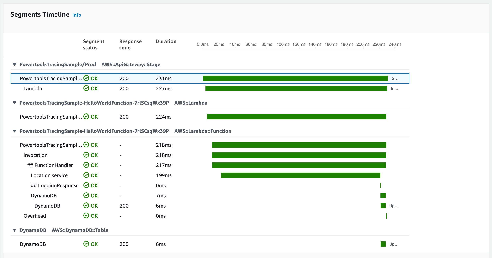

Powertools for AWS Lambda (.NET) tracing is an opinionated thin wrapper for [AWS X-Ray .NET SDK](https://github.com/aws/aws-xray-sdk-dotnet/)
a provides functionality to reduce the overhead of performing common tracing tasks.



## Key Features

* Helper methods to improve the developer experience for creating [custom AWS X-Ray subsegments](https://docs.aws.amazon.com/xray/latest/devguide/xray-sdk-dotnet-subsegments.html){target=blank}.
* Capture cold start as annotation.
* Capture function responses and full exceptions as metadata.
* Better experience when developing with multiple threads.
* Auto-patch supported modules by AWS X-Ray
* Auto-disable when not running in AWS Lambda environment
* Ahead-of-Time compilation to native code support [AOT](https://docs.aws.amazon.com/lambda/latest/dg/dotnet-native-aot.html) from version 1.5.0

!!! warning "Migrating to v3"

    If you're upgrading to v3, please review the [Migration Guide v3](../migration-guide-v3.md) for important breaking changes including .NET 8 requirement and AWS SDK v4 migration.

## Installation

Powertools for AWS Lambda (.NET) are available as NuGet packages. You can install the packages from [NuGet Gallery](https://www.nuget.org/packages?q=AWS+Lambda+Powertools*){target="_blank"} or from Visual Studio editor by searching `AWS.Lambda.Powertools*` to see various utilities available.

* [AWS.Lambda.Powertools.Tracing](https://www.nuget.org/packages?q=AWS.Lambda.Powertools.Tracing):

    `dotnet nuget add AWS.Lambda.Powertools.Tracing`

## Getting Started

!!! note "Tracer relies on AWS X-Ray SDK over [OpenTelememetry Distro (ADOT)](https://aws-otel.github.io/docs/getting-started/lambda){target="_blank"} for optimal cold start (lower latency)."

Before you use this utility, your AWS Lambda function [must have permissions](https://docs.aws.amazon.com/lambda/latest/dg/services-xray.html#services-xray-permissions) to send traces to AWS X-Ray.

To enable active tracing on an AWS Serverless Application Model (AWS SAM) AWS::Serverless::Function resource, use the `Tracing` property. You can use the Globals section of the AWS SAM template to set this for all  

### Using AWS Serverless Application Model (AWS SAM)

=== "template.yaml"

    ```yaml hl_lines="8 11"
    Resources:
        HelloWorldFunction:
            Type: AWS::Serverless::Function
            Properties:
            ...
            Runtime: dotnet6.0
    
            Tracing: Active
            Environment:
                Variables:
                    POWERTOOLS_SERVICE_NAME: example
    ```

The Powertools for AWS Lambda (.NET) service name is used as the X-Ray namespace. This can be set using the environment variable
`POWERTOOLS_SERVICE_NAME`

## Full list of environment variables

| Environment variable | Description | Default |
| ------------------------------------------------- | --------------------------------------------------------------------------------- |  ------------------------------------------------- |
| **POWERTOOLS_SERVICE_NAME** | Sets service name used for tracing namespace, metrics dimension and structured logging | `"service_undefined"` |
| **POWERTOOLS_TRACE_DISABLED** | Disables tracing | `false` |
| **POWERTOOLS_TRACER_CAPTURE_RESPONSE** | Captures Lambda or method return as metadata. | `true` |
| **POWERTOOLS_TRACER_CAPTURE_ERROR** | Captures Lambda or method exception as metadata. | `true` |

### Lambda handler

To enable Powertools for AWS Lambda (.NET) tracing to your function add the `[Tracing]` attribute to your `FunctionHandler` method or on
any method will capture the method as a separate subsegment automatically. You can optionally choose to customize
segment name that appears in traces.

=== "Tracing attribute"

    ```csharp hl_lines="3 14 20"
    --8<-- "docs/snippets/tracing/GettingStarted.cs:tracing_attribute"
    ```

=== "Custom Segment names"

    ```csharp hl_lines="3"
    --8<-- "docs/snippets/tracing/GettingStarted.cs:custom_segment_name"
    ```

By default, this attribute will automatically record method responses and exceptions. You can change the default behavior by setting
the environment variables `POWERTOOLS_TRACER_CAPTURE_RESPONSE` and `POWERTOOLS_TRACER_CAPTURE_ERROR` as needed. Optionally, you can override behavior by different supported `CaptureMode` to record response, exception or both.

!!! warning "Returning sensitive information from your Lambda handler or functions, where `Tracing` is used?"
    You can disable attribute from capturing their responses and exception as tracing metadata with **`captureMode=DISABLED`**
    or globally by setting environment variables **`POWERTOOLS_TRACER_CAPTURE_RESPONSE`** and **`POWERTOOLS_TRACER_CAPTURE_ERROR`** to **`false`**

=== "Disable on attribute"

    ```csharp hl_lines="3"
    --8<-- "docs/snippets/tracing/GettingStarted.cs:disable_capture_mode"
    ```

=== "Disable Globally"

    ```yaml hl_lines="11 12"
    Resources:
        HelloWorldFunction:
            Type: AWS::Serverless::Function
            Properties:
            ...
            Runtime: dotnetcore3.1
    
            Tracing: Active
            Environment:
                Variables:
                    POWERTOOLS_TRACER_CAPTURE_RESPONSE: false
                    POWERTOOLS_TRACER_CAPTURE_ERROR: false
    ```

### Annotations & Metadata

**Annotations** are key-values associated with traces and indexed by AWS X-Ray. You can use them to filter traces and to
create [Trace Groups](https://aws.amazon.com/about-aws/whats-new/2018/11/aws-xray-adds-the-ability-to-group-traces/) to slice and dice your transactions.

**Metadata** are key-values also associated with traces but not indexed by AWS X-Ray. You can use them to add additional
context for an operation using any native object.

=== "Annotations"

    You can add annotations using `AddAnnotation()` method from Tracing
    ```csharp hl_lines="9"
    --8<-- "docs/snippets/tracing/AnnotationsAndMetadata.cs:add_annotation"
    ```

=== "Metadata"

    You can add metadata using `AddMetadata()` method from Tracing
    ```csharp hl_lines="9"
    --8<-- "docs/snippets/tracing/AnnotationsAndMetadata.cs:add_metadata"
    ```

## Utilities

Tracing modules comes with certain utility methods when you don't want to use attribute for capturing a code block
under a subsegment, or you are doing multithreaded programming. Refer examples below.

### Using Statement Pattern

You can create subsegments using the familiar `using` statement pattern for automatic cleanup and exception safety.

=== "Basic Using Statement"

    ```csharp hl_lines="8 9 10 11 12 13"
    --8<-- "docs/snippets/tracing/UsingStatementPattern.cs:basic_using_statement"
    ```

=== "With Custom Namespace"

    ```csharp hl_lines="8 9 10"
    --8<-- "docs/snippets/tracing/UsingStatementPattern.cs:custom_namespace"
    ```

=== "Nested Subsegments"

    ```csharp hl_lines="8 9 10 11 12 13 14 15 16"
    --8<-- "docs/snippets/tracing/UsingStatementPattern.cs:nested_subsegments"
    ```

### Callback Pattern

=== "Functional Api"

    ```csharp hl_lines="8 9 10 12 13 14"
    --8<-- "docs/snippets/tracing/CallbackPattern.cs:functional_api"
    ```

=== "Multi Threaded Programming"

    ```csharp hl_lines="13-16"
    --8<-- "docs/snippets/tracing/CallbackPattern.cs:multi_threaded"
    ```

### Subsegment Methods

When using the `using` statement pattern, the returned `TracingSubsegment` object provides direct access to tracing methods:

=== "Available Methods"

    ```csharp hl_lines="8 9 10 11 12 13 14 15 16"
    --8<-- "docs/snippets/tracing/SubsegmentMethods.cs:available_methods"
    ```

## Instrumenting SDK clients

You should make sure to instrument the SDK clients explicitly based on the function dependency. You can instrument all of your AWS SDK for .NET clients by calling RegisterForAllServices before you create them.

=== "Function.cs"

    ```csharp hl_lines="14"
    --8<-- "docs/snippets/tracing/SdkInstrumentation.cs:register_all_services"
    ```

To instrument clients for some services and not others, call Register instead of RegisterForAllServices. Replace the highlighted text with the name of the service's client interface.

```csharp
--8<-- "docs/snippets/tracing/SdkInstrumentation.cs:register_single_service"
```

This functionality is a thin wrapper for AWS X-Ray .NET SDK. Refer details on [how to instrument SDK client with Xray](https://docs.aws.amazon.com/xray/latest/devguide/xray-sdk-dotnet-sdkclients.html)

## Instrumenting outgoing HTTP calls 

=== "Function.cs"

    ```csharp hl_lines="7"
    --8<-- "docs/snippets/tracing/SdkInstrumentation.cs:instrument_http_calls"
    ```

More information about instrumenting [outgoing http calls](https://docs.aws.amazon.com/xray/latest/devguide/xray-sdk-dotnet-httpclients.html).

## AOT Support

Native AOT trims your application code as part of the compilation to ensure that the binary is as small as possible. .NET 8 for Lambda provides improved trimming support compared to previous versions of .NET.


### WithTracing()

To use Tracing utility with AOT support you first need to add `WithTracing()` to the source generator you are using either the default `SourceGeneratorLambdaJsonSerializer`
or the Powertools Logging utility [source generator](logging.md#aot-support){:target="_blank"} `PowertoolsSourceGeneratorSerializer`.

Examples:

=== "Without Powertools Logging"

    ```csharp hl_lines="8"
    --8<-- "docs/snippets/tracing/AotSupport.cs:without_powertools_logging"
    ```

=== "With Powertools Logging"

    ```csharp hl_lines="10 11"
    --8<-- "docs/snippets/tracing/AotSupport.cs:with_powertools_logging"
    ```

### Publishing

!!! warning "Publishing"
    Make sure you are publishing your code with `--self-contained true` and that you have `<TrimMode>partial</TrimMode>` in your `.csproj` file 

### Trimming

!!! warning "Trim warnings"
    ```xml
    <ItemGroup>
        <TrimmerRootAssembly Include="AWSSDK.Core" />
        <TrimmerRootAssembly Include="AWSXRayRecorder.Core" />
        <TrimmerRootAssembly Include="AWSXRayRecorder.Handlers.AwsSdk" />
        <TrimmerRootAssembly Include="Amazon.Lambda.APIGatewayEvents" />
        <TrimmerRootAssembly Include="bootstrap" />
        <TrimmerRootAssembly Include="Shared" />
    </ItemGroup>
    ```

    Note that when you receive a trim warning, adding the class that generates the warning to TrimmerRootAssembly might not resolve the issue. A trim warning indicates that the class is trying to access some other class that can't be determined until runtime. To avoid runtime errors, add this second class to TrimmerRootAssembly. 
    
    To learn more about managing trim warnings, see [Introduction to trim warnings](https://learn.microsoft.com/en-us/dotnet/core/deploying/trimming/fixing-warnings) in the Microsoft .NET documentation.

### Not supported

!!! warning "Not supported"
    Currently instrumenting SDK clients with `Tracing.RegisterForAllServices()` is not supported on AOT mode.