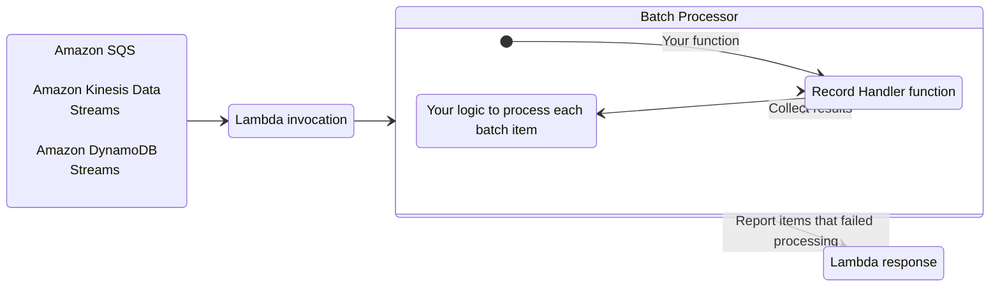
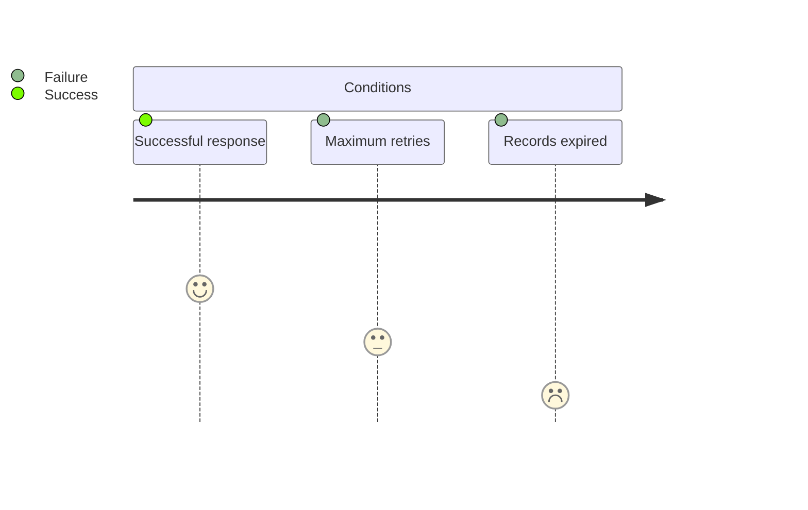

???+ warning
	**This utility is currently in developer preview** and is intended strictly for feedback and testing purposes **and not for production workloads**. The version and all future versions tagged with the `-preview` suffix should be treated as not stable. Until this utility is [General Availability](https://github.com/aws-powertools/powertools-lambda-dotnet/milestone/4) we may introduce significant breaking changes and improvements in response to customer feedback.

The batch processing utility handles partial failures when processing batches from Amazon SQS, Amazon Kinesis Data Streams, and Amazon DynamoDB Streams.



## Key features

* Reports batch item failures to reduce number of retries for a record upon errors
* Simple interface to process each batch record
* Bring your own batch processor
* Parallel processing

## Background

When using SQS, Kinesis Data Streams, or DynamoDB Streams as a Lambda event source, your Lambda functions are triggered with a batch of messages.

If your function fails to process any message from the batch, the entire batch returns to your queue or stream. This same batch is then retried until either condition happens first: **a)** your Lambda function returns a successful response, **b)** record reaches maximum retry attempts, or **c)** when records expire.



This behavior changes when you enable Report Batch Item Failures feature in your Lambda function event source configuration:

* [**SQS queues**](#sqs-standard). Only messages reported as failure will return to the queue for a retry, while successful ones will be deleted.
* [**Kinesis data streams**](#kinesis-and-dynamodb-streams) and [**DynamoDB streams**](#kinesis-and-dynamodb-streams). Single reported failure will use its sequence number as the stream checkpoint. Multiple  reported failures will use the lowest sequence number as checkpoint.

<!-- HTML tags are required in admonition content thus increasing line length beyond our limits -->

???+ warning "Warning: This utility lowers the chance of processing records more than once; it does not guarantee it"
	We recommend implementing processing logic in an [idempotent manner](idempotency.md){target="_blank"} wherever possible.

	You can find more details on how Lambda works with either [SQS](https://docs.aws.amazon.com/lambda/latest/dg/with-sqs.html){target="_blank"}, [Kinesis](https://docs.aws.amazon.com/lambda/latest/dg/with-kinesis.html){target="_blank"}, or [DynamoDB](https://docs.aws.amazon.com/lambda/latest/dg/with-ddb.html){target="_blank"} in the AWS Documentation.

## Getting started

For this feature to work, you need to **(1)** configure your Lambda function event source to use `ReportBatchItemFailures`, and **(2)** return [a specific response](https://docs.aws.amazon.com/lambda/latest/dg/with-sqs.html#services-sqs-batchfailurereporting){target="_blank" rel="nofollow"} to report which records failed to be processed.

You use your preferred deployment framework to set the correct configuration while this utility handles the correct response to be returned.

### Required resources

The remaining sections of the documentation will rely on these samples. For completeness, this demonstrates IAM permissions and Dead Letter Queue where batch records will be sent after 2 retries were attempted.

!!! note "You do not need any additional IAM permissions to use this utility, except for what each event source requires."

=== "SQS"

    ```yaml title="template.yaml" hl_lines="34-35"
    --8<-- "docs/snippets/batch/templates/sqs.yaml"
    ```

=== "Kinesis Data Streams"

    ```yaml title="template.yaml" hl_lines="48-49"
    --8<-- "docs/snippets/batch/templates/kinesis.yaml"
    ```

=== "DynamoDB Streams"

    ```yaml title="template.yaml" hl_lines="47-48"
    --8<-- "docs/snippets/batch/templates/dynamodb.yaml"
    ```

### Processing messages from SQS

#### Using Handler decorator

Processing batches from SQS using Lambda handler decorator works in three stages:

1. Decorate your handler with **`BatchProcessor`** attribute
2. Create a class that implements **`SQSCustomRecordHandler`** and override the HandleAsync method. 
3. Pass the type of that class to  **`RecordHandler`** property of the **`BatchProcessor`** attribute

=== "Function.cs"

    ```csharp hl_lines="1 12 22 17 25"
	public class CustomSqsRecordHandler : SQSCustomRecordHandler // (1)!
	{
		public override async Task<RecordHandlerResult> HandleAsync(SQSEvent.SQSMessage record, CancellationToken cancellationToken)
		{
			 /*
			 * Your business logic.
			 * If an exception is thrown, the item will be marked as a partial batch item failure.
             */
			  
             var product = JsonSerializer.Deserialize<Product>(record.Body);

             if (product.Id == 4) // (2)!
             {
                 throw new ArgumentException("Error on id 4");
             }
			
             return await Task.FromResult(RecordHandlerResult.None); // (3)!
         }
  	}


	[BatchProcessor(RecordHandler = typeof(CustomSqsRecordHandler))]
	public BatchItemFailuresResponse SqsHandlerUsingAttribute(SQSEvent _)
	{
		return SqsBatchProcessor.Result.BatchItemFailuresResponse; // (4)!
	}

    ```

    1.  **Step 1**. Creates a class that inherits from SQSCustomRecordHandler and override the HandleAsync method.
    2.  **Step 2**. You can have custom logic inside the record handler and throw exceptions that will cause this SQS message to fail
    3.  **Step 3**. RecordHandlerResult can return empty (None) or some data.
	3.  **Step 4**. Lambda function returns the Partial batch response


=== "Sample response"

    The second record failed to be processed, therefore the processor added its message ID in the response.

    ```json
    {
		"batchItemFailures": [
			{
				"itemIdentifier": "244fc6b4-87a3-44ab-83d2-361172410c3a"
			},
			{
				"itemIdentifier": "213f4fd3-84a4-4667-a1b9-c277964197d9"
			}
		]
	}
    ```

=== "Sample event"

    ```json
    {
		"Records": [
			{
				"messageId": "059f36b4-87a3-44ab-83d2-661975830a7d",
				"receiptHandle": "AQEBwJnKyrHigUMZj6rYigCgxlaS3SLy0a",
				"body": "{\"Id\":1,\"Name\":\"product-4\",\"Price\":14}",
				"attributes": {
					"ApproximateReceiveCount": "1",
					"SentTimestamp": "1545082649183",
					"SenderId": "AIDAIENQZJOLO23YVJ4VO",
					"ApproximateFirstReceiveTimestamp": "1545082649185"
				},
				"messageAttributes": {},
				"md5OfBody": "e4e68fb7bd0e697a0ae8f1bb342846b3",
				"eventSource": "aws:sqs",
				"eventSourceARN": "arn:aws:sqs:us-east-2: 123456789012:my-queue",
				"awsRegion": "us-east-1"
			},
			{
				"messageId": "244fc6b4-87a3-44ab-83d2-361172410c3a",
				"receiptHandle": "AQEBwJnKyrHigUMZj6rYigCgxlaS3SLy0a",
				"body": "fail",
				"attributes": {
					"ApproximateReceiveCount": "1",
					"SentTimestamp": "1545082649183",
					"SenderId": "AIDAIENQZJOLO23YVJ4VO",
					"ApproximateFirstReceiveTimestamp": "1545082649185"
				},
				"messageAttributes": {},
				"md5OfBody": "e4e68fb7bd0e697a0ae8f1bb342846b3",
				"eventSource": "aws:sqs",
				"eventSourceARN": "arn:aws:sqs:us-east-2: 123456789012:my-queue",
				"awsRegion": "us-east-1"
			},
			{
				"messageId": "213f4fd3-84a4-4667-a1b9-c277964197d9",
				"receiptHandle": "AQEBwJnKyrHigUMZj6rYigCgxlaS3SLy0a",
				"body": "{\"Id\":4,\"Name\":\"product-4\",\"Price\":14}",
				"attributes": {
					"ApproximateReceiveCount": "1",
					"SentTimestamp": "1545082649183",
					"SenderId": "AIDAIENQZJOLO23YVJ4VO",
					"ApproximateFirstReceiveTimestamp": "1545082649185"
				},
				"messageAttributes": {},
				"md5OfBody": "e4e68fb7bd0e697a0ae8f1bb342846b3",
				"eventSource": "aws:sqs",
				"eventSourceARN": "arn:aws:sqs:us-east-2: 123456789012:my-queue",
				"awsRegion": "us-east-1"
			},
		]
	}

    ```

#### FIFO queues

When using [SQS FIFO queues](https://docs.aws.amazon.com/AWSSimpleQueueService/latest/SQSDeveloperGuide/FIFO-queues.html){target="_blank"}, we will stop processing messages after the first failure, and return all failed and unprocessed messages in `batchItemFailures`.
This helps preserve the ordering of messages in your queue.

### Processing messages from Kinesis

### Processing messages from DynamoDB

### Error handling

BatchProcessingErrorHandlingPolicy

### Advanced
#### Using utility outside handler and IoC
#### Processing messages in parallel
#### Extending BatchProcessor
#### Bring your own partial processor