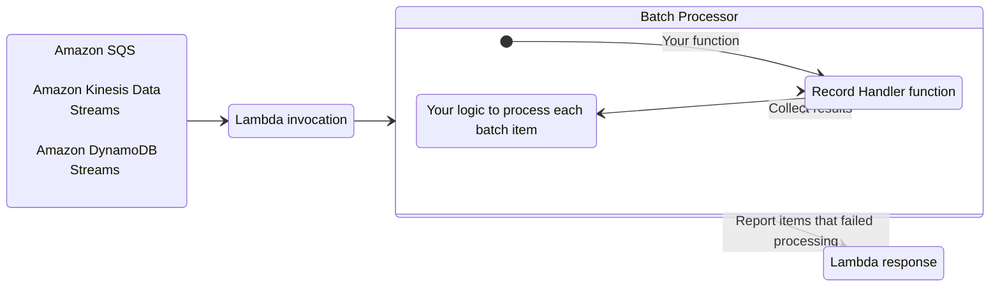
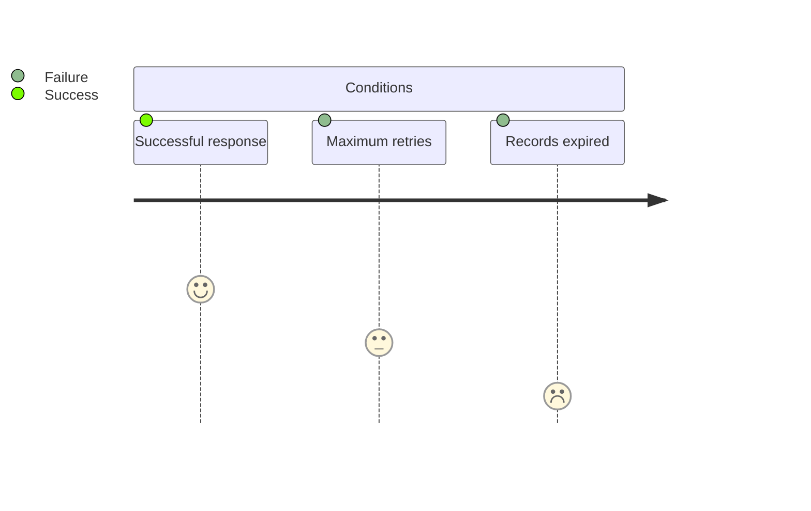
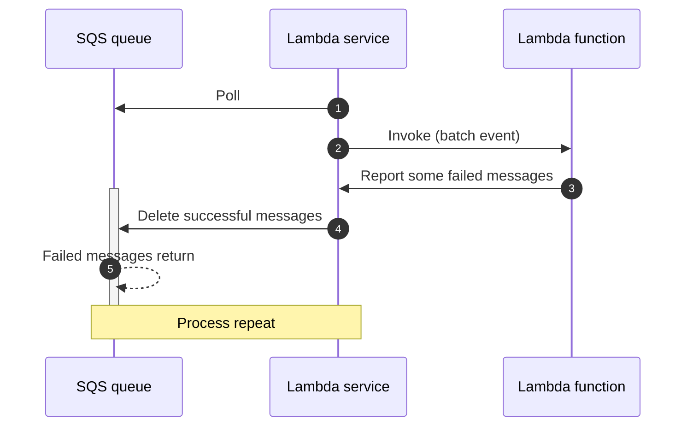
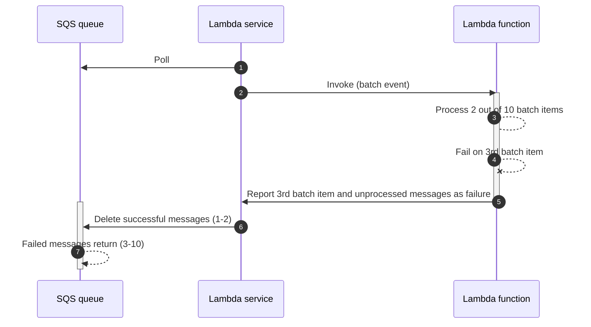
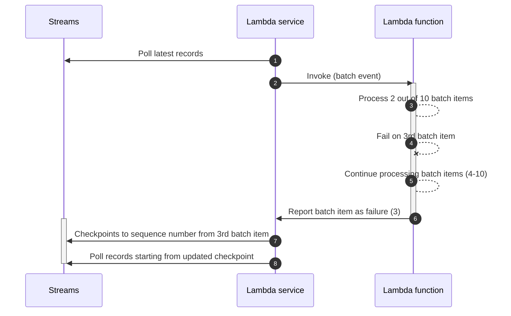
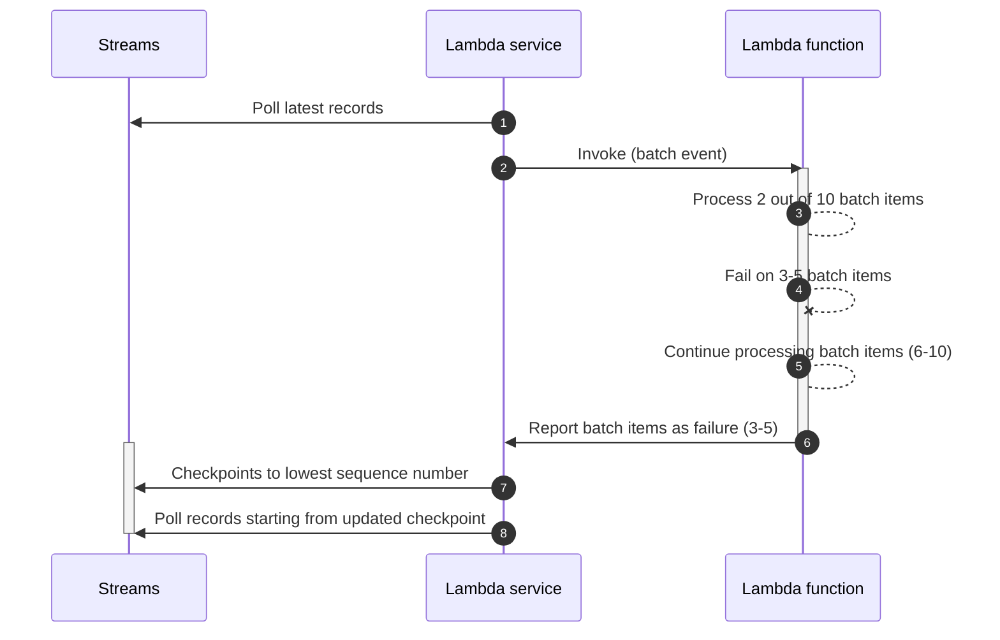

The batch processing utility handles partial failures when processing batches from Amazon SQS, Amazon Kinesis Data Streams, and Amazon DynamoDB Streams.



## Key features

* Reports batch item failures to reduce number of retries for a record upon errors
* Simple interface to process each batch record
* Bring your own batch processor
* Parallel processing

## Background

When using SQS, Kinesis Data Streams, or DynamoDB Streams as a Lambda event source, your Lambda functions are triggered with a batch of messages.

If your function fails to process any message from the batch, the entire batch returns to your queue or stream. This same batch is then retried until either condition happens first: **a)** your Lambda function returns a successful response, **b)** record reaches maximum retry attempts, or **c)** when records expire.



This behavior changes when you enable Report Batch Item Failures feature in your Lambda function event source configuration:

* [**SQS queues**](#sqs-standard). Only messages reported as failure will return to the queue for a retry, while successful ones will be deleted.
* [**Kinesis data streams**](#kinesis-and-dynamodb-streams) and [**DynamoDB streams**](#kinesis-and-dynamodb-streams). Single reported failure will use its sequence number as the stream checkpoint. Multiple  reported failures will use the lowest sequence number as checkpoint.

<!-- HTML tags are required in admonition content thus increasing line length beyond our limits -->

???+ warning "Warning: This utility lowers the chance of processing records more than once; it does not guarantee it"
	We recommend implementing processing logic in an [idempotent manner](idempotency.md){target="_blank"} wherever possible.

	You can find more details on how Lambda works with either [SQS](https://docs.aws.amazon.com/lambda/latest/dg/with-sqs.html){target="_blank"}, [Kinesis](https://docs.aws.amazon.com/lambda/latest/dg/with-kinesis.html){target="_blank"}, or [DynamoDB](https://docs.aws.amazon.com/lambda/latest/dg/with-ddb.html){target="_blank"} in the AWS Documentation.

## Getting started

For this feature to work, you need to **(1)** configure your Lambda function event source to use `ReportBatchItemFailures`, and **(2)** return [a specific response](https://docs.aws.amazon.com/lambda/latest/dg/with-sqs.html#services-sqs-batchfailurereporting){target="_blank" rel="nofollow"} to report which records failed to be processed.

You use your preferred deployment framework to set the correct configuration while this utility handles the correct response to be returned.

Batch processing can be configured with the settings bellow:

Setting | Description                                                             | Environment variable | Default
------------------------------------------------- |-------------------------------------------------------------------------| ------------------------------------------------- | -------------------------------------------------
**Error Handling Policy** | Sets the error handling policy applied during batch processing.         | `POWERTOOLS_BATCH_ERROR_HANDLING_POLICY` | `DeriveFromEvent`
**Parallel Enabled** | Sets if parallelism is enabled                                          |  `POWERTOOLS_BATCH_PARALLEL_ENABLED` | `false`
**Max Degree of Parallelism** | Sets the maximum degree of parallelism to apply during batch processing |  `POWERTOOLS_BATCH_MAX_DEGREE_OF_PARALLELISM` | `1`

### Required resources

The remaining sections of the documentation will rely on these samples. For completeness, this demonstrates IAM permissions and Dead Letter Queue where batch records will be sent after 2 retries were attempted.

!!! note "You do not need any additional IAM permissions to use this utility, except for what each event source requires."

=== "SQS"

    ```yaml title="template.yaml" hl_lines="36-37"
    --8<-- "docs/snippets/batch/templates/sqs.yaml"
    ```

=== "Kinesis Data Streams"

    ```yaml title="template.yaml" hl_lines="50-51"
    --8<-- "docs/snippets/batch/templates/kinesis.yaml"
    ```

=== "DynamoDB Streams"

    ```yaml title="template.yaml" hl_lines="49-50"
    --8<-- "docs/snippets/batch/templates/dynamodb.yaml"
    ```

### Processing messages from SQS

#### Using Handler decorator

Processing batches from SQS using Lambda handler decorator works in three stages:

1. Decorate your handler with **`BatchProcessor`** attribute
2. Create a class that implements **`ISqsRecordHandler`** interface and the HandleAsync method. 
3. Pass the type of that class to  **`RecordHandler`** property of the **`BatchProcessor`** attribute
4. Return **`BatchItemFailuresResponse`** from Lambda handler using **`SqsBatchProcessor.Result.BatchItemFailuresResponse`**

=== "Function.cs"

    ```csharp hl_lines="1 12 22 17 25"
	public class CustomSqsRecordHandler : ISqsRecordHandler // (1)!
	{
		public async Task<RecordHandlerResult> HandleAsync(SQSEvent.SQSMessage record, CancellationToken cancellationToken)
		{
			 /*
			 * Your business logic.
			 * If an exception is thrown, the item will be marked as a partial batch item failure.
             */
			  
             var product = JsonSerializer.Deserialize<Product>(record.Body);

             if (product.Id == 4) // (2)!
             {
                 throw new ArgumentException("Error on id 4");
             }
			
             return await Task.FromResult(RecordHandlerResult.None); // (3)!
         }
  	}


	[BatchProcessor(RecordHandler = typeof(CustomSqsRecordHandler))]
	public BatchItemFailuresResponse HandlerUsingAttribute(SQSEvent _)
	{
		return SqsBatchProcessor.Result.BatchItemFailuresResponse; // (4)!
	}

    ```

    1.  **Step 1**. Creates a class that implements ISqsRecordHandler interface and the HandleAsync method.
    2.  **Step 2**. You can have custom logic inside the record handler and throw exceptions that will cause this message to fail
    3.  **Step 3**. RecordHandlerResult can return empty (None) or some data.
	3.  **Step 4**. Lambda function returns the Partial batch response

=== "Sample event"

    ```json
    {
		"Records": [
			{
				"messageId": "059f36b4-87a3-44ab-83d2-661975830a7d",
				"receiptHandle": "AQEBwJnKyrHigUMZj6rYigCgxlaS3SLy0a",
				"body": "{\"Id\":1,\"Name\":\"product-4\",\"Price\":14}",
				"attributes": {
					"ApproximateReceiveCount": "1",
					"SentTimestamp": "1545082649183",
					"SenderId": "AIDAIENQZJOLO23YVJ4VO",
					"ApproximateFirstReceiveTimestamp": "1545082649185"
				},
				"messageAttributes": {},
				"md5OfBody": "e4e68fb7bd0e697a0ae8f1bb342846b3",
				"eventSource": "aws:sqs",
				"eventSourceARN": "arn:aws:sqs:us-east-2: 123456789012:my-queue",
				"awsRegion": "us-east-1"
			},
			{
				"messageId": "244fc6b4-87a3-44ab-83d2-361172410c3a",
				"receiptHandle": "AQEBwJnKyrHigUMZj6rYigCgxlaS3SLy0a",
				"body": "fail",
				"attributes": {
					"ApproximateReceiveCount": "1",
					"SentTimestamp": "1545082649183",
					"SenderId": "AIDAIENQZJOLO23YVJ4VO",
					"ApproximateFirstReceiveTimestamp": "1545082649185"
				},
				"messageAttributes": {},
				"md5OfBody": "e4e68fb7bd0e697a0ae8f1bb342846b3",
				"eventSource": "aws:sqs",
				"eventSourceARN": "arn:aws:sqs:us-east-2: 123456789012:my-queue",
				"awsRegion": "us-east-1"
			},
			{
				"messageId": "213f4fd3-84a4-4667-a1b9-c277964197d9",
				"receiptHandle": "AQEBwJnKyrHigUMZj6rYigCgxlaS3SLy0a",
				"body": "{\"Id\":4,\"Name\":\"product-4\",\"Price\":14}",
				"attributes": {
					"ApproximateReceiveCount": "1",
					"SentTimestamp": "1545082649183",
					"SenderId": "AIDAIENQZJOLO23YVJ4VO",
					"ApproximateFirstReceiveTimestamp": "1545082649185"
				},
				"messageAttributes": {},
				"md5OfBody": "e4e68fb7bd0e697a0ae8f1bb342846b3",
				"eventSource": "aws:sqs",
				"eventSourceARN": "arn:aws:sqs:us-east-2: 123456789012:my-queue",
				"awsRegion": "us-east-1"
			},
		]
	}

    ```

=== "Sample response"

    The second record failed to be processed, therefore the processor added its message ID in the response.

    ```json
    {
		"batchItemFailures": [
			{
				"itemIdentifier": "244fc6b4-87a3-44ab-83d2-361172410c3a"
			},
			{
				"itemIdentifier": "213f4fd3-84a4-4667-a1b9-c277964197d9"
			}
		]
	}
    ```

#### FIFO queues

When using [SQS FIFO queues](https://docs.aws.amazon.com/AWSSimpleQueueService/latest/SQSDeveloperGuide/FIFO-queues.html){target="_blank"}, we will stop processing messages after the first failure, and return all failed and unprocessed messages in `batchItemFailures`.
This helps preserve the ordering of messages in your queue. Powertools automatically detects a FIFO queue.

### Processing messages from Kinesis

Processing batches from Kinesis using Lambda handler decorator works in three stages:

1. Decorate your handler with **`BatchProcessor`** attribute
2. Create a class that implements **`IKinesisEventRecordHandler`** interface and the HandleAsync method.
3. Pass the type of that class to  **`RecordHandler`** property of the **`BatchProcessor`** attribute
4. Return **`BatchItemFailuresResponse`** from Lambda handler using **`KinesisEventBatchProcessor.Result.BatchItemFailuresResponse`**

=== "Function.cs"

    ```csharp hl_lines="1 7 12 17 20"
	internal class CustomKinesisEventRecordHandler : IKinesisEventRecordHandler // (1)!
	{
		public async Task<RecordHandlerResult> HandleAsync(KinesisEvent.KinesisEventRecord record, CancellationToken cancellationToken)
		{
			var product = JsonSerializer.Deserialize<Product>(record.Kinesis.Data);
		
			if (product.Id == 4) // (2)!
			{
				throw new ArgumentException("Error on id 4");
			}
			
			return await Task.FromResult(RecordHandlerResult.None); // (3)!
		}
	}


	[BatchProcessor(RecordHandler = typeof(CustomKinesisEventRecordHandler))]
	public BatchItemFailuresResponse HandlerUsingAttribute(KinesisEvent _)
	{
		return KinesisEventBatchProcessor.Result.BatchItemFailuresResponse; // (4)!
	}

    ```

    1.  **Step 1**. Creates a class that implements the IKinesisEventRecordHandler interface and the HandleAsync method.
    2.  **Step 2**. You can have custom logic inside the record handler and throw exceptions that will cause this message to fail
    3.  **Step 3**. RecordHandlerResult can return empty (None) or some data.
	3.  **Step 4**. Lambda function returns the Partial batch response

=== "Sample event"

    ```json
    {
		"Records": [
			{
				"messageId": "059f36b4-87a3-44ab-83d2-661975830a7d",
				"receiptHandle": "AQEBwJnKyrHigUMZj6rYigCgxlaS3SLy0a",
				"body": "{\"Id\":1,\"Name\":\"product-4\",\"Price\":14}",
				"attributes": {
					"ApproximateReceiveCount": "1",
					"SentTimestamp": "1545082649183",
					"SenderId": "AIDAIENQZJOLO23YVJ4VO",
					"ApproximateFirstReceiveTimestamp": "1545082649185"
				},
				"messageAttributes": {},
				"md5OfBody": "e4e68fb7bd0e697a0ae8f1bb342846b3",
				"eventSource": "aws:sqs",
				"eventSourceARN": "arn:aws:sqs:us-east-2: 123456789012:my-queue",
				"awsRegion": "us-east-1"
			},
			{
				"messageId": "244fc6b4-87a3-44ab-83d2-361172410c3a",
				"receiptHandle": "AQEBwJnKyrHigUMZj6rYigCgxlaS3SLy0a",
				"body": "fail",
				"attributes": {
					"ApproximateReceiveCount": "1",
					"SentTimestamp": "1545082649183",
					"SenderId": "AIDAIENQZJOLO23YVJ4VO",
					"ApproximateFirstReceiveTimestamp": "1545082649185"
				},
				"messageAttributes": {},
				"md5OfBody": "e4e68fb7bd0e697a0ae8f1bb342846b3",
				"eventSource": "aws:sqs",
				"eventSourceARN": "arn:aws:sqs:us-east-2: 123456789012:my-queue",
				"awsRegion": "us-east-1"
			},
			{
				"messageId": "213f4fd3-84a4-4667-a1b9-c277964197d9",
				"receiptHandle": "AQEBwJnKyrHigUMZj6rYigCgxlaS3SLy0a",
				"body": "{\"Id\":4,\"Name\":\"product-4\",\"Price\":14}",
				"attributes": {
					"ApproximateReceiveCount": "1",
					"SentTimestamp": "1545082649183",
					"SenderId": "AIDAIENQZJOLO23YVJ4VO",
					"ApproximateFirstReceiveTimestamp": "1545082649185"
				},
				"messageAttributes": {},
				"md5OfBody": "e4e68fb7bd0e697a0ae8f1bb342846b3",
				"eventSource": "aws:sqs",
				"eventSourceARN": "arn:aws:sqs:us-east-2: 123456789012:my-queue",
				"awsRegion": "us-east-1"
			},
		]
	}

    ```

=== "Sample response"

    The second record failed to be processed, therefore the processor added its message ID in the response.

    ```json
    {
		"batchItemFailures": [
			{
				"itemIdentifier": "244fc6b4-87a3-44ab-83d2-361172410c3a"
			},
			{
				"itemIdentifier": "213f4fd3-84a4-4667-a1b9-c277964197d9"
			}
		]
	}
    ```

### Processing messages from DynamoDB

Processing batches from DynamoDB Streams using Lambda handler decorator works in three stages:

1. Decorate your handler with **`BatchProcessor`** attribute
2. Create a class that implements **`IDynamoDbStreamRecordHandler`** and the HandleAsync method.
3. Pass the type of that class to  **`RecordHandler`** property of the **`BatchProcessor`** attribute
4. Return **`BatchItemFailuresResponse`** from Lambda handler using **`DynamoDbStreamBatchProcessor.Result.BatchItemFailuresResponse`**

=== "Function.cs"

    ```csharp hl_lines="1 7 12 17 20"
	internal class CustomDynamoDbStreamRecordHandler : IDynamoDbStreamRecordHandler // (1)!
	{
		public async Task<RecordHandlerResult> HandleAsync(DynamoDBEvent.DynamodbStreamRecord record, CancellationToken cancellationToken)
		{
			var product = JsonSerializer.Deserialize<Product>(record.Dynamodb.NewImage["Product"].S);
		
			if (product.Id == 4) // (2)!
			{
				throw new ArgumentException("Error on id 4");
			}
			
			return await Task.FromResult(RecordHandlerResult.None); // (3)!
		}
	}


	[BatchProcessor(RecordHandler = typeof(CustomDynamoDbStreamRecordHandler))]
	public BatchItemFailuresResponse HandlerUsingAttribute(DynamoDBEvent _)
	{
		return DynamoDbStreamBatchProcessor.Result.BatchItemFailuresResponse; // (4)!
	}

    ```

    1.  **Step 1**. Creates a class that implements the IDynamoDbStreamRecordHandler and the HandleAsync method.
    2.  **Step 2**. You can have custom logic inside the record handler and throw exceptions that will cause this message to fail
    3.  **Step 3**. RecordHandlerResult can return empty (None) or some data.
	3.  **Step 4**. Lambda function returns the Partial batch response

=== "Sample event"

    ```json
    {
		"Records": [
			{
				"eventID": "1",
				"eventVersion": "1.0",
				"dynamodb": {
					"Keys": {
						"Id": {
							"N": "101"
					}
				},
				"NewImage": {
					"Product": {
						"S": "{\"Id\":1,\"Name\":\"product-name\",\"Price\":14}"
					}
				},
				"StreamViewType": "NEW_AND_OLD_IMAGES",
				"SequenceNumber": "3275880929",
				"SizeBytes": 26
				},
				"awsRegion": "us-west-2",
				"eventName": "INSERT",
				"eventSourceARN": "eventsource_arn",
				"eventSource": "aws:dynamodb"
			},
			{
				"eventID": "1",
				"eventVersion": "1.0",
				"dynamodb": {
					"Keys": {
						"Id": {
							"N": "101"
					}
				},
				"NewImage": {
					"Product": {
						"S": "fail"
					}
				},
				"StreamViewType": "NEW_AND_OLD_IMAGES",
				"SequenceNumber": "8640712661",
				"SizeBytes": 26
				},
				"awsRegion": "us-west-2",
				"eventName": "INSERT",
				"eventSourceARN": "eventsource_arn",
				"eventSource": "aws:dynamodb"
			}
		]
	}

    ```

=== "Sample response"

    The second record failed to be processed, therefore the processor added its message ID in the response.

    ```json
    {
		"batchItemFailures": [
			{
				"itemIdentifier": "8640712661"
			}
		]
	}
    ```

### Error handling

By default, we catch any exception raised by your custom record handler HandleAsync method (ISqsRecordHandler, IKinesisEventRecordHandler, IDynamoDbStreamRecordHandler). 
This allows us to **(1)** continue processing the batch, **(2)** collect each batch item that failed processing, and **(3)** return the appropriate response correctly without failing your Lambda function execution.

=== "Function.cs"

    ```csharp hl_lines="14"
	public class CustomSqsRecordHandler : ISqsRecordHandler // (1)!
	{
		public async Task<RecordHandlerResult> HandleAsync(SQSEvent.SQSMessage record, CancellationToken cancellationToken)
		{
			 /*
			 * Your business logic.
			 * If an exception is thrown, the item will be marked as a partial batch item failure.
             */
			  
             var product = JsonSerializer.Deserialize<Product>(record.Body);

             if (product.Id == 4) // (2)!
             {
                 throw new ArgumentException("Error on id 4");
             }
			
             return await Task.FromResult(RecordHandlerResult.None); // (3)!
         }
  	}

    ```

=== "Sample event"

    ```json
    {
		"Records": [
			{
				"messageId": "059f36b4-87a3-44ab-83d2-661975830a7d",
				"receiptHandle": "AQEBwJnKyrHigUMZj6rYigCgxlaS3SLy0a",
				"body": "{\"Id\":1,\"Name\":\"product-4\",\"Price\":14}",
				"attributes": {
					"ApproximateReceiveCount": "1",
					"SentTimestamp": "1545082649183",
					"SenderId": "AIDAIENQZJOLO23YVJ4VO",
					"ApproximateFirstReceiveTimestamp": "1545082649185"
				},
				"messageAttributes": {},
				"md5OfBody": "e4e68fb7bd0e697a0ae8f1bb342846b3",
				"eventSource": "aws:sqs",
				"eventSourceARN": "arn:aws:sqs:us-east-2: 123456789012:my-queue",
				"awsRegion": "us-east-1"
			},
			{
				"messageId": "244fc6b4-87a3-44ab-83d2-361172410c3a",
				"receiptHandle": "AQEBwJnKyrHigUMZj6rYigCgxlaS3SLy0a",
				"body": "fail",
				"attributes": {
					"ApproximateReceiveCount": "1",
					"SentTimestamp": "1545082649183",
					"SenderId": "AIDAIENQZJOLO23YVJ4VO",
					"ApproximateFirstReceiveTimestamp": "1545082649185"
				},
				"messageAttributes": {},
				"md5OfBody": "e4e68fb7bd0e697a0ae8f1bb342846b3",
				"eventSource": "aws:sqs",
				"eventSourceARN": "arn:aws:sqs:us-east-2: 123456789012:my-queue",
				"awsRegion": "us-east-1"
			},
			{
				"messageId": "213f4fd3-84a4-4667-a1b9-c277964197d9",
				"receiptHandle": "AQEBwJnKyrHigUMZj6rYigCgxlaS3SLy0a",
				"body": "{\"Id\":4,\"Name\":\"product-4\",\"Price\":14}",
				"attributes": {
					"ApproximateReceiveCount": "1",
					"SentTimestamp": "1545082649183",
					"SenderId": "AIDAIENQZJOLO23YVJ4VO",
					"ApproximateFirstReceiveTimestamp": "1545082649185"
				},
				"messageAttributes": {},
				"md5OfBody": "e4e68fb7bd0e697a0ae8f1bb342846b3",
				"eventSource": "aws:sqs",
				"eventSourceARN": "arn:aws:sqs:us-east-2: 123456789012:my-queue",
				"awsRegion": "us-east-1"
			},
		]
	}

    ```

=== "Sample response"

    The second record failed to be processed, therefore the processor added its message ID in the response.

    ```json
    {
		"batchItemFailures": [
			{
				"itemIdentifier": "244fc6b4-87a3-44ab-83d2-361172410c3a"
			},
			{
				"itemIdentifier": "213f4fd3-84a4-4667-a1b9-c277964197d9"
			}
		]
	}
    ```

#### Error Handling Policy

You can specify the error handling policy applied during batch processing.

`ErrorHandlingPolicy` is used to control the error handling policy of the batch item processing.
With a value of `DeriveFromEvent` (default), the specific BatchProcessor, determines the policy based on the incoming event.

For example, the `SqsBatchProcessor` looks at the EventSourceArn to determine if the ErrorHandlingPolicy should be `StopOnFirstBatchItemFailure` (for FIFO queues) or `ContinueOnBatchItemFailure` (for standard queues).
For `StopOnFirstBatchItemFailure` the batch processor stops processing and marks any remaining records as batch item failures.
For `ContinueOnBatchItemFailure` the batch processor continues processing batch items regardless of item failures.

| Policy                          | Description                                                                                                                                  |
|---------------------------------|----------------------------------------------------------------------------------------------------------------------------------------------|
| **DeriveFromEvent**             | Auto-derive the policy based on the event.                                                                                                   |
| **ContinueOnBatchItemFailure**  | Continue processing regardless of whether other batch items fails during processing.                                                         |
| **StopOnFirstBatchItemFailure** | Stop processing other batch items after the first batch item has failed processing. This is useful to preserve ordered processing of events. |

!!! note
 	
	When using **StopOnFirstBatchItemFailure** and parallel processing is enabled, all batch items already scheduled to be processed, will be allowed to complete before the batch processing stops. 
	
	Therefore, if order is important, it is recommended to use sequential (non-parallel) processing together with this value."

To change the default error handling policy, you can set the **`POWERTOOLS_BATCH_ERROR_HANDLING_POLICY`** Environment Variable.

Another approach is to decorate the handler and use one of the policies in the **`ErrorHandlingPolicy`** Enum property of the **`BatchProcessor`** attribute

=== "Function.cs"

    ```csharp hl_lines="2"
	[BatchProcessor(RecordHandler = typeof(CustomDynamoDbStreamRecordHandler), 
		ErrorHandlingPolicy = BatchProcessorErrorHandlingPolicy.StopOnFirstBatchItemFailure)]
	public BatchItemFailuresResponse HandlerUsingAttribute(DynamoDBEvent _)
	{
		return DynamoDbStreamBatchProcessor.Result.BatchItemFailuresResponse;
	}

    ```


### Partial failure mechanics

All records in the batch will be passed to this handler for processing, even if exceptions are thrown - Here's the behaviour after completing the batch:

* **All records successfully processed**. We will return an empty list of item failures `{'batchItemFailures': []}`
* **Partial success with some exceptions**. We will return a list of all item IDs/sequence numbers that failed processing
* **All records failed to be processed**. We will raise `AWS.Lambda.Powertools.BatchProcessing.Exceptions.BatchProcessingException` exception with a list of all exceptions raised when processing

The following sequence diagrams explain how each Batch processor behaves under different scenarios.

#### SQS Standard

> Read more about [Batch Failure Reporting feature in AWS Lambda](https://docs.aws.amazon.com/lambda/latest/dg/with-sqs.html#services-sqs-batchfailurereporting){target="_blank"}.

Sequence diagram to explain how [`BatchProcessor` works](#processing-messages-from-sqs) with SQS Standard queues.

<center>

<i>SQS mechanism with Batch Item Failures</i>
</center>

#### SQS FIFO

> Read more about [Batch Failure Reporting feature in AWS Lambda](https://docs.aws.amazon.com/lambda/latest/dg/with-sqs.html#services-sqs-batchfailurereporting){target="_blank"}.

Sequence diagram to explain how [`SqsFifoPartialProcessor` works](#fifo-queues) with SQS FIFO queues.

<center>

<i>SQS FIFO mechanism with Batch Item Failures</i>
</center>

#### Kinesis and DynamoDB Streams

> Read more about [Batch Failure Reporting feature](https://docs.aws.amazon.com/lambda/latest/dg/with-kinesis.html#services-kinesis-batchfailurereporting){target="_blank"}.

Sequence diagram to explain how `BatchProcessor` works with both [Kinesis Data Streams](#processing-messages-from-kinesis) and [DynamoDB Streams](#processing-messages-from-dynamodb).

For brevity, we will use `Streams` to refer to either services. For theory on stream checkpoints, see this [blog post](https://aws.amazon.com/blogs/compute/optimizing-batch-processing-with-custom-checkpoints-in-aws-lambda/){target="_blank"}

<center>

<i>Kinesis and DynamoDB streams mechanism with single batch item failure</i>
</center>

The behavior changes slightly when there are multiple item failures. Stream checkpoint is updated to the lowest sequence number reported.

!!! important "Note that the batch item sequence number could be different from batch item number in the illustration."

<center>

<i>Kinesis and DynamoDB streams mechanism with multiple batch item failures</i>
</center>


### Advanced
#### Using utility outside handler and IoC

You can use Batch processing without using the decorator.

Calling the **`ProcessAsync`** method on the Instance of the static BatchProcessor (`SqsBatchProcessor`, `DynamoDbStreamBatchProcessor`, `KinesisEventBatchProcessor`)

=== "Function.cs"

    ```csharp hl_lines="3"
	public async Task<BatchItemFailuresResponse> HandlerUsingUtility(DynamoDBEvent dynamoDbEvent)
	{
		var result = await DynamoDbStreamBatchProcessor.Instance.ProcessAsync(dynamoDbEvent, RecordHandler<DynamoDBEvent.DynamodbStreamRecord>.From(record =>
        {
            var product = JsonSerializer.Deserialize<JsonElement>(record.Dynamodb.NewImage["Product"].S);
        
            if (product.GetProperty("Id").GetInt16() == 4)
            {
                throw new ArgumentException("Error on 4");
            }
        }));
        return result.BatchItemFailuresResponse;
	}

    ```

To make the handler testable you can use Dependency Injection to resolve the BatchProcessor (`SqsBatchProcessor`, `DynamoDbStreamBatchProcessor`, `KinesisEventBatchProcessor`) instance and then call the **`ProcessAsync`** method.

=== "GetRequiredService inside the method"

    ```csharp hl_lines="3 4 5"
	public async Task<BatchItemFailuresResponse> HandlerUsingUtilityFromIoc(DynamoDBEvent dynamoDbEvent)
    {
        var batchProcessor = Services.Provider.GetRequiredService<IDynamoDbStreamBatchProcessor>();
        var recordHandler = Services.Provider.GetRequiredService<IDynamoDbStreamRecordHandler>();
        var result = await batchProcessor.ProcessAsync(dynamoDbEvent, recordHandler);
        return result.BatchItemFailuresResponse;
    }

	```

=== "Injecting method parameters"

	```csharp hl_lines="2 4"
	public async Task<BatchItemFailuresResponse> HandlerUsingUtilityFromIoc(DynamoDBEvent dynamoDbEvent, 
		IDynamoDbStreamBatchProcessor batchProcessor, IDynamoDbStreamRecordHandler recordHandler)
    {
        var result = await batchProcessor.ProcessAsync(dynamoDbEvent, recordHandler);
        return result.BatchItemFailuresResponse;
    }
		
	```

=== "Example implementation of IServiceProvider"

	```csharp hl_lines="16 17"
	internal class Services
	{
		private static readonly Lazy<IServiceProvider> LazyInstance = new(Build);
	
		private static ServiceCollection _services;
		public static IServiceProvider Provider => LazyInstance.Value;
	
		public static IServiceProvider Init()
		{
			return LazyInstance.Value;
		}
	
		private static IServiceProvider Build()
		{
			_services = new ServiceCollection();
			_services.AddScoped<IDynamoDbStreamBatchProcessor, CustomDynamoDbStreamBatchProcessor>();
			_services.AddScoped<IDynamoDbStreamRecordHandler, CustomDynamoDbStreamRecordHandler>();
			return _services.BuildServiceProvider();
		}
	}

    ```

#### Processing messages in parallel

You can set the `POWERTOOLS_BATCH_PARALLEL_ENABLED` Environment Variable to `true` or set the property `BatchParallelProcessingEnabled` on the Lambda decorator to process messages concurrently.

You can also set `POWERTOOLS_BATCH_MAX_DEGREE_OF_PARALLELISM` Environment Variable to the number of parallelism you which.

!!! note

	MaxDegreeOfParallelism is used to control the parallelism of the batch item processing. 
	
	With a value of 1, the processing is done sequentially (default). Sequential processing is recommended when preserving order is important - i.e. with SQS FIFIO queues. 

	With a value > 1, the processing is done in parallel. Doing parallel processing can enable processing to complete faster, i.e., when processing does downstream service calls. 

	With a value of -1, the parallelism is automatically configured to be the vCPU count of the Lambda function. Internally, the Batch Processing Utility utilizes Parallel.ForEachAsync Method and the ParallelOptions.MaxDegreeOfParallelism Property to enable this functionality.

???+ question "When is this useful?"
	Your use case might be able to process multiple records at the same time without conflicting with one another.

    For example, imagine you need to process multiple loyalty points and incrementally save in a database. While you await the database to confirm your records are saved, you could start processing another request concurrently.

    The reason this is not the default behaviour is that not all use cases can handle concurrency safely (e.g., loyalty points must be updated in order).

=== "Function.cs"
	
	```csharp hl_lines="1"
	[BatchProcessor(RecordHandler = typeof(CustomDynamoDbStreamRecordHandler), BatchParallelProcessingEnabled = true )]
	public BatchItemFailuresResponse HandlerUsingAttribute(DynamoDBEvent _)
	{
		return DynamoDbStreamBatchProcessor.Result.BatchItemFailuresResponse;
	}
	```

#### Extending BatchProcessor

You might want to bring custom logic to the existing `BatchProcessor` to slightly override how we handle successes and failures.

For these scenarios, you can create a class that inherits from `BatchProcessor` (`SqsBatchProcessor`, `DynamoDbStreamBatchProcessor`, `KinesisEventBatchProcessor`) and quickly override `ProcessAsync` and `HandleRecordFailureAsync` methods:

* **`ProcessAsync()`** – Keeps track of successful batch records
* **`HandleRecordFailureAsync()`** – Keeps track of failed batch records

???+ example
	Let's suppose you'd like to add a metric named `BatchRecordFailures` for each batch record that failed processing. And also override the default error handling policy to stop on first item failure.

=== "Function.cs"

	```csharp hl_lines="1 21 54 97"
	
	public class CustomDynamoDbStreamBatchProcessor : DynamoDbStreamBatchProcessor
	{
		public override async Task<ProcessingResult<DynamoDBEvent.DynamodbStreamRecord>> ProcessAsync(DynamoDBEvent @event,
		IRecordHandler<DynamoDBEvent.DynamodbStreamRecord> recordHandler, ProcessingOptions processingOptions)
		{
			ProcessingResult = new ProcessingResult<DynamoDBEvent.DynamodbStreamRecord>();
	
			// Prepare batch records (order is preserved)
			var batchRecords = GetRecordsFromEvent(@event).Select(x => new KeyValuePair<string, DynamoDBEvent.DynamodbStreamRecord>(GetRecordId(x), x))
				.ToArray();
	
			// We assume all records fail by default to avoid loss of data
			var failureBatchRecords = batchRecords.Select(x => new KeyValuePair<string, RecordFailure<DynamoDBEvent.DynamodbStreamRecord>>(x.Key,
				new RecordFailure<DynamoDBEvent.DynamodbStreamRecord>
				{
					Exception = new UnprocessedRecordException($"Record: '{x.Key}' has not been processed."),
					Record = x.Value
				}));
	
			// Override to fail on first failure
			var errorHandlingPolicy = BatchProcessorErrorHandlingPolicy.StopOnFirstBatchItemFailure;
			
			var successRecords = new Dictionary<string, RecordSuccess<DynamoDBEvent.DynamodbStreamRecord>>();
			var failureRecords = new Dictionary<string, RecordFailure<DynamoDBEvent.DynamodbStreamRecord>>(failureBatchRecords);
	
			try
			{
				foreach (var pair in batchRecords)
				{
					var (recordId, record) = pair;
	
					try
					{
						var result = await HandleRecordAsync(record, recordHandler, CancellationToken.None);
						failureRecords.Remove(recordId, out _);
						successRecords.TryAdd(recordId, new RecordSuccess<DynamoDBEvent.DynamodbStreamRecord>
						{
							Record = record,
							RecordId = recordId,
							HandlerResult = result
						});
					}
					catch (Exception ex)
					{
						// Capture exception
						failureRecords[recordId] = new RecordFailure<DynamoDBEvent.DynamodbStreamRecord>
						{
							Exception = new RecordProcessingException(
								$"Failed processing record: '{recordId}'. See inner exception for details.", ex),
							Record = record,
							RecordId = recordId
						};
						
						Metrics.AddMetric("BatchRecordFailures", 1, MetricUnit.Count);
						
						try
						{
							// Invoke hook
							await HandleRecordFailureAsync(record, ex);
						}
						catch
						{
							// NOOP
						}
	
						// Check if we should stop record processing on first error
						// ReSharper disable once ConditionIsAlwaysTrueOrFalse
						if (errorHandlingPolicy == BatchProcessorErrorHandlingPolicy.StopOnFirstBatchItemFailure)
						{
							// This causes the loop's (inner) cancellation token to be cancelled for all operations already scheduled internally
							throw new CircuitBreakerException(
								"Error handling policy is configured to stop processing on first batch item failure. See inner exception for details.",
								ex);
						}
					}
				}
			}
			catch (Exception ex) when (ex is CircuitBreakerException or OperationCanceledException)
			{
				// NOOP
			}
			
			ProcessingResult.BatchRecords.AddRange(batchRecords.Select(x => x.Value));
			ProcessingResult.BatchItemFailuresResponse.BatchItemFailures.AddRange(failureRecords.Select(x =>
				new BatchItemFailuresResponse.BatchItemFailure
				{
					ItemIdentifier = x.Key
				}));
			ProcessingResult.FailureRecords.AddRange(failureRecords.Values);
	
			ProcessingResult.SuccessRecords.AddRange(successRecords.Values);
	
			return ProcessingResult;
		}
	
		// ReSharper disable once RedundantOverriddenMember
		protected override async Task HandleRecordFailureAsync(DynamoDBEvent.DynamodbStreamRecord record, Exception exception)
		{
			await base.HandleRecordFailureAsync(record, exception);
		}
	}
	```

## Testing your code

As there is no external calls, you can unit test your code with `BatchProcessor` quite easily.

=== "Test.cs"

	```csharp
	[Fact]
	public Task Sqs_Handler_Using_Attribute()
	{
		var request = new SQSEvent
		{
			Records = TestHelper.SqsMessages
		};
		
		var function = new HandlerFunction();
	
		var response = function.HandlerUsingAttribute(request);
	
		Assert.Equal(2, response.BatchItemFailures.Count);
		Assert.Equal("2", response.BatchItemFailures[0].ItemIdentifier);
		Assert.Equal("4", response.BatchItemFailures[1].ItemIdentifier);
	
		return Task.CompletedTask;
	}
	```

=== "Function.cs"

	```csharp
    [BatchProcessor(RecordHandler = typeof(CustomSqsRecordHandler))]
    public BatchItemFailuresResponse HandlerUsingAttribute(SQSEvent _)
    {
        return SqsBatchProcessor.Result.BatchItemFailuresResponse;
    }
	```

=== "CustomSqsRecordHandler.cs"

	```csharp
    public class CustomSqsRecordHandler : ISqsRecordHandler
	{
		public async Task<RecordHandlerResult> HandleAsync(SQSEvent.SQSMessage record, CancellationToken cancellationToken)
		{
			var product = JsonSerializer.Deserialize<JsonElement>(record.Body);
	
			if (product.GetProperty("Id").GetInt16() == 4)
			{
				throw new ArgumentException("Error on 4");
			}
        
        	return await Task.FromResult(RecordHandlerResult.None);
		}
	}
	```

=== "SQS Event.cs"

	```csharp
	internal static List<SQSEvent.SQSMessage> SqsMessages => new()
	{
		new SQSEvent.SQSMessage
		{
			MessageId = "1",
			Body = "{\"Id\":1,\"Name\":\"product-4\",\"Price\":14}",
			EventSourceArn = "arn:aws:sqs:us-east-2:123456789012:my-queue"
		},
		new SQSEvent.SQSMessage
		{
			MessageId = "2",
			Body = "fail",
			EventSourceArn = "arn:aws:sqs:us-east-2:123456789012:my-queue"
		},
		new SQSEvent.SQSMessage
		{
			MessageId = "3",
			Body = "{\"Id\":3,\"Name\":\"product-4\",\"Price\":14}",
			EventSourceArn = "arn:aws:sqs:us-east-2:123456789012:my-queue"
		},
		new SQSEvent.SQSMessage
		{
			MessageId = "4",
			Body = "{\"Id\":4,\"Name\":\"product-4\",\"Price\":14}",
			EventSourceArn = "arn:aws:sqs:us-east-2:123456789012:my-queue"
		},
		new SQSEvent.SQSMessage
		{
			MessageId = "5",
			Body = "{\"Id\":5,\"Name\":\"product-4\",\"Price\":14}",
			EventSourceArn = "arn:aws:sqs:us-east-2:123456789012:my-queue"
		},
	};
	```
