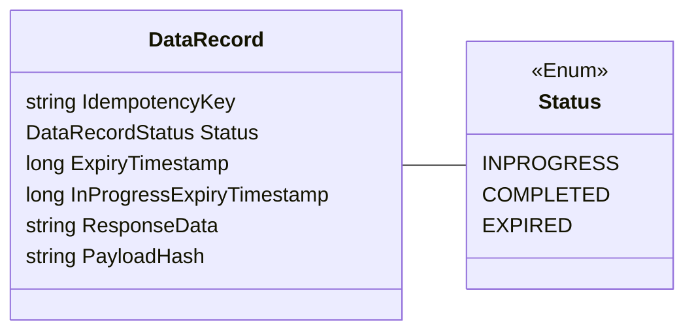
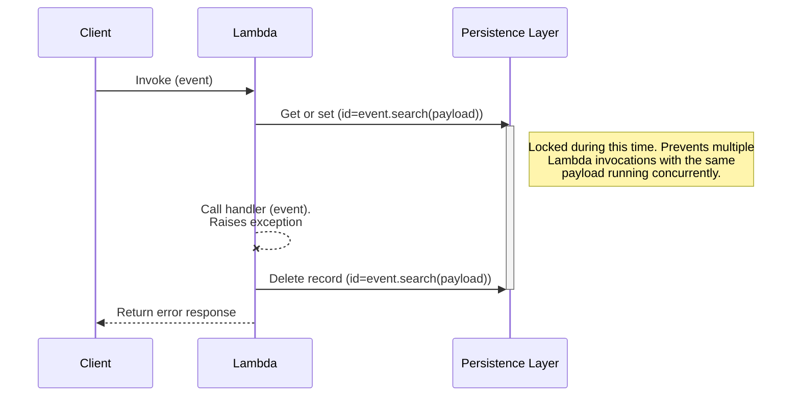
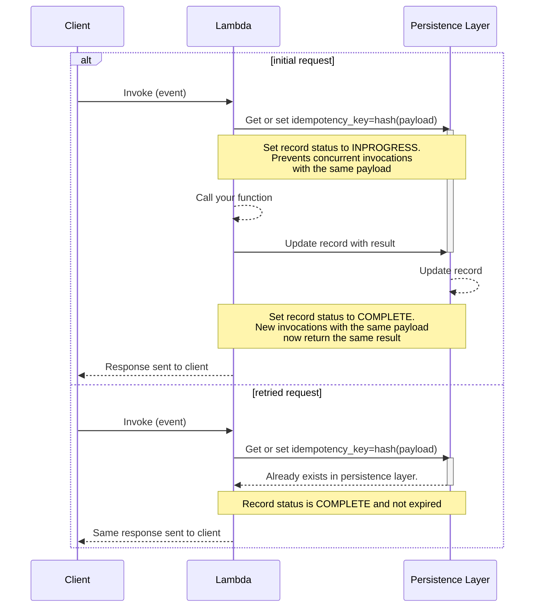
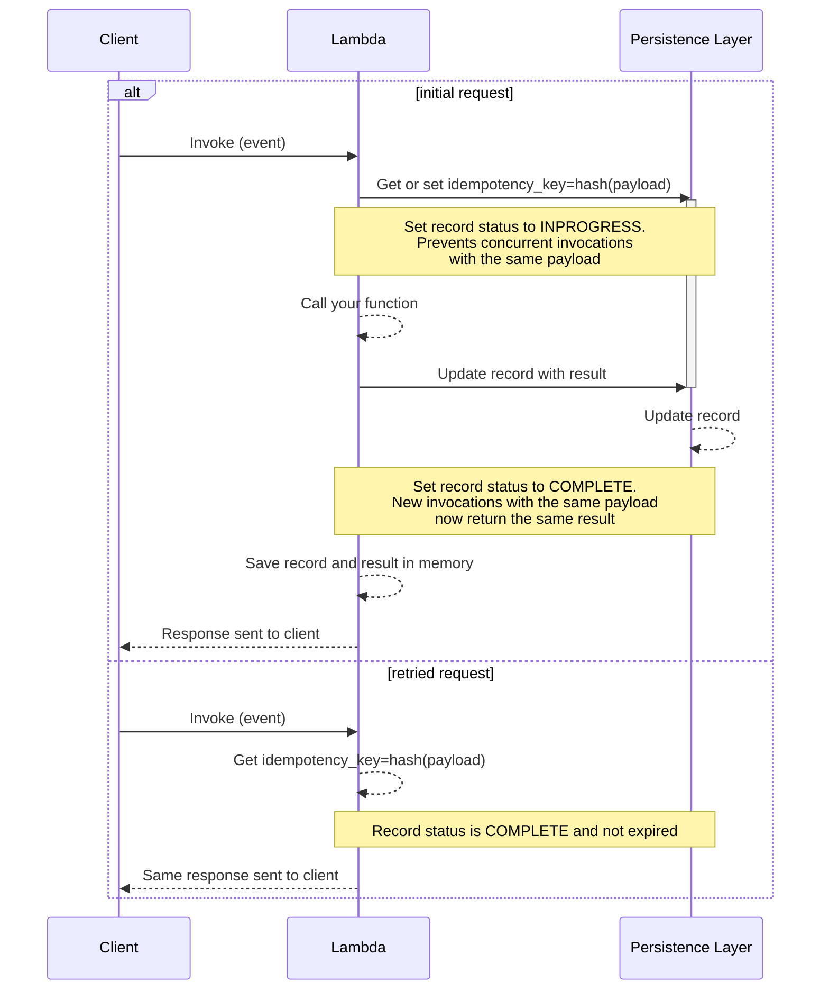
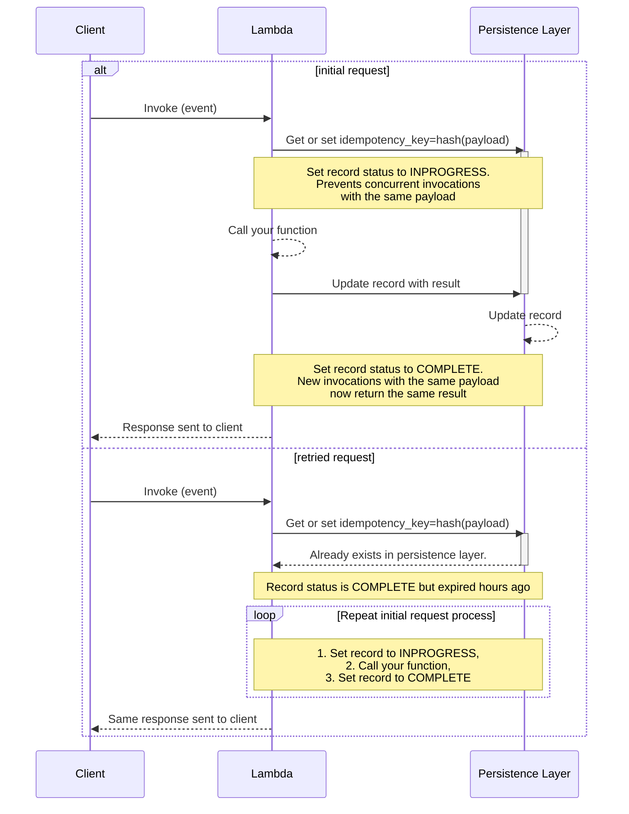
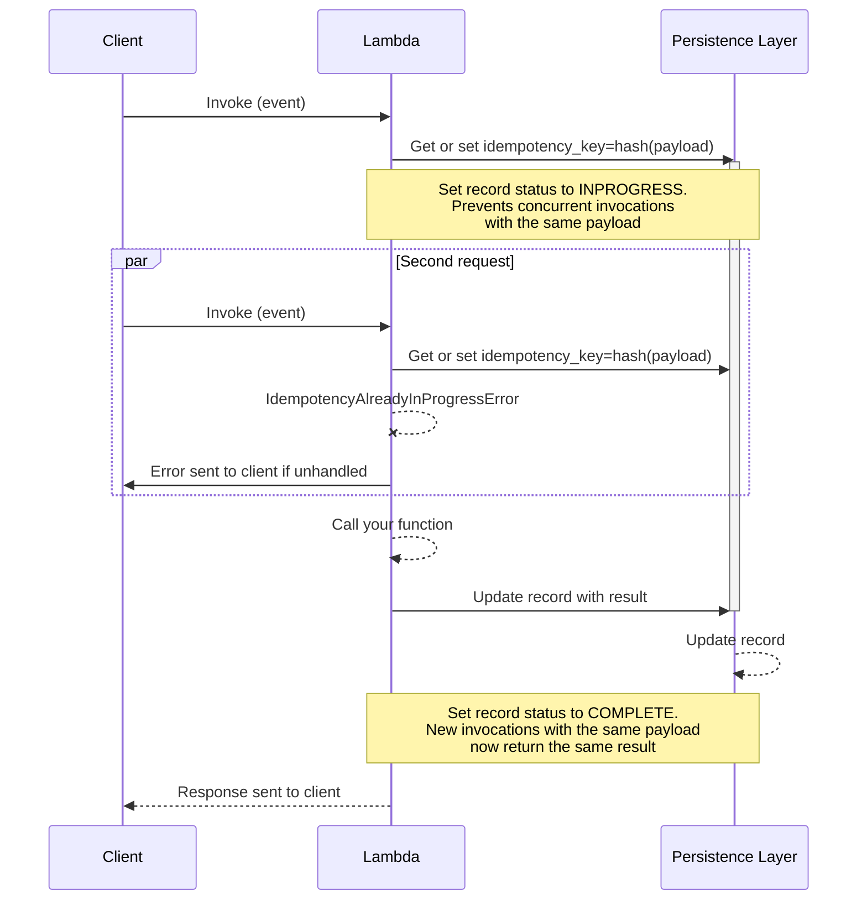
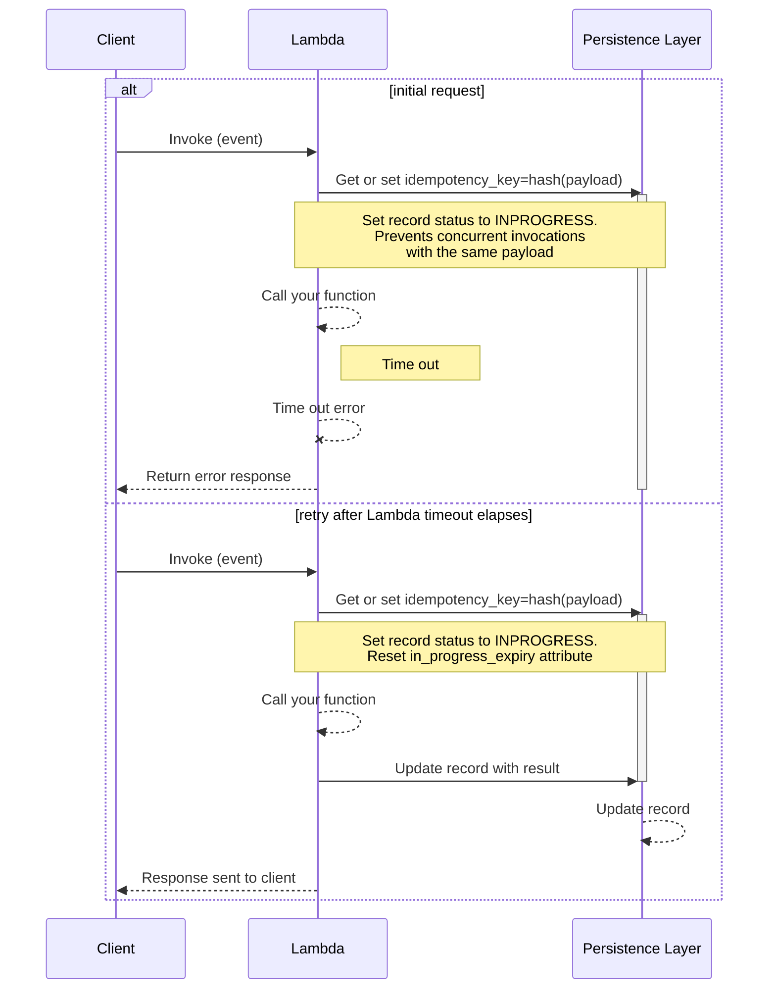
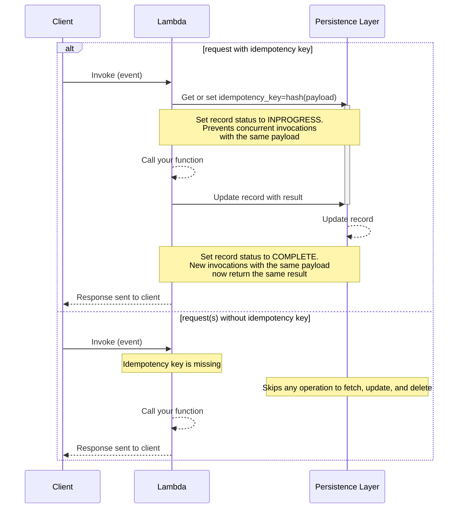

<!-- markdownlint-disable MD013 -->

The idempotency utility provides a simple solution to convert your Lambda functions into idempotent operations which are safe to retry.

## Key features

* Prevent Lambda handler function from executing more than once on the same event payload during a time window
* Ensure Lambda handler returns the same result when called with the same payload
* Select a subset of the event as the idempotency key using [JMESPath](https://jmespath.org/) expressions
* Set a time window in which records with the same payload should be considered duplicates
* Expires in-progress executions if the Lambda function times out halfway through
* Ahead-of-Time compilation to native code support [AOT](https://docs.aws.amazon.com/lambda/latest/dg/dotnet-native-aot.html) from version 1.3.0

## Terminology

The property of idempotency means that an operation does not cause additional side effects if it is called more than once with the same input parameters.

**Idempotent operations will return the same result when they are called multiple times with the same parameters**. This makes idempotent operations safe to retry. [Read more](https://aws.amazon.com/builders-library/making-retries-safe-with-idempotent-APIs/) about idempotency.

**Idempotency key** is a hash representation of either the entire event or a specific configured subset of the event, and invocation results are **JSON serialized** and stored in your persistence storage layer.

**Idempotency record** is the data representation of an idempotent request saved in your preferred  storage layer. We use it to coordinate whether a request is idempotent, whether it's still valid or expired based on timestamps, etc.

<div style="text-align: center;">

<i>Idempotency record representation</i>
</div>


## Getting started

### Installation

You should install with NuGet:

```powershell
Install-Package AWS.Lambda.Powertools.Idempotency
```

Or via the .NET Core command line interface:

```bash
dotnet add package AWS.Lambda.Powertools.Idempotency
```

### IAM Permissions

Your Lambda function IAM Role must have `dynamodb:GetItem`, `dynamodb:PutItem`, `dynamodb:UpdateItem` and `dynamodb:DeleteItem` IAM permissions before using this feature.

???+ note
If you're using our example [AWS Serverless Application Model (SAM)](#required-resources), [AWS Cloud Development Kit (CDK)](#required-resources), or [Terraform](#required-resources) it already adds the required permissions.

### Required resources

Before getting started, you need to create a persistent storage layer where the idempotency utility can store its state - your Lambda functions will need read and write access to it.

As of now, Amazon DynamoDB is the only supported persistent storage layer, so you'll need to create a table first.

**Default table configuration**

If you're not [changing the default configuration for the DynamoDB persistence layer](#dynamodbpersistencestore), this is the expected default configuration:

| Configuration      | Value        | Notes                                                                               |
|--------------------|--------------|-------------------------------------------------------------------------------------|
| Partition key      | `id`         |                                                                                     |
| TTL attribute name | `expiration` | This can only be configured after your table is created if you're using AWS Console |

!!! Tip "Tip: You can share a single state table for all functions"
    You can reuse the same DynamoDB table to store idempotency state. We add your function name in addition to the idempotency key as a hash key.

=== "template.yml"

    ```yaml hl_lines="5-13 21-23 26" title="AWS Serverless Application Model (SAM) example"
    Resources:
    IdempotencyTable:
        Type: AWS::DynamoDB::Table
        Properties:
        AttributeDefinitions:
            - AttributeName: id
            AttributeType: S
        KeySchema:
            - AttributeName: id
            KeyType: HASH
        TimeToLiveSpecification:
            AttributeName: expiration
            Enabled: true
        BillingMode: PAY_PER_REQUEST

    IdempotencyFunction:
        Type: AWS::Serverless::Function
        Properties:
        CodeUri: Function
        Handler: HelloWorld::HelloWorld.Function::FunctionHandler
        Policies:
            - DynamoDBCrudPolicy:
                TableName: !Ref IdempotencyTable
        Environment:
            Variables:
            IDEMPOTENCY_TABLE: !Ref IdempotencyTable
    ```

!!! warning "Warning: Large responses with DynamoDB persistence layer"
    When using this utility with DynamoDB, your function's responses must be [smaller than 400KB](https://docs.aws.amazon.com/amazondynamodb/latest/developerguide/Limits.html#limits-items).
    Larger items cannot be written to DynamoDB and will cause exceptions.

!!! info "Info: DynamoDB"
    Each function invocation will generally make 2 requests to DynamoDB. If the
    result returned by your Lambda is less than 1kb, you can expect 2 WCUs per invocation. For retried invocations, you will
    see 1WCU and 1RCU. Review the [DynamoDB pricing documentation](https://aws.amazon.com/dynamodb/pricing/) to
    estimate the cost.

### Idempotent attribute

You can quickly start by configuring `Idempotency` and using it with the `Idempotent` attribute on your Lambda function.

!!! warning "Important"
    Initialization and configuration of the `Idempotency` must be performed outside the handler, preferably in the constructor.

    ```csharp hl_lines="5 8"
    public class Function
    {
        public Function()
        {
            Idempotency.Configure(builder => builder.UseDynamoDb("idempotency_table"));
        }
        
        [Idempotent]
        public Task<string> FunctionHandler(string input, ILambdaContext context)
        {
            return Task.FromResult(input.ToUpper());
        }
    }
    ```

#### Idempotent attribute on another method

You can use the `Idempotent` attribute for any .NET function, not only the Lambda handlers.

When using `Idempotent` attribute on another method, you must tell which parameter in the method signature has the data we should use:

 - If the method only has one parameter, it will be used by default. 
 - If there are 2 or more parameters, you must set the `IdempotencyKey` attribute on the parameter to use.

!!! info "The parameter must be serializable in JSON. We use `System.Text.Json` internally to (de)serialize objects"

    ```csharp hl_lines="5 14-15"
    public class Function
    {
        public Function()
        {
            Idempotency.Configure(builder => builder.UseDynamoDb("idempotency_table"));
        }
        
        public Task<string> FunctionHandler(string input, ILambdaContext context)
        {
            MyInternalMethod("hello", "world")
            return Task.FromResult(input.ToUpper());
        }

        [Idempotent]
        private string MyInternalMethod(string argOne, [IdempotencyKey] string argTwo) {
            return "something";
        }
    }
    ```

### Choosing a payload subset for idempotency

!!! tip "Tip: Dealing with always changing payloads"
    When dealing with an elaborate payload (API Gateway request for example), where parts of the payload always change, you should configure the **`EventKeyJmesPath`**.

Use [`IdempotencyConfig`](#customizing-the-default-behavior) to instruct the Idempotent annotation to only use a portion of your payload to verify whether a request is idempotent, and therefore it should not be retried.

> **Payment scenario**

In this example, we have a Lambda handler that creates a payment for a user subscribing to a product. We want to ensure that we don't accidentally charge our customer by subscribing them more than once.

Imagine the function executes successfully, but the client never receives the response due to a connection issue. It is safe to retry in this instance, as the idempotent decorator will return a previously saved response.

**What we want here** is to instruct Idempotency to use `user_id` and `product_id` fields from our incoming payload as our idempotency key.
If we were to treat the entire request as our idempotency key, a simple HTTP header change would cause our customer to be charged twice.

???+ tip "Deserializing JSON strings in payloads for increased accuracy."
    The payload extracted by the `EventKeyJmesPath` is treated as a string by default, so will be sensitive to differences in whitespace even when the JSON payload itself is identical.

    To alter this behaviour, you can use the JMESPath built-in function `powertools_json()` to treat the payload as a JSON object rather than a string.

=== "Payment function"

    ```csharp hl_lines="4"
    Idempotency.Configure(builder =>
            builder
                .WithOptions(optionsBuilder =>
                    optionsBuilder.WithEventKeyJmesPath("powertools_json(Body).[\"user_id\", \"product_id\"]"))
                .UseDynamoDb("idempotency_table"));
    ```

=== "Sample event"

    ```json hl_lines="28"
    {
    "version": "2.0",
    "routeKey": "ANY /createpayment",
    "rawPath": "/createpayment",
    "rawQueryString": "",
    "headers": {
    "Header1": "value1",
    "Header2": "value2"
    },
    "requestContext": {
    "accountId": "123456789012",
    "apiId": "api-id",
    "domainName": "id.execute-api.us-east-1.amazonaws.com",
    "domainPrefix": "id",
    "http": {
    "method": "POST",
    "path": "/createpayment",
    "protocol": "HTTP/1.1",
    "sourceIp": "ip",
    "userAgent": "agent"
    },
    "requestId": "id",
    "routeKey": "ANY /createpayment",
    "stage": "$default",
    "time": "10/Feb/2021:13:40:43 +0000",
    "timeEpoch": 1612964443723
    },
    "body": "{\"user_id\":\"xyz\",\"product_id\":\"123456789\"}",
    "isBase64Encoded": false
    }
    ```

### Lambda timeouts

???+ note
    This is automatically done when you decorate your Lambda handler with [Idempotent attribute](#idempotent-attribute).
    
    To prevent against extended failed retries when a [Lambda function times out](https://aws.amazon.com/premiumsupport/knowledge-center/lambda-verify-invocation-timeouts/){target="_blank"},
    Powertools for AWS Lambda (.NET) calculates and includes the remaining invocation available time as part of the idempotency record.

???+ example
    If a second invocation happens **after** this timestamp, and the record is marked as `INPROGRESS`, we will execute the invocation again as if it was in the `EXPIRED` state (e.g, `Expired` field elapsed).

    This means that if an invocation expired during execution, it will be quickly executed again on the next retry.

???+ important
    If you are only using the [Idempotent attribute](#Idempotent-attribute-on-another-method) to guard isolated parts of your code,
    you must use `RegisterLambdaContext` available in the `Idempotency` static class to benefit from this protection.

Here is an example on how you register the Lambda context in your handler:

=== "Registering the Lambda context"

    ```csharp hl_lines="10" title="Registering the Lambda context"
    public class Function
    {
        public Function()
        {
            Idempotency.Configure(builder => builder.UseDynamoDb("idempotency_table"));
        }
        
        public Task<string> FunctionHandler(string input, ILambdaContext context)
        {
            Idempotency.RegisterLambdaContext(context);
            MyInternalMethod("hello", "world")
            return Task.FromResult(input.ToUpper());
        }

        [Idempotent]
        private string MyInternalMethod(string argOne, [IdempotencyKey] string argTwo) {
            return "something";
        }
    }
    ```

### Handling exceptions

If you are using the `Idempotent` attribute on your Lambda handler or any other method, any unhandled exceptions that are thrown during the code execution will cause **the record in the persistence layer to be deleted**.
This means that new invocations will execute your code again despite having the same payload. If you don't want the record to be deleted, you need to catch exceptions within the idempotent function and return a successful response.

!!! warning
    **We will throw an `IdempotencyPersistenceLayerException`** if any of the calls to the persistence layer fail unexpectedly.

    As this happens outside the scope of your decorated function, you are not able to catch it.

<center>

<i>Idempotent sequence exception</i>
</center>

If you are using `Idempotent` attribute on another method, any unhandled exceptions that are raised _inside_ the decorated function will cause the record in the persistence layer to be deleted, and allow the function to be executed again if retried.

If an Exception is raised _outside_ the scope of the decorated method and after your method has been called, the persistent record will not be affected. In this case, idempotency will be maintained for your decorated function. Example:

=== "Handling exceptions"

    ```csharp hl_lines="10-12 16-18 21" title="Exception not affecting idempotency record sample"
    public class Function
    {
        public Function()
        {
            Idempotency.Configure(builder => builder.UseDynamoDb("idempotency_table"));
        }
        
        public Task<string> FunctionHandler(string input, ILambdaContext context)
        {
            Idempotency.RegisterLambdaContext(context);
            // If an exception is thrown here, no idempotent record will ever get created as the
            // idempotent method does not get called

            MyInternalMethod("hello", "world")

            // This exception will not cause the idempotent record to be deleted, since it
            // happens after the decorated method has been successfully called    
            throw new Exception();
        }

        [Idempotent]
        private string MyInternalMethod(string argOne, [IdempotencyKey] string argTwo) {
            return "something";
        }
    }
    ```

### Idempotency request flow

The following sequence diagrams explain how the Idempotency feature behaves under different scenarios.

#### Successful request

<center>

<i>Idempotent successful request</i>
</center>

#### Successful request with cache enabled

!!! note "[In-memory cache is disabled by default](#using-in-memory-cache)."

<center>

<i>Idempotent successful request cached</i>
</center>

#### Expired idempotency records

<center>

<i>Previous Idempotent request expired</i>
</center>

#### Concurrent identical in-flight requests

<center>

<i>Concurrent identical in-flight requests</i>
</center>

#### Lambda request timeout

<center>

<i>Idempotent request during and after Lambda timeouts</i>
</center>

#### Optional idempotency key

<center>

<i>Optional idempotency key</i>
</center>

## Advanced

### Persistence stores

#### DynamoDBPersistenceStore

This persistence store is built-in, and you can either use an existing DynamoDB table or create a new one dedicated for idempotency state (recommended).

Use the builder to customize the table structure:
```csharp title="Customizing DynamoDBPersistenceStore to suit your table structure"
new DynamoDBPersistenceStoreBuilder()
    .WithTableName("TABLE_NAME")
    .WithKeyAttr("idempotency_key")
    .WithExpiryAttr("expires_at")
    .WithStatusAttr("current_status")
    .WithDataAttr("result_data")
    .WithValidationAttr("validation_key")
    .WithInProgressExpiryAttr("in_progress_expires_at")
    .Build()
```

When using DynamoDB as a persistence layer, you can alter the attribute names by passing these parameters when initializing the persistence layer:

| Parameter                  | Required | Default                              | Description                                                                                            |
|----------------------------|----------|--------------------------------------|--------------------------------------------------------------------------------------------------------|
| **TableName**              | Y        |                                      | Table name to store state                                                                              |
| **KeyAttr**                |          | `id`                                 | Partition key of the table. Hashed representation of the payload (unless **SortKeyAttr** is specified) |
| **ExpiryAttr**             |          | `expiration`                         | Unix timestamp of when record expires                                                                  |
| **InProgressExpiryAttr**   |          | `in_progress_expiration`             | Unix timestamp of when record expires while in progress (in case of the invocation times out)          |
| **StatusAttr**             |          | `status`                             | Stores status of the Lambda execution during and after invocation                                      |
| **DataAttr**               |          | `data`                               | Stores results of successfully idempotent methods                                                      |
| **ValidationAttr**         |          | `validation`                         | Hashed representation of the parts of the event used for validation                                    |
| **SortKeyAttr**            |          |                                      | Sort key of the table (if table is configured with a sort key).                                        |
| **StaticPkValue**          |          | `idempotency#{LAMBDA_FUNCTION_NAME}` | Static value to use as the partition key. Only used when **SortKeyAttr** is set.                       |


### Customizing the default behavior

Idempotency behavior can be further configured with **`IdempotencyOptions`** using a builder:

```csharp
new IdempotencyOptionsBuilder()
    .WithEventKeyJmesPath("id")
    .WithPayloadValidationJmesPath("paymentId")
    .WithThrowOnNoIdempotencyKey(true)
    .WithExpiration(TimeSpan.FromMinutes(1))
    .WithUseLocalCache(true)
    .WithHashFunction("MD5")
    .Build();
```

These are the available options for further configuration:

| Parameter                                         | Default | Description                                                                                                                      |
|---------------------------------------------------|---------|----------------------------------------------------------------------------------------------------------------------------------|
| **EventKeyJMESPath**                              | `""`    | JMESPath expression to extract the idempotency key from the event record.                                                        |
| **PayloadValidationJMESPath**                     | `""`    | JMESPath expression to validate whether certain parameters have changed in the event                                             |
| **ThrowOnNoIdempotencyKey**                       | `False` | Throw exception if no idempotency key was found in the request                                                                   |
| **ExpirationInSeconds**                           | 3600    | The number of seconds to wait before a record is expired                                                                         |
| **UseLocalCache**                                 | `false` | Whether to locally cache idempotency results (LRU cache)                                                                         |
| **HashFunction**                                  | `MD5`   | Algorithm to use for calculating hashes, as supported by `System.Security.Cryptography.HashAlgorithm` (eg. SHA1, SHA-256, ...)   |

These features are detailed below.

### Handling concurrent executions with the same payload

This utility will throw an **`IdempotencyAlreadyInProgressException`** if we receive **multiple invocations with the same payload while the first invocation hasn't completed yet**.

!!! info
    If you receive `IdempotencyAlreadyInProgressException`, you can safely retry the operation.

This is a locking mechanism for correctness. Since we don't know the result from the first invocation yet, we can't safely allow another concurrent execution.

### Using in-memory cache

**By default, in-memory local caching is disabled**, to avoid using memory in an unpredictable way. 

!!! warning Memory configuration of your function
    Be sure to configure the Lambda memory according to the number of records and the potential size of each record.

You can enable it as seen before with:
```csharp title="Enable local cache"
    new IdempotencyOptionsBuilder()
        .WithUseLocalCache(true)
        .Build()
```
When enabled, we cache a maximum of 255 records in each Lambda execution environment

!!! note "Note: This in-memory cache is local to each Lambda execution environment"
    This means it will be effective in cases where your function's concurrency is low in comparison to the number of "retry" invocations with the same payload, because cache might be empty.


### Expiring idempotency records

!!! note
    By default, we expire idempotency records after **an hour** (3600 seconds).

In most cases, it is not desirable to store the idempotency records forever. Rather, you want to guarantee that the same payload won't be executed within a period of time.

You can change this window with the **`ExpirationInSeconds`** parameter:
```csharp title="Customizing expiration time"
new IdempotencyOptionsBuilder()
    .WithExpiration(TimeSpan.FromMinutes(5))
    .Build()
```

Records older than 5 minutes will be marked as expired, and the Lambda handler will be executed normally even if it is invoked with a matching payload.

!!! note "Note: DynamoDB time-to-live field"
    This utility uses **`expiration`** as the TTL field in DynamoDB, as [demonstrated in the SAM example earlier](#required-resources).

### Payload validation

!!! question "Question: What if your function is invoked with the same payload except some outer parameters have changed?"
    Example: A payment transaction for a given productID was requested twice for the same customer, **however the amount to be paid has changed in the second transaction**.

By default, we will return the same result as it returned before, however in this instance it may be misleading; we provide a fail fast payload validation to address this edge case.

With **`PayloadValidationJMESPath`**, you can provide an additional JMESPath expression to specify which part of the event body should be validated against previous idempotent invocations

=== "Function.cs"

    ```csharp hl_lines="6"
    Idempotency.Configure(builder =>
            builder
                .WithOptions(optionsBuilder =>
                    optionsBuilder
                        .WithEventKeyJmesPath("[userDetail, productId]")
                        .WithPayloadValidationJmesPath("amount"))
                .UseDynamoDb("TABLE_NAME"));
    ```

=== "Example Event 1"

    ```json hl_lines="8"
    {
        "userDetail": {
            "username": "User1",
            "user_email": "user@example.com"
        },
        "productId": 1500,
        "charge_type": "subscription",
        "amount": 500
    }
    ```

=== "Example Event 2"

    ```json hl_lines="8"
    {
        "userDetail": {
            "username": "User1",
            "user_email": "user@example.com"
        },
        "productId": 1500,
        "charge_type": "subscription",
        "amount": 1
    }
    ```

In this example, the **`userDetail`** and **`productId`** keys are used as the payload to generate the idempotency key, as per **`EventKeyJMESPath`** parameter.

!!! note
    If we try to send the same request but with a different amount, we will raise **`IdempotencyValidationException`**.

Without payload validation, we would have returned the same result as we did for the initial request. Since we're also returning an amount in the response, this could be quite confusing for the client.

By using **`withPayloadValidationJMESPath("amount")`**, we prevent this potentially confusing behavior and instead throw an Exception.

### Making idempotency key required

If you want to enforce that an idempotency key is required, you can set **`ThrowOnNoIdempotencyKey`** to `True`.

This means that we will throw **`IdempotencyKeyException`** if the evaluation of **`EventKeyJMESPath`** is `null`.

=== "Function.cs"

    ```csharp hl_lines="9"
    public App() 
    {
      Idempotency.Configure(builder =>
            builder
                .WithOptions(optionsBuilder =>
                    optionsBuilder
                        // Requires "user"."uid" and "orderId" to be present
                        .WithEventKeyJmesPath("[user.uid, orderId]")
                        .WithThrowOnNoIdempotencyKey(true))
                .UseDynamoDb("TABLE_NAME"));
    }

    [Idempotent]
    public Task<OrderResult> FunctionHandler(Order input, ILambdaContext context)
    {
      // ...
    }
    ```

=== "Success Event"

    ```json hl_lines="6"
    {
        "user": {
            "uid": "BB0D045C-8878-40C8-889E-38B3CB0A61B1",
            "name": "Foo"
        },
        "orderId": 10000
    }
    ```

=== "Failure Event"

    Notice that `orderId` is now accidentally within `user` key

    ```json
    {
        "user": {
            "uid": "DE0D000E-1234-10D1-991E-EAC1DD1D52C8",
            "name": "Joe Bloggs",
            "orderId": 10000
        },
    }
    ```

### Customizing DynamoDB configuration

When creating the `DynamoDBPersistenceStore`, you can set a custom [`AmazonDynamoDBClient`](https://docs.aws.amazon.com/sdkfornet1/latest/apidocs/html/T_Amazon_DynamoDB_AmazonDynamoDBClient.htm) if you need to customize the configuration:

=== "Custom AmazonDynamoDBClient"

    ```csharp hl_lines="3 9"
    public Function()
    {
        AmazonDynamoDBClient customClient = new AmazonDynamoDBClient(RegionEndpoint.APSouth1);
      
        Idempotency.Configure(builder => 
            builder.UseDynamoDb(storeBuilder => 
                storeBuilder.
                    WithTableName("TABLE_NAME")
                    .WithDynamoDBClient(customClient)
            ));
    }
    ```

### Using a DynamoDB table with a composite primary key

When using a composite primary key table (hash+range key), use `SortKeyAttr` parameter when initializing your persistence store.

With this setting, we will save the idempotency key in the sort key instead of the primary key. By default, the primary key will now be set to `idempotency#{LAMBDA_FUNCTION_NAME}`.

You can optionally set a static value for the partition key using the `StaticPkValue` parameter.

=== "Reusing a DynamoDB table that uses a composite primary key"

    ```csharp hl_lines="5"
    Idempotency.Configure(builder => 
        builder.UseDynamoDb(storeBuilder => 
            storeBuilder.
                WithTableName("TABLE_NAME")
                .WithSortKeyAttr("sort_key")
        ));
    ```

Data would then be stored in DynamoDB like this:

| id                           | sort_key                         | expiration | status      | data                                 |
|------------------------------|----------------------------------|------------|-------------|--------------------------------------|
| idempotency#MyLambdaFunction | 1e956ef7da78d0cb890be999aecc0c9e | 1636549553 | COMPLETED   | {"id": 12391, "message": "success"}  |
| idempotency#MyLambdaFunction | 2b2cdb5f86361e97b4383087c1ffdf27 | 1636549571 | COMPLETED   | {"id": 527212, "message": "success"} |
| idempotency#MyLambdaFunction | f091d2527ad1c78f05d54cc3f363be80 | 1636549585 | IN_PROGRESS |                                      |


## AOT Support

Native AOT trims your application code as part of the compilation to ensure that the binary is as small as possible. .NET 8 for Lambda provides improved trimming support compared to previous versions of .NET.

### WithJsonSerializationContext()

To use Idempotency utility with AOT support you first need to add `WithJsonSerializationContext()` to your `Idempotency` configuration.

This ensures that when serializing your payload, the utility uses the correct serialization context.

In the example below, we use the default `LambdaFunctionJsonSerializerContext`:

```csharp
Idempotency.Configure(builder =>
builder.WithJsonSerializationContext(LambdaFunctionJsonSerializerContext.Default)));

```

Full example:

```csharp hl_lines="8"
public static class Function
{
    private static async Task Main()
    {
        var tableName = Environment.GetEnvironmentVariable("IDEMPOTENCY_TABLE_NAME");
        Idempotency.Configure(builder =>
            builder
                .WithJsonSerializationContext(LambdaFunctionJsonSerializerContext.Default)
                .WithOptions(optionsBuilder => optionsBuilder
                    .WithExpiration(TimeSpan.FromHours(1)))
                .UseDynamoDb(storeBuilder => storeBuilder
                    .WithTableName(tableName)
                ));

        Func<APIGatewayProxyRequest, ILambdaContext, APIGatewayProxyResponse> handler = FunctionHandler;
        await LambdaBootstrapBuilder.Create(handler,
                new SourceGeneratorLambdaJsonSerializer<LambdaFunctionJsonSerializerContext>())
            .Build()
            .RunAsync();
    }

    [Idempotent]
    public static APIGatewayProxyResponse FunctionHandler(APIGatewayProxyRequest apigwProxyEvent,
        ILambdaContext context)
    {
        return new APIGatewayProxyResponse
            {
                Body = JsonSerializer.Serialize(response, typeof(Response), LambdaFunctionJsonSerializerContext.Default),
                StatusCode = 200,
                Headers = new Dictionary<string, string> { { "Content-Type", "application/json" } }
            };
    }
}

[JsonSerializable(typeof(APIGatewayProxyRequest))]
[JsonSerializable(typeof(APIGatewayProxyResponse))]
[JsonSerializable(typeof(Response))]
public partial class LambdaFunctionJsonSerializerContext : JsonSerializerContext
{
}
```

## Testing your code

The idempotency utility provides several routes to test your code.

You can check our Integration tests which use [TestContainers](https://testcontainers.com/modules/dynamodb/){:target="_blank"} with a local DynamoDB instance to test the idempotency utility. Or our end-to-end tests which use the AWS SDK to interact with a real DynamoDB table.

### Disabling the idempotency utility
When testing your code, you may wish to disable the idempotency logic altogether and focus on testing your business logic. To do this, you can set the environment variable `POWERTOOLS_IDEMPOTENCY_DISABLED` to true. 

## Extra resources

If you're interested in a deep dive on how Amazon uses idempotency when building our APIs, check out
[this article](https://aws.amazon.com/builders-library/making-retries-safe-with-idempotent-APIs/).
