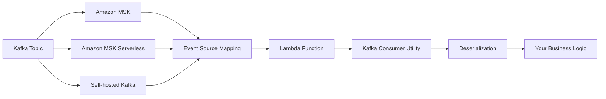
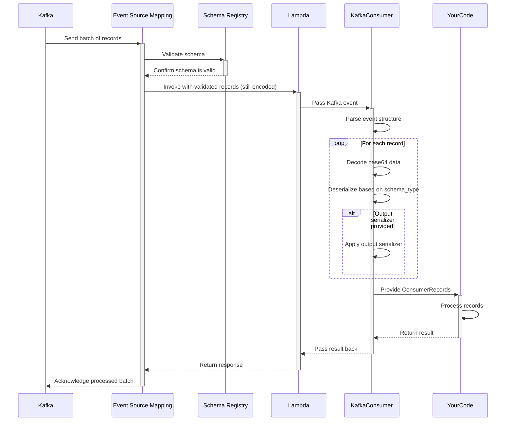
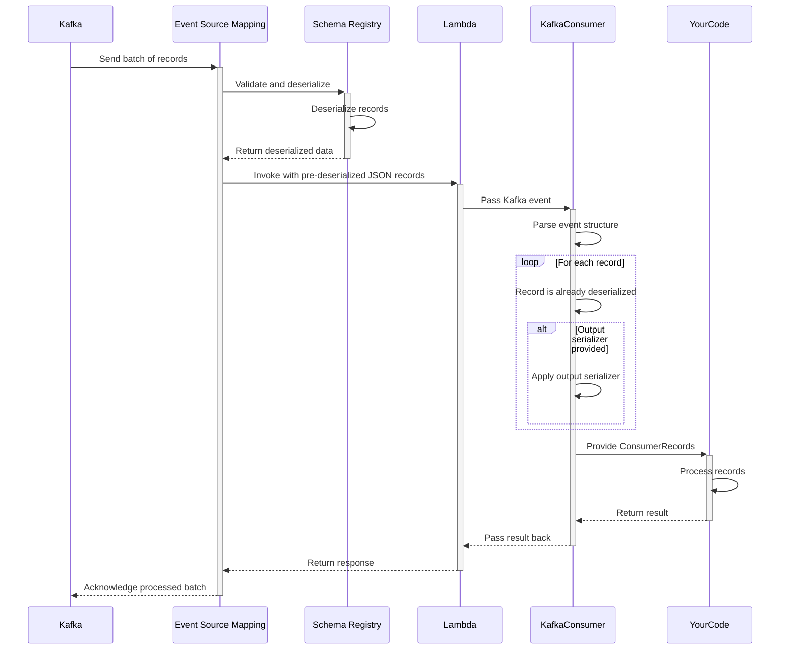
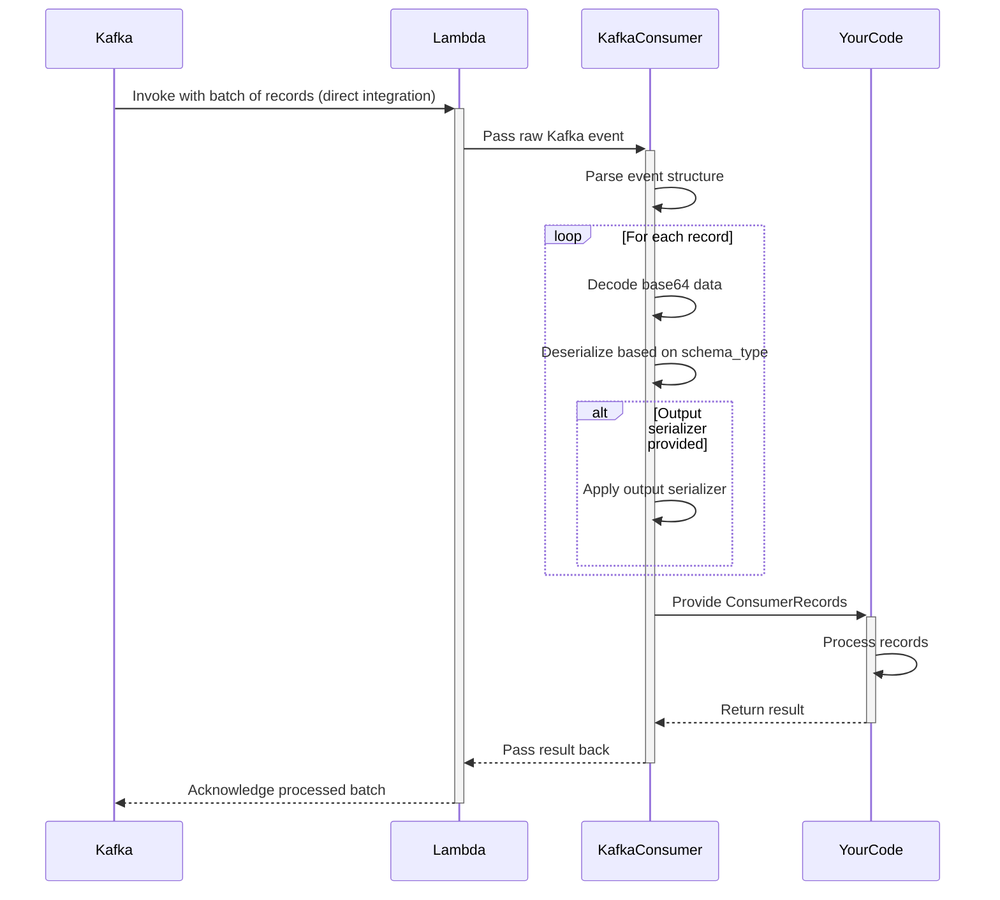

<!-- markdownlint-disable MD043 -->

The Kafka Consumer utility transparently handles message deserialization, provides an intuitive developer experience, and integrates seamlessly with the rest of the Powertools for AWS Lambda ecosystem.



## Key features

* Automatic deserialization of Kafka messages (JSON, Avro, and Protocol Buffers)
* Simplified event record handling with intuitive interface
* Support for key and value deserialization
* Support for ESM with and without Schema Registry integration
* Proper error handling for deserialization issues
* Support for native AOT

## Terminology

**Event Source Mapping (ESM)**  A Lambda feature that reads from streaming sources (like Kafka) and invokes your Lambda function. It manages polling, batching, and error handling automatically, eliminating the need for consumer management code.

**Record Key and Value** A Kafka messages contain two important parts: an optional key that determines the partition and a value containing the actual message data. Both are base64-encoded in Lambda events and can be independently deserialized.

**Deserialization** Is the process of converting binary data (base64-encoded in Lambda events) into usable C# objects according to a specific format like JSON, Avro, or Protocol Buffers. Powertools handles this conversion automatically.

**SchemaConfig class** Contains parameters that tell Powertools how to interpret message data, including the format type (JSON, Avro, Protocol Buffers) and optional schema definitions needed for binary formats.

**Schema Registry** Is a centralized service that stores and validates schemas, ensuring producers and consumers maintain compatibility when message formats evolve over time.

## Moving from traditional Kafka consumers

Lambda processes Kafka messages as discrete events rather than continuous streams, requiring a different approach to consumer development that Powertools for AWS helps standardize.

| Aspect | Traditional Kafka Consumers | Lambda Kafka Consumer |
|--------|----------------------------|----------------------|
| **Model** | Pull-based (you poll for messages) | Push-based (Lambda invoked with messages) |
| **Scaling** | Manual scaling configuration | Automatic scaling to partition count |
| **State** | Long-running application with state | Stateless, ephemeral executions |
| **Offsets** | Manual offset management | Automatic offset commitment |
| **Schema Validation** | Client-side schema validation | Optional Schema Registry integration with Event Source Mapping |
| **Error Handling** | Per-message retry control | Batch-level retry policies |

## Getting started

### Installation

Install the Powertools for AWS Lambda package with the appropriate extras for your use case:

```bash
# For processing Avro messages
dotnet add package AWS.Lambda.Powertools.Kafka.Avro

# For working with Protocol Buffers
dotnet add package AWS.Lambda.Powertools.Kafka.Protobuf

# For working with Json messages
dotnet add package AWS.Lambda.Powertools.Kafka.Json
```

### Required resources

To use the Kafka consumer utility, you need an AWS Lambda function configured with a Kafka event source. This can be Amazon MSK, MSK Serverless, or a self-hosted Kafka cluster.

=== "getting_started_with_msk.yaml"

    ```yaml
    AWSTemplateFormatVersion: '2010-09-09'
    Transform: AWS::Serverless-2016-10-31
    Resources:
      KafkaConsumerFunction:
        Type: AWS::Serverless::Function
        Properties:
          Handler: LambdaFunction::LambdaFunction.Function::FunctionHandler
          Runtime: dotnet8
          Timeout: 30
          Events:
            MSKEvent:
              Type: MSK
              Properties:
                StartingPosition: LATEST
                Stream: !GetAtt MyMSKCluster.Arn
                Topics:
                  - my-topic-1
                  - my-topic-2
          Policies:
            - AWSLambdaMSKExecutionRole
    ```

### Using ESM with Schema Registry

The Event Source Mapping configuration determines which mode is used. With `JSON`, Lambda converts all messages to JSON before invoking your function. With `SOURCE` mode, Lambda preserves the original format, requiring you function to handle the appropriate deserialization.

Powertools for AWS supports both Schema Registry integration modes in your Event Source Mapping configuration.

### Function deployment type

The Kafka consumer utility can be used with both Class Library and Top Level Function deployment types. The choice depends on your project structure and whether you prefer to define your Lambda handler in a class or as a standalone function.

When using the Kafka consumer utility, you must specify the serializer in your Lambda function. This serializer handles the deserialization of Kafka messages into C# objects.

- Class Library Deployment: Use `PowertoolsKafkaAvroSerializer`, `PowertoolsKafkaProtobufSerializer`, or `PowertoolsKafkaJsonSerializer` and replace the default serializer in your Lambda function assembly attribute. 
- Top Level Function Deployment: Use `PowertoolsKafkaAvroSerializer`, `PowertoolsKafkaProtobufSerializer`, or `PowertoolsKafkaJsonSerializer` and pass it to the `LambdaBootstrapBuilder.Create` method.

=== "Class Library Deployment"

    ```csharp hl_lines="5"
    using AWS.Lambda.Powertools.Kafka;
    using AWS.Lambda.Powertools.Kafka.Avro;
    using AWS.Lambda.Powertools.Logging;

    [assembly: LambdaSerializer(typeof(PowertoolsKafkaAvroSerializer))] // Use PowertoolsKafkaAvroSerializer for Avro serialization

    namespace MyKafkaConsumer;

    public class Function
    {
        public string FunctionHandler(ConsumerRecords<string, CustomerProfile> records, ILambdaContext context)
        {
            foreach (var record in records)
            {
                Logger.LogInformation("Record Value: {@record}", record.Value);
            }
        
            return "Processed " + records.Count() + " records";
        }
    }
    ```
=== "Top Level Function Deployment"

    ```csharp hl_lines="15"
    using AWS.Lambda.Powertools.Kafka;
    using AWS.Lambda.Powertools.Kafka.Avro;
    using AWS.Lambda.Powertools.Logging;        

    string Handler(ConsumerRecords<string, CustomerProfile> records, ILambdaContext context)
    {
        foreach (var record in records)
        {
            Logger.LogInformation("Record Value: {@record}", record.Value);
        }
        
        return "Processed " + records.Count() + " records";
    }
    await LambdaBootstrapBuilder.Create((Func<ConsumerRecords<string, CustomerProfile>, ILambdaContext, string>?)Handler,
            new PowertoolsKafkaAvroSerializer()) // Use PowertoolsKafkaAvroSerializer for Avro serialization
        .Build()
        .RunAsync();
    ```


### Processing Kafka events

The Kafka consumer utility transforms raw Lambda Kafka events into an intuitive format for processing. To handle messages effectively, you'll need to configure a schema that matches your data format. 

The parameter for the handler funcion is `ConsumerRecords<TK, T>`, where `TK` is the type of the key and `T` is the type of the value.


???+ tip "Using Avro or Protocol Buffers is recommended"
    We recommend Avro or Protocol Buffers for production Kafka implementations due to its schema evolution capabilities, compact binary format, and integration with Schema Registry. This offers better type safety and forward/backward compatibility compared to JSON.


=== "Avro Messages"

    ```csharp hl_lines="16"
    using AWS.Lambda.Powertools.Kafka;
    using AWS.Lambda.Powertools.Kafka.Avro;
    using AWS.Lambda.Powertools.Logging;

    string Handler(ConsumerRecords<string, CustomerProfile> records, ILambdaContext context)
    {
        foreach (var record in records)
        {
            Logger.LogInformation("Record Value: {@record}", record.Value);
        }
        
        return "Processed " + records.Count() + " records";
    }

    await LambdaBootstrapBuilder.Create((Func<ConsumerRecords<string, CustomerProfile>, ILambdaContext, string>?)Handler,
            new PowertoolsKafkaAvroSerializer()) // Use PowertoolsKafkaAvroSerializer for Avro serialization
        .Build()
        .RunAsync();
    ```

=== "Protocol Buffers"

    ```csharp hl_lines="16"
    using AWS.Lambda.Powertools.Kafka;
    using AWS.Lambda.Powertools.Kafka.Protobuf;
    using AWS.Lambda.Powertools.Logging;

    string Handler(ConsumerRecords<string, CustomerProfile> records, ILambdaContext context)
    {
        foreach (var record in records)
        {
            Logger.LogInformation("Record Value: {@record}", record.Value);
        }

        return "Processed " + records.Count() + " records";
    }

    await LambdaBootstrapBuilder.Create((Func<ConsumerRecords<string, CustomerProfile>, ILambdaContext, string>?)Handler,
            new PowertoolsKafkaProtobufSerializer()) // Use PowertoolsKafkaProtobufSerializer for Protobuf serialization
        .Build()
        .RunAsync();
    ```

=== "JSON Messages"

    ```csharp hl_lines="16"
    using AWS.Lambda.Powertools.Kafka;
    using AWS.Lambda.Powertools.Kafka.Json;
    using AWS.Lambda.Powertools.Logging;

    string Handler(ConsumerRecords<string, CustomerProfile> records, ILambdaContext context)
    {
        foreach (var record in records)
        {
            Logger.LogInformation("Record Value: {@record}", record.Value);
        }
        
        return "Processed " + records.Count() + " records";
    }

    await LambdaBootstrapBuilder.Create((Func<ConsumerRecords<string, CustomerProfile>, ILambdaContext, string>?)Handler,
            new PowertoolsKafkaJsonSerializer()) // Use PowertoolsKafkaJsonSerializer for Json serialization
        .Build()
        .RunAsync();
    ```

???+ tip "Full examples on GitHub"
    A full example including how to generate Avro and Protobuf Java classes can be found on [GitHub](https://github.com/aws-powertools/powertools-lambda-dotnet/tree/main/examples/kafka).

### Deserializing keys and values

The `PowertoolsKafkaJsonSerializer`, `PowertoolsKafkaProtobufSerializer` and `PowertoolsKafkaAvroSerializer` serializers can deserialize both keys and values independently based on your schema configuration. 

This flexibility allows you to work with different data formats in the same message.

=== "Key and Value Deserialization"

    ```csharp hl_lines="5"
    using AWS.Lambda.Powertools.Kafka;
    using AWS.Lambda.Powertools.Kafka.Protobuf;
    using AWS.Lambda.Powertools.Logging;

    string Handler(ConsumerRecords<CustomerKey, CustomerProfile> records, ILambdaContext context)
    {
        foreach (var record in records)
        {
            Logger.LogInformation("Record Value: {@record}", record.Value);
        }

        return "Processed " + records.Count() + " records";
    }

    await LambdaBootstrapBuilder.Create((Func<ConsumerRecords<CustomerKey, CustomerProfile>, ILambdaContext, string>?)Handler,
            new PowertoolsKafkaProtobufSerializer()) // Use PowertoolsKafkaProtobufSerializer for Protobuf serialization
        .Build()
        .RunAsync();
    ```

=== "Value-Only Deserialization"

    ```csharp hl_lines="5"
    using AWS.Lambda.Powertools.Kafka;
    using AWS.Lambda.Powertools.Kafka.Protobuf;
    using AWS.Lambda.Powertools.Logging;

    string Handler(ConsumerRecords<string, CustomerProfile> records, ILambdaContext context)
    {
        foreach (var record in records)
        {
            Logger.LogInformation("Record Value: {@record}", record.Value);
        }

        return "Processed " + records.Count() + " records";
    }

    await LambdaBootstrapBuilder.Create((Func<ConsumerRecords<string, CustomerProfile>, ILambdaContext, string>?)Handler,
            new PowertoolsKafkaProtobufSerializer()) // Use PowertoolsKafkaProtobufSerializer for Protobuf serialization
        .Build()
        .RunAsync();
    ```

### Handling primitive types

When working with primitive data types (string, int, etc.) rather than complex types, you can use any deserialization type like `PowertoolsKafkaJsonSerializer`. 

Simply place the primitive type like `int` or `string` in the ` ConsumerRecords<TK,T>` type parameters, and the library will automatically handle primitive type deserialization.

???+ tip "Common pattern: Keys with primitive values"
    Using primitive types (strings, integers) as Kafka message keys is a common pattern for partitioning and identifying messages. Powertools automatically handles these primitive keys without requiring special configuration, making it easy to implement this popular design pattern.

=== "Primitive key"

    ```csharp hl_lines="5"
    using AWS.Lambda.Powertools.Kafka;
    using AWS.Lambda.Powertools.Kafka.Protobuf;
    using AWS.Lambda.Powertools.Logging;

    string Handler(ConsumerRecords<string, CustomerProfile> records, ILambdaContext context)
    {
        foreach (var record in records)
        {
            Logger.LogInformation("Record Value: {@record}", record.Value);
        }

        return "Processed " + records.Count() + " records";
    }

    await LambdaBootstrapBuilder.Create((Func<ConsumerRecords<string, CustomerProfile>, ILambdaContext, string>?)Handler,
            new PowertoolsKafkaProtobufSerializer()) // Use PowertoolsKafkaProtobufSerializer for Protobuf serialization
        .Build()
        .RunAsync();
    ```

=== "Primitive key and value"

    ```csharp hl_lines="5"
    using AWS.Lambda.Powertools.Kafka;
    using AWS.Lambda.Powertools.Kafka.Protobuf;
    using AWS.Lambda.Powertools.Logging;

    string Handler(ConsumerRecords<string, string> records, ILambdaContext context)
    {
        foreach (var record in records)
        {
            Logger.LogInformation("Record Value: {@record}", record.Value);
        }

        return "Processed " + records.Count() + " records";
    }

    await LambdaBootstrapBuilder.Create((Func<ConsumerRecords<string, string>, ILambdaContext, string>?)Handler,
            new PowertoolsKafkaProtobufSerializer()) // Use PowertoolsKafkaProtobufSerializer for Protobuf serialization
        .Build()
        .RunAsync();
    ```

### Message format support and comparison

The Kafka consumer utility supports multiple serialization formats to match your existing Kafka implementation. Choose the format that best suits your needs based on performance, schema evolution requirements, and ecosystem compatibility.

???+ tip "Selecting the right format"
    For new applications, consider Avro or Protocol Buffers over JSON. Both provide schema validation, evolution support, and significantly better performance with smaller message sizes. Avro is particularly well-suited for Kafka due to its built-in schema evolution capabilities.

=== "Supported Formats"

    | Format | Schema Type | Description | Required Parameters |
    |--------|-------------|-------------|---------------------|
    | **JSON** | `"PowertoolsKafkaJsonSerializer"` | Human-readable text format | None |
    | **Avro** | `"PowertoolsKafkaAvroSerializer"` | Compact binary format with schema | Apache Avro |
    | **Protocol Buffers** | `"PowertoolsKafkaProtobufSerializer"` | Efficient binary format | Protocol Buffers |

=== "Format Comparison"

    | Feature | JSON | Avro | Protocol Buffers |
    |---------|------|------|-----------------|
    | **Schema Definition** | Optional | Required schema file | Required .proto file |
    | **Schema Evolution** | None | Strong support | Strong support |
    | **Size Efficiency** | Low | High | Highest |
    | **Processing Speed** | Slower | Fast | Fastest |
    | **Human Readability** | High | Low | Low |
    | **Implementation Complexity** | Low | Medium | Medium |
    | **Additional Dependencies** | None | Apache Avro | Protocol Buffers |

Choose the serialization format that best fits your needs:

* **JSON**: Best for simplicity and when schema flexibility is important
* **Avro**: Best for systems with evolving schemas and when compatibility is critical
* **Protocol Buffers**: Best for performance-critical systems with structured data

## Advanced

### Accessing record metadata

Each Kafka record contains important metadata that you can access alongside the deserialized message content. This metadata helps with message processing, troubleshooting, and implementing advanced patterns like exactly-once processing.

=== "Working with Record Metadata"

    ```csharp
    using AWS.Lambda.Powertools.Kafka;
    using AWS.Lambda.Powertools.Kafka.Protobuf;
    using AWS.Lambda.Powertools.Logging;

    string Handler(ConsumerRecords<string, CustomerProfile> records, ILambdaContext context)
    {
        foreach (var record in records)
        {
            // Log record coordinates for tracing
            Logger.LogInformation("Processing messagem from topic: {topic}", record.Topic);
            Logger.LogInformation("Partition: {partition}, Offset: {offset}", record.Partition, record.Offset);
            Logger.LogInformation("Produced at: {timestamp}", record.Timestamp);
            
            // Process message headers
            foreach (var header in record.Headers.DecodedValues())
            {
                Logger.LogInformation($"{header.Key}: {header.Value}");
            }
            
            // Access the Avro deserialized message content
            CustomerProfile customerProfile = record.Value; // CustomerProfile class is auto-generated from Protobuf schema
            Logger.LogInformation("Processing order for: {fullName}", customerProfile.FullName);
        }
    }

    await LambdaBootstrapBuilder.Create((Func<ConsumerRecords<string, CustomerProfile>, ILambdaContext, string>?)Handler,
            new PowertoolsKafkaProtobufSerializer()) // Use PowertoolsKafkaProtobufSerializer for Protobuf serialization
        .Build()
        .RunAsync();
    ```

#### Available metadata properties

| Property | Description | Example Use Case |
|----------|-------------|-----------------|
| `Topic` | Topic name the record was published to | Routing logic in multi-topic consumers |
| `Partition` | Kafka partition number | Tracking message distribution |
| `Offset` | Position in the partition | De-duplication, exactly-once processing |
| `Timestamp` | Unix Timestamp when record was created | Event timing analysis |
| `TimestampType` | Timestamp type (CREATE_TIME or LOG_APPEND_TIME) | Data lineage verification |
| `Headers` | Key-value pairs attached to the message | Cross-cutting concerns like correlation IDs |
| `Key` | Deserialized message key | Customer ID or entity identifier |
| `Value` | Deserialized message content | The actual business data |

### Error handling

Handle errors gracefully when processing Kafka messages to ensure your application maintains resilience and provides clear diagnostic information. The Kafka consumer utility integrates with standard C# exception handling patterns.

=== "Error Handling"

    ```csharp
    using AWS.Lambda.Powertools.Kafka;
    using AWS.Lambda.Powertools.Kafka.Protobuf;
    using AWS.Lambda.Powertools.Logging;

    var successfulRecords = 0;
    var failedRecords = 0;

    string Handler(ConsumerRecords<string, CustomerProfile> records, ILambdaContext context)
    {
        foreach (var record in records)
        {
            try 
            {
                // Process each record
                Logger.LogInformation("Processing record from topic: {topic}", record.Topic);
                Logger.LogInformation("Partition: {partition}, Offset: {offset}", record.Partition, record.Offset);
                
                // Access the deserialized message content
                CustomerProfile customerProfile = record.Value; // CustomerProfile class is auto-generated from Protobuf schema
                ProcessOrder(customerProfile);
                successfulRecords ++; 
            }
            catch (Exception ex)
            {
                failedRecords ++;

                // Log the error and continue processing other records
                Logger.LogError(ex, "Error processing record from topic: {topic}, partition: {partition}, offset: {offset}",
                    record.Topic, record.Partition, record.Offset);
                
                SendToDeadLetterQueue(record, ex); // Optional: Send to a dead-letter queue for further analysis
            }

            Logger.LogInformation("Record Value: {@record}", record.Value);
        }

        return $"Processed {successfulRecords} records successfully, {failedRecords} records failed";
    }

    private void ProcessOrder(CustomerProfile customerProfile)
    {
        Logger.LogInformation("Processing order for: {fullName}", customerProfile.FullName);
        // Your business logic to process the order
        // This could throw exceptions for various reasons (e.g., validation errors, database issues)
    }

    private void SendToDeadLetterQueue(ConsumerRecord<string, CustomerProfile> record, Exception ex)
    {
        // Implement your dead-letter queue logic here
        Logger.LogError("Sending record to dead-letter queue: {record}, error: {error}", record, ex.Message);
    }

    await LambdaBootstrapBuilder.Create((Func<ConsumerRecords<string, CustomerProfile>, ILambdaContext, string>?)Handler,
            new PowertoolsKafkaProtobufSerializer()) // Use PowertoolsKafkaProtobufSerializer for Protobuf serialization
        .Build()
        .RunAsync();
    ```

<!-- prettier-ignore -->
!!! info "Treating Deserialization errors"
    Read [Deserialization failures](#deserialization-failures). Deserialization failures will fail the whole batch and do not execute your handler.

### Integrating with Idempotency

When processing Kafka messages in Lambda, failed batches can result in message reprocessing. The idempotency utility prevents duplicate processing by tracking which messages have already been handled, ensuring each message is processed exactly once.

The Idempotency utility automatically stores the result of each successful operation, returning the cached result if the same message is processed again, which prevents potentially harmful duplicate operations like double-charging customers or double-counting metrics.

=== "Idempotent Kafka Processing"

    ```csharp
    using Amazon.Lambda.Core;
    using AWS.Lambda.Powertools.Kafka;
    using AWS.Lambda.Powertools.Kafka.Protobuf;
    using AWS.Lambda.Powertools.Logging;
    using AWS.Lambda.Powertools.Idempotency;

    [assembly: LambdaSerializer(typeof(PowertoolsKafkaProtobufSerializer))]

    namespace ProtoBufClassLibrary;

    public class Function
    {
        public Function()
        {
            Idempotency.Configure(builder => builder.UseDynamoDb("idempotency_table"));
        }

        public string FunctionHandler(ConsumerRecords<string, Payment> records, ILambdaContext context)
        {
            foreach (var record in records)
            {
                ProcessPayment(record.Key, record.Value);
            }
        
            return "Processed " + records.Count() + " records";
        }

        [Idempotent]
        private void ProcessPayment(Payment payment)
        {
            Logger.LogInformation("Processing payment {paymentId} for customer {customerName}",
                payment.Id, payment.CustomerName);

            // Your payment processing logic here
            // This could involve calling an external payment service, updating a database, etc.
        }
    }
    ```

<!-- prettier-ignore -->
???+ tip "Ensuring exactly-once processing"
    The `[Idempotent]` attribute will use the JSON representation of the Payment object to make sure that the same object is only processed exactly once. Even if a batch fails and Lambda retries the messages, each unique payment will be processed exactly once.

### Best practices

#### Handling large messages

When processing large Kafka messages in Lambda, be mindful of memory limitations. Although the Kafka consumer utility optimizes memory usage, large deserialized messages can still exhaust Lambda's resources.

For large messages, consider these proven approaches:

* **Store the data**: use Amazon S3 and include only the S3 reference in your Kafka message
* **Split large payloads**: use multiple smaller messages with sequence identifiers
* **Increase memory** Increase your Lambda function's memory allocation, which also increases CPU capacity

#### Batch size configuration

The number of Kafka records processed per Lambda invocation is controlled by your Event Source Mapping configuration. Properly sized batches optimize cost and performance.

=== "Batch size configuration"
    ```yaml
    Resources:
    OrderProcessingFunction:
        Type: AWS::Serverless::Function
        Properties:
            Handler: LambdaFunction::LambdaFunction.Function::FunctionHandler
            Runtime: dotnet8
        Events:
            KafkaEvent:
            Type: MSK
            Properties:
                Stream: !GetAtt OrdersMSKCluster.Arn
                Topics:
                - order-events
                - payment-events
                # Configuration for optimal throughput/latency balance
                BatchSize: 100
                MaximumBatchingWindowInSeconds: 5
                StartingPosition: LATEST
                # Enable partial batch success reporting
                FunctionResponseTypes:
                - ReportBatchItemFailures
    ```

Different workloads benefit from different batch configurations:

* **High-volume, simple processing**: Use larger batches (100-500 records) with short timeout
* **Complex processing with database operations**: Use smaller batches (10-50 records)
* **Mixed message sizes**: Set appropriate batching window (1-5 seconds) to handle variability

#### Cross-language compatibility

When using binary serialization formats across multiple programming languages, ensure consistent schema handling to prevent deserialization failures.

In case where you have a Python producer and a C# consumer, you may need to adjust your C# code to handle Python's naming conventions (snake_case) and data types.

=== "Using Python naming convention"

    ```c#
    using AWS.Lambda.Powertools.Kafka;
    using AWS.Lambda.Powertools.Kafka.Protobuf;
    using AWS.Lambda.Powertools.Logging;

    string Handler(ConsumerRecords<string, CustomerProfile> records, ILambdaContext context)
    {
        foreach (var record in records)
        {
            Logger.LogInformation("Record Value: {@record}", record.Value);
        }

        return "Processed " + records.Count() + " records";
    }

    await LambdaBootstrapBuilder.Create((Func<ConsumerRecords<string, CustomerProfile>, ILambdaContext, string>?)Handler,
            new PowertoolsKafkaProtobufSerializer()) // Use PowertoolsKafkaProtobufSerializer for Protobuf serialization
        .Build()
        .RunAsync();

    // Example class that handles Python snake_case field names
    public partial class CustomerProfile
    {
        [JsonPropertyName("user_id")] public string UserId { get; set; }

        [JsonPropertyName("full_name")] public string FullName { get; set; }

        [JsonPropertyName("age")] public long Age { get; set; }

        [JsonPropertyName("account_status")] public string AccountStatus { get; set; }
    }
    ```

Common cross-language challenges to address:

* **Field naming conventions**: PascalCase in C# vs snake_case in Python
* **Date/time**: representation differences
* **Numeric precision handling**: especially decimals

### Troubleshooting common errors

### Troubleshooting

#### Deserialization failures

The Powertools .NET Kafka utility replaces the DefaultLambdaSerializer and performs **eager deserialization** of all records in the batch before your handler method is invoked.

This means that if any record in the batch fails deserialization, a `RuntimeException` will be thrown with a concrete error message explaining why deserialization failed, and your handler method will never be called.

**Key implications:**

- **Batch-level failure**: If one record fails deserialization, the entire batch fails
- **Early failure detection**: Deserialization errors are caught before your business logic runs
- **Clear error messages**: The `RuntimeException` provides specific details about what went wrong
- **No partial processing**: You cannot process some records while skipping failed ones within the same batch

**Handling deserialization failures:**

Since deserialization happens before your handler is called, you cannot catch these exceptions within your handler method. Instead, configure your Event Source Mapping with appropriate error handling:

- **Dead Letter Queue (DLQ)**: Configure a DLQ to capture failed batches for later analysis
- **Maximum Retry Attempts**: Set appropriate retry limits to avoid infinite retries
- **Batch Size**: Use smaller batch sizes to minimize the impact of individual record failures

```yaml
# Example SAM template configuration for error handling
Events:
  KafkaEvent:
    Type: MSK
    Properties:
      # ... other properties
      BatchSize: 10 # Smaller batches reduce failure impact
      MaximumRetryAttempts: 3
      DestinationConfig:
        OnFailure:
          Type: SQS
          Destination: !GetAtt DeadLetterQueue.Arn
```

#### Schema compatibility issues

Schema compatibility issues often manifest as successful connections but failed deserialization. Common causes include:

* **Schema evolution without backward compatibility**: New producer schema is incompatible with consumer schema
* **Field type mismatches**: For example, a field changed from string to integer across systems
* **Missing required fields**: Fields required by the consumer schema but absent in the message
* **Default value discrepancies**: Different handling of default values between languages

When using Schema Registry, verify schema compatibility rules are properly configured for your topics and that all applications use the same registry.

#### Memory and timeout optimization

Lambda functions processing Kafka messages may encounter resource constraints, particularly with large batches or complex processing logic.

For memory errors:

* Increase Lambda memory allocation, which also provides more CPU resources
* Process fewer records per batch by adjusting the `BatchSize` parameter in your event source mapping
* Consider optimizing your message format to reduce memory footprint

For timeout issues:

* Extend your Lambda function timeout setting to accommodate processing time
* Implement chunked or asynchronous processing patterns for time-consuming operations
* Monitor and optimize database operations, external API calls, or other I/O operations in your handler

???+ tip "Monitoring memory usage"
    Use CloudWatch metrics to track your function's memory utilization. If it consistently exceeds 80% of allocated memory, consider increasing the memory allocation or optimizing your code.

## Kafka consumer workflow

### Using ESM with Schema Registry validation (SOURCE)

<center>

</center>

### Using ESM with Schema Registry deserialization (JSON)

<center>

</center>

### Using ESM without Schema Registry integration

<center>

</center>

## Testing your code

Testing Kafka consumer functions is straightforward with Xunit. You can create simple test fixtures that simulate Kafka events without needing a real Kafka cluster.

=== "Testing your code"

    ```csharp
    using System.Text;
    using Amazon.Lambda.Core;
    using Amazon.Lambda.TestUtilities;
    using AWS.Lambda.Powertools.Kafka.Protobuf;
    using Google.Protobuf;
    using TestKafka;

    public class KafkaTests
    {
        [Fact]
        public void SimpleHandlerTest()
        {
            string Handler(ConsumerRecords<int, ProtobufProduct> records, ILambdaContext context)
            {
                foreach (var record in records)
                {
                    var product = record.Value;
                    context.Logger.LogInformation($"Processing {product.Name} at ${product.Price}");
                }

                return "Successfully processed Protobuf Kafka events";
            }
            // Simulate the handler execution
            var mockLogger = new TestLambdaLogger();
            var mockContext = new TestLambdaContext
            {
                Logger = mockLogger
            };

            var records = new ConsumerRecords<int, ProtobufProduct>
            {
                Records = new Dictionary<string, List<ConsumerRecord<int, ProtobufProduct>>>
                {
                    { "mytopic-0", new List<ConsumerRecord<int, ProtobufProduct>>
                        {
                            new()
                            {
                                Topic = "mytopic",
                                Partition = 0,
                                Offset = 15,
                                Key = 42,
                                Value = new ProtobufProduct { Name = "Test Product", Id = 1, Price = 99.99 }
                            }
                        }
                    }
                }
            };
            
            // Call the handler
            var result = Handler(records, mockContext);
            
            // Assert the result
            Assert.Equal("Successfully processed Protobuf Kafka events", result);
            
            // Verify the context logger output
            Assert.Contains("Processing Test Product at $99.99", mockLogger.Buffer.ToString());
            
            // Verify the records were processed
            Assert.Single(records.Records);
            Assert.Contains("mytopic-0", records.Records.Keys);
            Assert.Single(records.Records["mytopic-0"]);
            Assert.Equal("mytopic", records.Records["mytopic-0"][0].Topic);
            Assert.Equal(0, records.Records["mytopic-0"][0].Partition);
            Assert.Equal(15, records.Records["mytopic-0"][0].Offset);
            Assert.Equal(42, records.Records["mytopic-0"][0].Key);
            Assert.Equal("Test Product", records.Records["mytopic-0"][0].Value.Name);
            Assert.Equal(1, records.Records["mytopic-0"][0].Value.Id);
            Assert.Equal(99.99, records.Records["mytopic-0"][0].Value.Price);
        }
    }

    ```

## Code Generation for Serialization

This guide explains how to automatically generate C# classes from Avro and Protobuf schema files in your Lambda projects.

### Avro Class Generation

#### Prerequisites

Install the Apache Avro Tools globally:

```bash
dotnet tool install --global Apache.Avro.Tools
```

#### MSBuild Integration

Add the following target to your `.csproj` file to automatically generate Avro classes during compilation:

```xml
<Target Name="GenerateAvroClasses" BeforeTargets="CoreCompile">
    <Exec Command="avrogen -s $(ProjectDir)CustomerProfile.avsc $(ProjectDir)Generated"/>
</Target>
```

This target will:
- Run before compilation
- Generate C# classes from `CustomerProfile.avsc` schema file
- Output generated classes to the `Generated` folder

### Protobuf Class Generation

#### Package Reference

Add the Grpc.Tools package to your `.csproj` file:

```xml
<PackageReference Include="Grpc.Tools" Version="2.72.0">
    <PrivateAssets>all</PrivateAssets>
    <IncludeAssets>runtime; build; native; contentfiles; analyzers</IncludeAssets>
</PackageReference>
```

#### Schema Files Configuration

Add your `.proto` files to the project with the following configuration:

```xml
<ItemGroup>
    <Protobuf Include="CustomerProfile.proto">
        <GrpcServices>Client</GrpcServices>
        <Access>Public</Access>
        <ProtoCompile>True</ProtoCompile>
        <CompileOutputs>True</CompileOutputs>
        <OutputDir>obj\Debug/net8.0/</OutputDir>
        <Generator>MSBuild:Compile</Generator>
        <CopyToOutputDirectory>PreserveNewest</CopyToOutputDirectory>
    </Protobuf>
</ItemGroup>
```

This configuration will:
- Generate client-side gRPC services
- Make generated classes public
- Automatically compile and include generated files
- Copy proto files to output directory

### Generated Code Usage

Both Avro and Protobuf generators create strongly-typed C# classes that can be used with the PowerTools serialization utilities for efficient Lambda function processing.