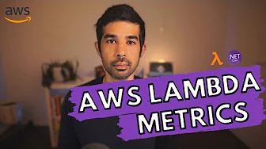

<!-- markdownlint-disable  MD001 MD043 -->

This space is dedicated to highlight our awesome community content featuring Powertools for AWS Lambda (.NET) 🙏!

!!! info "[Get your content featured here](https://github.com/aws-powertools/powertools-lambda-dotnet/issues/new?assignees=&labels=community-content&template=share_your_work.yml&title=%5BI+Made+This%5D%3A+%3CTITLE%3E){target="_blank"}!"

## Connect

Join us on [Discord](https://discord.gg/B8zZKbbyET){target="_blank"} to connect with the Powertools for AWS Lambda community 👋. Ask questions, learn from each other, contribute, hang out with key contributors, and more!

{target="_blank"}

## Videos

Check out the great series of videos from Rahul Nath on Powertools for AWS Lambda (.NET). Rahul is a programmer, blogger, Microsoft MVP, AWS Community Builder and YouTuber! He loves teaching and try to explain 'Why we do, What we do' by going a level deeper in the things I teach. His YouTube channel has a lot of AWS content that you can what on his [AWS .NET series](https://bit.ly/aws-net-series){:target="_blank"}.

-   :material-motion-play-outline:{ .lg .middle } __Logging__

    ---
    

    The Powertools for AWS Lambda (.NET) Logging utility provides a Lambda-optimized logger to output JSON logs. In this video, let's learn how to get started with the Powertools for Lambda Logging utility when building Lambda Functions in .NET. 
 
    [:octicons-arrow-right-24: Watch now](https://youtu.be/uQxAIYkdNFM?si=vwnqTwzJ1rL89MJ9){:target="_blank"}

-   :material-motion-play-outline:{ .lg .middle } __Tracing__

    ---
    

    The Powertools for AWS Lambda (.NET) Tracing library is an opinionated wrapper for AWS X-Ray aimed to reduce the overhead of performing common tracing tasks. In this video let’s explore how you can start using the Lambda Annotations library when building AWS Lambda Functions in .NET.

    [:octicons-arrow-right-24: Watch now](https://youtu.be/m8JL-aYrLHw?si=38UyseHFXYXH0vFn){:target="_blank"}

-   :material-motion-play-outline:{ .lg .middle } __Metrics__

    ---
    

    The Powertools for AWS Lambda (.NET) Metrics library makes publishing custom metrics from your AWS Lambda Function easy. In this video, let's learn how to easily integrate with Amazon CloudWatch Metrics and start publishing custom metrics from your .NET AWS Lambda Function.

    [:octicons-arrow-right-24: Watch now](https://youtu.be/SQ3rY28Eqeo?si=8A4cBYPQXLpHw2GX){:target="_blank"}

-   :material-motion-play-outline:{ .lg .middle } __Parameters__

    ---
    

    The Powertools for AWS Lambda (.NET) Parameters library makes it easy to work with these different services and retrieve parameter values. In this video, let’s learn how to get started using the Lambda Powertools Parameters NuGet package and how to use it when building Lambda Functions.

    [:octicons-arrow-right-24: Watch now](https://youtu.be/3Mdbaf4ox78?si=KyffGeKj4ZTXAm-C){:target="_blank"}

-   :material-motion-play-outline:{ .lg .middle } __Idempotency__

    ---
    

    The Powertools for AWS Lambda (.NET) Idempotency utility makes it easy to convert your Lambda functions into idempotent operations that are safe to retry. In this video, let's learn how to get started using the Powertools Idempotency package, some key features, and how it easily fits into your existing Lambda Functions.

    [:octicons-arrow-right-24: Watch now](https://youtu.be/v-A8iP0hSLQ?si=RZL23BRwO-kd1iq5){:target="_blank"}

-   :material-motion-play-outline:{ .lg .middle } __Batch Processing__

    ---
    

    The Powertools for AWS Lambda (.NET) Batch processing utility makes it easy to process a batch of messages from Amazon SQS, Amazon Kinesis Data Streams, and Amazon DynamoDB Streams. In this video, let’s learn how to use the Lambda Powertools Batch processing utility to process messages in batches from Amazon SQS.

    [:octicons-arrow-right-24: Watch now](https://youtu.be/vWYj6JwuiZ4?si=ccMqc25VV4cu_9B1){:target="_blank"}

## Workshops

### Accelerate your serverless journey with Powertools for AWS Lambda

Are you hoping to speed up your serverless applications with best practices and faster development? Powertools for AWS Lambda can help you reduce boilerplate code and increase developer velocity.
In this workshop, learn how you can implement structured logging and tracing, operational and business metrics, and idempotency practices for a media processing application. Choose between Python, JavaScript/TypeScript, Java, or .NET when building your program.

[:octicons-arrow-right-24: Explore workshop](https://catalog.workshops.aws/powertools-for-aws-lambda){:target="_blank"}

### AWS Serverless Developer Experience Workshop: A day in a life of a developer

This advanced workshop teaches building serverless solutions with AWS SAM and AWS SAM CLI. Learn about event-driven architectures, messaging patterns, orchestration, observability, and Powertools for AWS Lambda, in four different runtimes. Explore open-source tools and simplified CI/CD deployments with SAM Pipelines.

[:octicons-arrow-right-24: Explore workshop](https://catalog.workshops.aws/serverless-developer-experience){:target="_blank"}

<!-- ## Blog posts

## Sample projects -->
